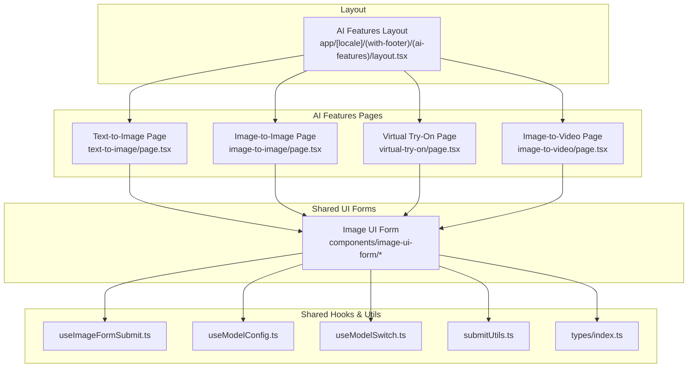
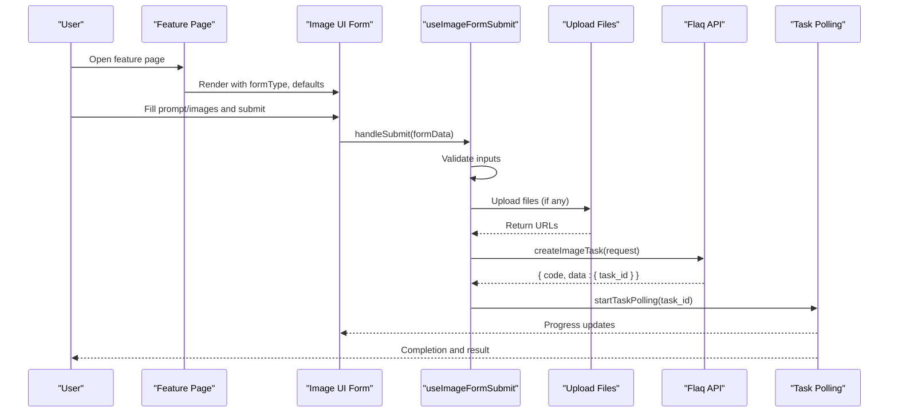
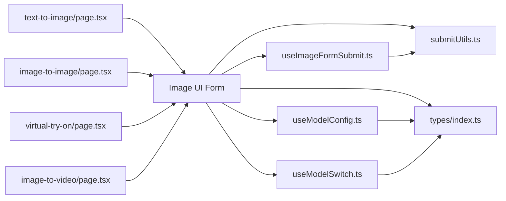

# AI Creative Tools

<cite>
**Referenced Files in This Document**
- [README.md](file://README.md)
- [layout.tsx](file://app/[locale]/(with-footer)/(ai-features)/layout.tsx)
- [text-to-image/page.tsx](file://app/[locale]/(with-footer)/(ai-features)/(image)/text-to-image/page.tsx)
- [image-to-image/page.tsx](file://app/[locale]/(with-footer)/(ai-features)/(image)/image-to-image/page.tsx)
- [virtual-try-on/page.tsx](file://app/[locale]/(with-footer)/(ai-features)/(image)/virtual-try-on/page.tsx)
- [image-to-video/page.tsx](file://app/[locale]/(with-footer)/(ai-features)/(video)/image-to-video/page.tsx)
- [useImageFormSubmit.ts](file://components/image-ui-form/hooks/useImageFormSubmit.ts)
- [useModelConfig.ts](file://components/image-ui-form/hooks/useModelConfig.ts)
- [useModelSwitch.ts](file://components/image-ui-form/hooks/useModelSwitch.ts)
- [index.ts](file://components/image-ui-form/types/index.ts)
- [submitUtils.ts](file://components/image-ui-form/utils/submitUtils.ts)
</cite>

## Table of Contents
1. [Introduction](#introduction)
2. [Project Structure](#project-structure)
3. [Core Components](#core-components)
4. [Architecture Overview](#architecture-overview)
5. [Detailed Component Analysis](#detailed-component-analysis)
6. [Dependency Analysis](#dependency-analysis)
7. [Performance Considerations](#performance-considerations)
8. [Troubleshooting Guide](#troubleshooting-guide)
9. [Conclusion](#conclusion)

## Introduction
This document describes Flaq’s AI Creative Tools built with Next.js and the Flaq platform. It focuses on four core AI features:
- Text-to-Image Generation
- Image-to-Image Transformation
- Virtual Try-On
- Image-to-Video Conversion

It explains each tool’s purpose, typical use cases, and unique capabilities, and documents the implementation details around form configuration, processing workflows, and result handling. It also covers UI patterns, input validation, progress tracking, output management, integration with external AI services, and performance considerations. Practical examples, parameter tuning tips, and customization/extensibility guidance are included.

## Project Structure
The AI features are organized under localized pages grouped by category (image/video). Each feature page composes a shared form component and passes feature-specific configuration. Shared hooks and utilities encapsulate submission logic, model configuration, and request building.

**Diagram sources**
- [layout.tsx](file://app/[locale]/(with-footer)/(ai-features)/layout.tsx#L1-L13)
- [text-to-image/page.tsx](file://app/[locale]/(with-footer)/(ai-features)/(image)/text-to-image/page.tsx#L76-L90)
- [image-to-image/page.tsx](file://app/[locale]/(with-footer)/(ai-features)/(image)/image-to-image/page.tsx#L50-L63)
- [virtual-try-on/page.tsx](file://app/[locale]/(with-footer)/(ai-features)/(image)/virtual-try-on/page.tsx#L97-L105)
- [image-to-video/page.tsx](file://app/[locale]/(with-footer)/(ai-features)/(video)/image-to-video/page.tsx#L25-L36)
- [useImageFormSubmit.ts:57-244](file://components/image-ui-form/hooks/useImageFormSubmit.ts#L57-L244)
- [useModelConfig.ts:14-93](file://components/image-ui-form/hooks/useModelConfig.ts#L14-L93)
- [useModelSwitch.ts:16-48](file://components/image-ui-form/hooks/useModelSwitch.ts#L16-L48)
- [submitUtils.ts:64-94](file://components/image-ui-form/utils/submitUtils.ts#L64-L94)
- [index.ts:24-107](file://components/image-ui-form/types/index.ts#L24-L107)

**Section sources**
- [layout.tsx](file://app/[locale]/(with-footer)/(ai-features)/layout.tsx#L1-L13)
- [text-to-image/page.tsx](file://app/[locale]/(with-footer)/(ai-features)/(image)/text-to-image/page.tsx#L76-L90)
- [image-to-image/page.tsx](file://app/[locale]/(with-footer)/(ai-features)/(image)/image-to-image/page.tsx#L50-L63)
- [virtual-try-on/page.tsx](file://app/[locale]/(with-footer)/(ai-features)/(image)/virtual-try-on/page.tsx#L97-L105)
- [image-to-video/page.tsx](file://app/[locale]/(with-footer)/(ai-features)/(video)/image-to-video/page.tsx#L25-L36)

## Core Components
This section outlines the shared components and hooks that power the AI features.

- Image UI Form Types
  - Defines the shape of form data and props for image/video forms, including prompt, images, model version, aspect ratio, resolution, quality, and optional extras like motion or radio buttons.
  - Provides flags to control visibility of prompt input, ratio selector, model version selector, and image upload mode.
  - Supports custom defaults, priority rules, and optional custom nodes for advanced layouts.

- Model Configuration Hook
  - Parses version configuration from provider lists or custom lists.
  - Exposes UI configuration (ratio/resolution/quality options, supported image inputs, max images).
  - Selects the appropriate model depending on whether images are provided (e.g., text-to-image vs image-edit/multi-image modes).

- Model Switch Hook
  - Detects model version switches and signals when form fields should be reset to new defaults.
  - Resets aspect ratio, resolution, and quality based on priority rules and current availability.

- Submission Hook
  - Orchestrates form validation, file uploads (mixed File and URL), prompt formatting, request building, task creation via Flaq API, and polling for results.
  - Manages submission state, analytics events, and error handling.

- Submit Utilities
  - Validates form inputs and optionally enforces image upload requirements.
  - Parses aspect ratio into numeric values and builds the request payload for image generation.
  - Provides image file validation helpers.

**Section sources**
- [index.ts:11-125](file://components/image-ui-form/types/index.ts#L11-L125)
- [useModelConfig.ts:14-93](file://components/image-ui-form/hooks/useModelConfig.ts#L14-L93)
- [useModelSwitch.ts:16-161](file://components/image-ui-form/hooks/useModelSwitch.ts#L16-L161)
- [useImageFormSubmit.ts:57-244](file://components/image-ui-form/hooks/useImageFormSubmit.ts#L57-L244)
- [submitUtils.ts:9-142](file://components/image-ui-form/utils/submitUtils.ts#L9-L142)

## Architecture Overview
The AI Creative Tools follow a consistent pattern:
- Feature pages configure the form type and defaults.
- The form component delegates submission to a shared hook.
- The submission hook handles uploads, builds requests, calls the Flaq API, and starts polling.
- Results are tracked and surfaced via a centralized polling store.

**Diagram sources**
- [text-to-image/page.tsx](file://app/[locale]/(with-footer)/(ai-features)/(image)/text-to-image/page.tsx#L76-L90)
- [image-to-image/page.tsx](file://app/[locale]/(with-footer)/(ai-features)/(image)/image-to-image/page.tsx#L50-L63)
- [virtual-try-on/page.tsx](file://app/[locale]/(with-footer)/(ai-features)/(image)/virtual-try-on/page.tsx#L97-L105)
- [image-to-video/page.tsx](file://app/[locale]/(with-footer)/(ai-features)/(video)/image-to-video/page.tsx#L25-L36)
- [useImageFormSubmit.ts:77-224](file://components/image-ui-form/hooks/useImageFormSubmit.ts#L77-L224)
- [submitUtils.ts:64-94](file://components/image-ui-form/utils/submitUtils.ts#L64-L94)

## Detailed Component Analysis

### Text-to-Image Generation
Purpose
- Generate images from text prompts using a configured model version.

Target Use Cases
- Concept art, illustrations, digital painting, branding visuals, mockups, and quick ideation.

Unique Capabilities
- Supports aspect ratio and resolution selection.
- Integrates with model configuration to pick the correct model for text-to-image.

Implementation Highlights
- The page sets defaults for model version, aspect ratio, resolution, and quality.
- The form passes the form type to the shared form component.
- Submission hook builds the request payload and creates a task via the Flaq API.

Practical Examples
- Example prompts are showcased in the page configuration for inspiration.
- Users can adjust aspect ratio and resolution to match desired outputs.

Parameter Tuning
- Prefer aspect ratios aligned with common social media or print formats.
- Increase resolution for detailed outputs; balance against latency and cost.

Best Practices
- Keep prompts concise yet descriptive.
- Use the model version selector to choose higher-capability models when needed.

Integration Notes
- Uses the shared submission pipeline and model configuration.

**Section sources**
- [text-to-image/page.tsx](file://app/[locale]/(with-footer)/(ai-features)/(image)/text-to-image/page.tsx#L11-L24)
- [text-to-image/page.tsx](file://app/[locale]/(with-footer)/(ai-features)/(image)/text-to-image/page.tsx#L76-L90)
- [useModelConfig.ts:70-86](file://components/image-ui-form/hooks/useModelConfig.ts#L70-L86)
- [submitUtils.ts:64-94](file://components/image-ui-form/utils/submitUtils.ts#L64-L94)
- [useImageFormSubmit.ts:177-184](file://components/image-ui-form/hooks/useImageFormSubmit.ts#L177-L184)

### Image-to-Image Transformation
Purpose
- Transform an existing image with a prompt, enabling editing, stylization, or enhancement.

Target Use Cases
- Background removal/editing, style transfer, object replacement, and artistic retouching.

Unique Capabilities
- Requires at least one input image by default.
- Leverages model configuration to select an editing-capable model.

Implementation Highlights
- The page sets defaults including a model version optimized for editing.
- The submission hook validates image presence and builds a request with image URLs.

Practical Examples
- Example galleries demonstrate before/after transformations.

Parameter Tuning
- Adjust aspect ratio and resolution to preserve quality.
- Refine prompts to guide edits precisely.

Best Practices
- Use high-resolution source images for best results.
- Start with conservative edits and iterate.

Integration Notes
- Enforces image upload requirement for editing tasks.

**Section sources**
- [image-to-image/page.tsx](file://app/[locale]/(with-footer)/(ai-features)/(image)/image-to-image/page.tsx#L11-L24)
- [image-to-image/page.tsx](file://app/[locale]/(with-footer)/(ai-features)/(image)/image-to-image/page.tsx#L50-L63)
- [useImageFormSubmit.ts:102-115](file://components/image-ui-form/hooks/useImageFormSubmit.ts#L102-L115)
- [submitUtils.ts:64-94](file://components/image-ui-form/utils/submitUtils.ts#L64-L94)

### Virtual Try-On
Purpose
- Overlay clothing or accessories onto a subject using object images as templates.

Target Use Cases
- E-commerce product visualization, fashion retail, personal styling, and marketing.

Unique Capabilities
- Supports a subject image and multiple object images for try-on combinations.
- Includes preset hints and example templates to accelerate use.

Implementation Highlights
- The page renders a dedicated form and showcases example combinations.
- Submission logic uploads subject and object images and constructs a request suitable for try-on models.

Practical Examples
- Preset subject-object pairs and AI-generated try-on results are provided.
- Users can copy the recommended prompt for best outcomes.

Parameter Tuning
- Ensure subject and object images are well-aligned and proportionally accurate.
- Use the provided prompt as a baseline and refine for fit and style.

Best Practices
- Prefer front-facing images with neutral backgrounds.
- Match the scale and pose between subject and object.

Integration Notes
- Uses the shared submission pipeline with image upload handling.

**Section sources**
- [virtual-try-on/page.tsx](file://app/[locale]/(with-footer)/(ai-features)/(image)/virtual-try-on/page.tsx#L27-L28)
- [virtual-try-on/page.tsx](file://app/[locale]/(with-footer)/(ai-features)/(image)/virtual-try-on/page.tsx#L97-L105)
- [useImageFormSubmit.ts:138-166](file://components/image-ui-form/hooks/useImageFormSubmit.ts#L138-L166)
- [submitUtils.ts:64-94](file://components/image-ui-form/utils/submitUtils.ts#L64-L94)

### Image-to-Video Conversion
Purpose
- Convert static images into short animated clips with optional motion controls.

Target Use Cases
- Social media content, explainer videos, ad creatives, and rapid prototyping.

Unique Capabilities
- Integrates with a video form component and showcases example outputs.
- Supports motion field configuration and other video-specific parameters.

Implementation Highlights
- The page renders a dedicated form for video conversion.
- The form integrates with video-specific hooks and stores to manage state and polling.

Practical Examples
- Example carousels demonstrate before/after video results.

Parameter Tuning
- Adjust motion parameters to control animation intensity and direction.
- Choose resolutions appropriate for the intended distribution platform.

Best Practices
- Use high-quality source images for smoother motion.
- Keep prompts focused on subtle, natural transitions.

Integration Notes
- Uses video-specific form hooks and stores for state synchronization and polling.

**Section sources**
- [image-to-video/page.tsx](file://app/[locale]/(with-footer)/(ai-features)/(video)/image-to-video/page.tsx#L25-L36)
- [image-to-video/page.tsx](file://app/[locale]/(with-footer)/(ai-features)/(video)/image-to-video/page.tsx#L40-L49)

## Dependency Analysis
The AI features share a common set of hooks and utilities, ensuring consistent behavior across tools.

**Diagram sources**
- [text-to-image/page.tsx](file://app/[locale]/(with-footer)/(ai-features)/(image)/text-to-image/page.tsx#L76-L90)
- [image-to-image/page.tsx](file://app/[locale]/(with-footer)/(ai-features)/(image)/image-to-image/page.tsx#L50-L63)
- [virtual-try-on/page.tsx](file://app/[locale]/(with-footer)/(ai-features)/(image)/virtual-try-on/page.tsx#L97-L105)
- [image-to-video/page.tsx](file://app/[locale]/(with-footer)/(ai-features)/(video)/image-to-video/page.tsx#L25-L36)
- [useImageFormSubmit.ts:57-244](file://components/image-ui-form/hooks/useImageFormSubmit.ts#L57-L244)
- [useModelConfig.ts:14-93](file://components/image-ui-form/hooks/useModelConfig.ts#L14-L93)
- [useModelSwitch.ts:16-48](file://components/image-ui-form/hooks/useModelSwitch.ts#L16-L48)
- [submitUtils.ts:64-94](file://components/image-ui-form/utils/submitUtils.ts#L64-L94)
- [index.ts:24-107](file://components/image-ui-form/types/index.ts#L24-L107)

**Section sources**
- [index.ts:24-107](file://components/image-ui-form/types/index.ts#L24-L107)
- [useModelConfig.ts:14-93](file://components/image-ui-form/hooks/useModelConfig.ts#L14-L93)
- [useModelSwitch.ts:16-48](file://components/image-ui-form/hooks/useModelSwitch.ts#L16-L48)
- [useImageFormSubmit.ts:57-244](file://components/image-ui-form/hooks/useImageFormSubmit.ts#L57-L244)
- [submitUtils.ts:64-94](file://components/image-ui-form/utils/submitUtils.ts#L64-L94)

## Performance Considerations
- Image Validation: Validate aspect ratios and loadability early to prevent wasted API calls.
- Request Filtering: Empty fields are removed from requests to reduce overhead and avoid integration errors.
- Polling Efficiency: Start polling only after successful task creation to minimize unnecessary checks.
- Upload Optimization: Batch uploads and reuse URLs to reduce redundant transfers.
- Resolution Trade-offs: Choose resolution and quality based on device capabilities and network conditions.

[No sources needed since this section provides general guidance]

## Troubleshooting Guide
Common Issues and Resolutions
- Missing Prompt: Ensure a prompt is provided when required by the form configuration.
- Missing Images: For editing and try-on modes, ensure required images are uploaded before submission.
- Invalid Aspect Ratio: Verify that uploaded images fall within acceptable aspect ranges.
- Submission Failures: Errors during submission are caught and surfaced via notifications; check console logs for underlying causes.

Submission Flow Diagnostics
- Validation runs before upload and API call.
- On success, a pending history item is added and polling begins.
- On failure, the polling task is removed and an error notification is shown.

**Section sources**
- [useImageFormSubmit.ts:97-115](file://components/image-ui-form/hooks/useImageFormSubmit.ts#L97-L115)
- [submitUtils.ts:9-40](file://components/image-ui-form/utils/submitUtils.ts#L9-L40)
- [submitUtils.ts:103-141](file://components/image-ui-form/utils/submitUtils.ts#L103-L141)

## Conclusion
Flaq’s AI Creative Tools provide a unified, extensible framework for text-to-image, image-to-image, virtual try-on, and image-to-video workflows. By leveraging shared hooks and utilities, the system ensures consistent validation, robust submission, and reliable progress tracking. The modular design allows easy customization of form defaults, model selection, and UI behavior, while maintaining strong integration with external AI services and asset management.

[No sources needed since this section summarizes without analyzing specific files]