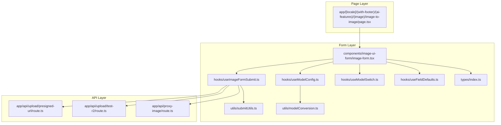
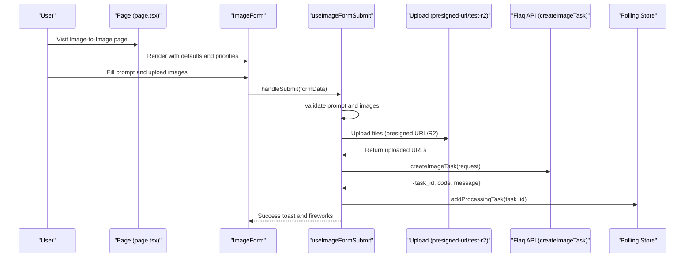
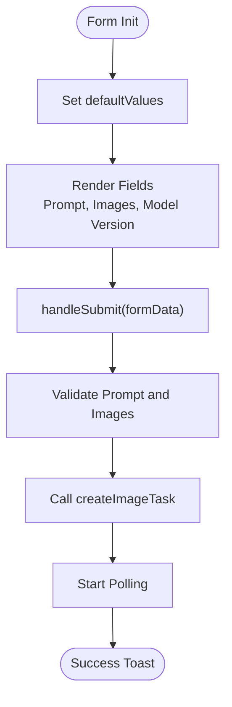
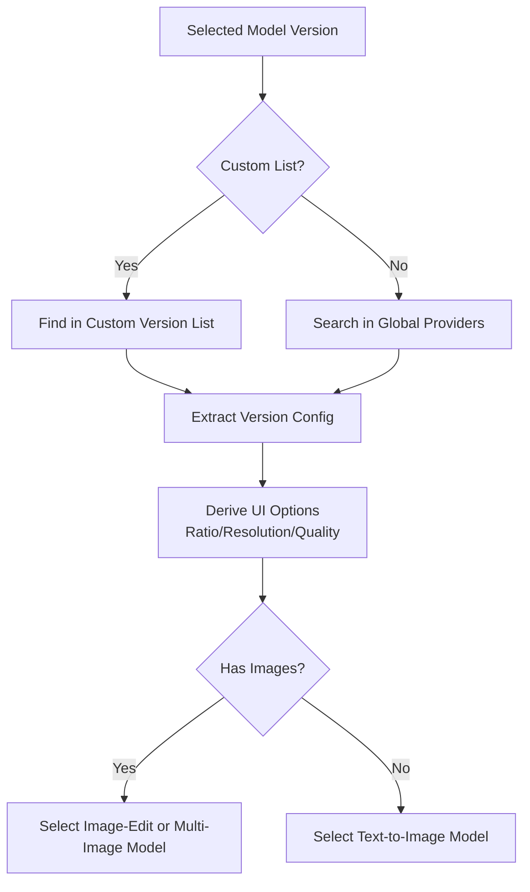
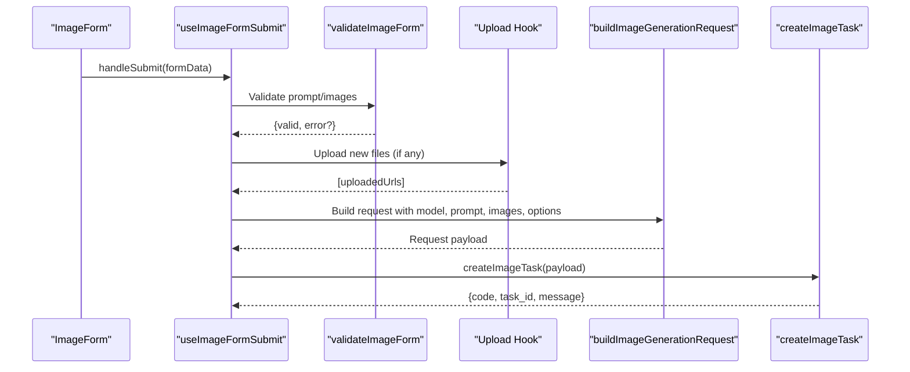
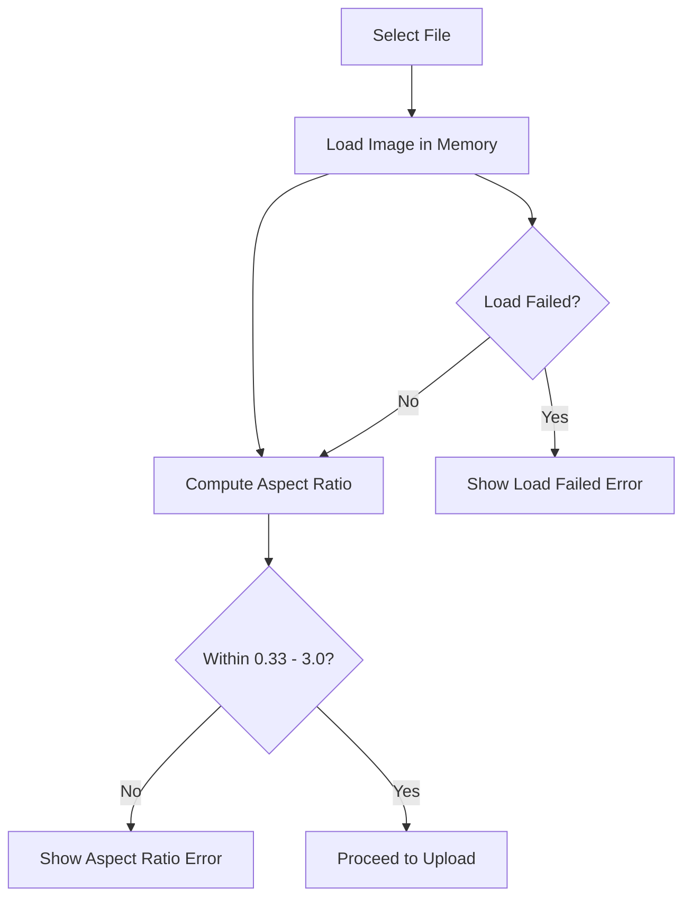
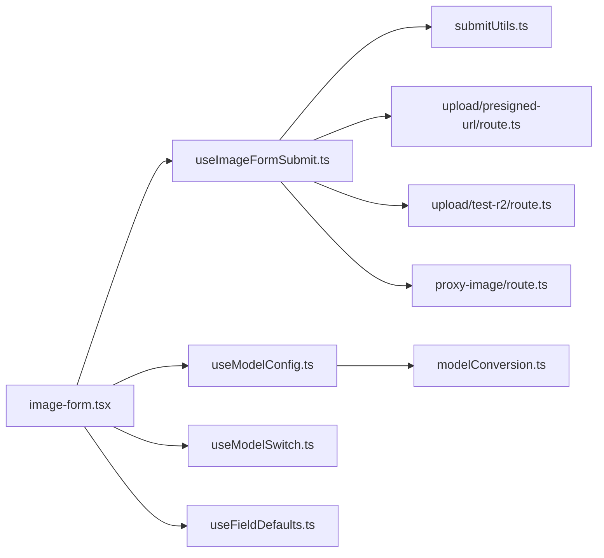

# Image-to-Image Transformer

<cite>
**Referenced Files in This Document**
- [README.md](file://README.md)
- [page.tsx](file://app/[locale]/(with-footer)/(ai-features)/(image)/image-to-image/page.tsx)
- [image-form.tsx](file://components/image-ui-form/image-form.tsx)
- [hooks/index.ts](file://components/image-ui-form/hooks/index.ts)
- [useImageFormSubmit.ts](file://components/image-ui-form/hooks/useImageFormSubmit.ts)
- [useModelConfig.ts](file://components/image-ui-form/hooks/useModelConfig.ts)
- [useModelSwitch.ts](file://components/image-ui-form/hooks/useModelSwitch.ts)
- [useFieldDefaults.ts](file://components/image-ui-form/hooks/useFieldDefaults.ts)
- [types/index.ts](file://components/image-ui-form/types/index.ts)
- [modelConversion.ts](file://components/image-ui-form/utils/modelConversion.ts)
- [submitUtils.ts](file://components/image-ui-form/utils/submitUtils.ts)
- [route.ts](file://app/api/upload/presigned-url/route.ts)
- [route.ts](file://app/api/upload/test-r2/route.ts)
- [route.ts](file://app/api/proxy-image/route.ts)
</cite>

## Table of Contents
1. [Introduction](#introduction)
2. [Project Structure](#project-structure)
3. [Core Components](#core-components)
4. [Architecture Overview](#architecture-overview)
5. [Detailed Component Analysis](#detailed-component-analysis)
6. [Dependency Analysis](#dependency-analysis)
7. [Performance Considerations](#performance-considerations)
8. [Troubleshooting Guide](#troubleshooting-guide)
9. [Conclusion](#conclusion)

## Introduction
This document explains the Image-to-Image Transformer feature built with Next.js and the flaq.ai SaaS template. It covers the AI-powered image modification and enhancement workflow, including the upload interface, effect selection system, adjustment controls, and the processing pipeline from upload to result delivery. It also documents the ImageForm component adaptation for image-based inputs, file validation, preview system functionality, and download options. Practical examples of common transformation effects, parameter adjustment techniques, and quality optimization strategies are included, along with guidance on file size/format limits, progress tracking, and integration with AWS S3-compatible storage.

## Project Structure
The Image-to-Image Transformer is implemented as a dedicated page that renders the ImageForm component and passes configuration for default values, priorities, and model selection. Supporting hooks manage model configuration, submission logic, validation, and field defaults. Utility modules assist with request building and image validation. API routes handle presigned URL generation, R2 uploads, and image proxying.

**Diagram sources**
- [page.tsx](file://app/[locale]/(with-footer)/(ai-features)/(image)/image-to-image/page.tsx#L50-L63)
- [image-form.tsx:144-153](file://components/image-ui-form/image-form.tsx#L144-L153)
- [useImageFormSubmit.ts:57-244](file://components/image-ui-form/hooks/useImageFormSubmit.ts#L57-L244)
- [useModelConfig.ts:14-93](file://components/image-ui-form/hooks/useModelConfig.ts#L14-L93)
- [useModelSwitch.ts:16-48](file://components/image-ui-form/hooks/useModelSwitch.ts#L16-L48)
- [useFieldDefaults.ts:11-79](file://components/image-ui-form/hooks/useFieldDefaults.ts#L11-L79)
- [types/index.ts:24-107](file://components/image-ui-form/types/index.ts#L24-L107)
- [submitUtils.ts:70-94](file://components/image-ui-form/utils/submitUtils.ts#L70-L94)
- [modelConversion.ts:7-23](file://components/image-ui-form/utils/modelConversion.ts#L7-L23)
- [route.ts](file://app/api/upload/presigned-url/route.ts)
- [route.ts](file://app/api/upload/test-r2/route.ts)
- [route.ts](file://app/api/proxy-image/route.ts)

**Section sources**
- [README.md:1-3](file://README.md#L1-L3)
- [page.tsx](file://app/[locale]/(with-footer)/(ai-features)/(image)/image-to-image/page.tsx#L50-L63)

## Core Components
- ImageForm: The primary UI component that renders the form, handles validation, and orchestrates submission via hooks. It initializes default values, exposes prompt and image inputs, and integrates with model configuration and field reset logic.
- useImageFormSubmit: Encapsulates the submission lifecycle: validation, file upload, API call, task creation, history registration, and polling initiation.
- useModelConfig: Parses model version configuration, exposes UI options (aspect ratios, resolutions, quality), and selects the appropriate model based on whether images are present.
- useModelSwitch: Detects model version switches and signals when fields need resetting to maintain consistency.
- useFieldDefaults: Computes default values for aspect ratio and resolution based on priority lists and available options.
- Types: Defines the shape of form data, props, and validation results.
- Utils: Provide request building, image validation helpers, and model conversion utilities.

Key responsibilities:
- Upload interface: Accepts File objects and URLs, supports mixed inputs, and validates aspect ratios.
- Effect selection: Chooses models based on presence of images (image-edit/multi-image-to-image) or text prompts (text-to-image).
- Adjustment controls: Exposes aspect ratio, resolution, and quality options derived from model configuration.
- Preview and download: Integrates with downstream components for result display and conversion/download.

**Section sources**
- [image-form.tsx:144-153](file://components/image-ui-form/image-form.tsx#L144-L153)
- [useImageFormSubmit.ts:57-244](file://components/image-ui-form/hooks/useImageFormSubmit.ts#L57-L244)
- [useModelConfig.ts:14-93](file://components/image-ui-form/hooks/useModelConfig.ts#L14-L93)
- [useModelSwitch.ts:16-48](file://components/image-ui-form/hooks/useModelSwitch.ts#L16-L48)
- [useFieldDefaults.ts:11-79](file://components/image-ui-form/hooks/useFieldDefaults.ts#L11-L79)
- [types/index.ts:11-107](file://components/image-ui-form/types/index.ts#L11-L107)
- [submitUtils.ts:70-94](file://components/image-ui-form/utils/submitUtils.ts#L70-L94)

## Architecture Overview
The Image-to-Image Transformer follows a modular, hook-driven architecture. The page configures defaults and priorities, the form collects user inputs, and hooks coordinate validation, uploads, and API requests. Results are tracked via a polling mechanism and surfaced through the UI.

**Diagram sources**
- [page.tsx](file://app/[locale]/(with-footer)/(ai-features)/(image)/image-to-image/page.tsx#L50-L63)
- [image-form.tsx:285-291](file://components/image-ui-form/image-form.tsx#L285-L291)
- [useImageFormSubmit.ts:77-224](file://components/image-ui-form/hooks/useImageFormSubmit.ts#L77-L224)
- [route.ts](file://app/api/upload/presigned-url/route.ts)
- [route.ts](file://app/api/upload/test-r2/route.ts)

## Detailed Component Analysis

### ImageForm Component Adaptation
- Initialization: Initializes react-hook-form with default values for prompt, images, modelVersion, aspectRatio, resolution, and quality. Defaults can be overridden by page-level props.
- Validation: Delegates to submission hook for prompt and image presence checks.
- Submission: Calls the submission hook, preventing concurrent submissions and respecting polling state.
- Rendering: Provides a structured layout for form fields, including optional prompt input, model version selector, and image upload controls.

**Diagram sources**
- [image-form.tsx:144-153](file://components/image-ui-form/image-form.tsx#L144-L153)
- [image-form.tsx:285-291](file://components/image-ui-form/image-form.tsx#L285-L291)

**Section sources**
- [image-form.tsx:144-153](file://components/image-ui-form/image-form.tsx#L144-L153)
- [image-form.tsx:285-291](file://components/image-ui-form/image-form.tsx#L285-L291)

### Model Configuration and Selection
- Version Config Parsing: Retrieves model version configuration from either a custom list or the global provider registry.
- UI Options: Extracts available aspect ratios, resolutions, and quality options; determines whether image input is supported and the maximum number of images allowed.
- Model Selection: Chooses an image-edit or multi-image-to-image model when images are present; otherwise selects a text-to-image model.

**Diagram sources**
- [useModelConfig.ts:21-86](file://components/image-ui-form/hooks/useModelConfig.ts#L21-L86)

**Section sources**
- [useModelConfig.ts:14-93](file://components/image-ui-form/hooks/useModelConfig.ts#L14-L93)

### Submission Pipeline and Validation
- Validation: Enforces prompt presence and image upload requirements depending on configuration. Supports both standard and product modes (subject + object images).
- File Upload: Handles mixed File and URL inputs, uploading new files while preserving existing URLs. Uses the upload hook to integrate with backend storage.
- Request Building: Constructs the request payload with model name, prompt, width/height derived from aspect ratio, image URL list, resolution, and quality. Filters out empty fields.
- Task Creation: Calls the Flaq API to create a generation task, registers pending history, starts polling, and displays success feedback.

**Diagram sources**
- [useImageFormSubmit.ts:77-224](file://components/image-ui-form/hooks/useImageFormSubmit.ts#L77-L224)
- [submitUtils.ts:9-40](file://components/image-ui-form/utils/submitUtils.ts#L9-L40)
- [submitUtils.ts:70-94](file://components/image-ui-form/utils/submitUtils.ts#L70-L94)

**Section sources**
- [useImageFormSubmit.ts:57-244](file://components/image-ui-form/hooks/useImageFormSubmit.ts#L57-L244)
- [submitUtils.ts:9-40](file://components/image-ui-form/utils/submitUtils.ts#L9-L40)
- [submitUtils.ts:70-94](file://components/image-ui-form/utils/submitUtils.ts#L70-L94)

### File Validation and Preview
- Aspect Ratio Validation: Validates uploaded images by loading them and checking the width/height ratio against a defined range. Emits errors for out-of-range ratios or load failures.
- Preview System: Integrates with downstream components to display results, detect image format, and enable conversions/downloads.

**Diagram sources**
- [submitUtils.ts:103-141](file://components/image-ui-form/utils/submitUtils.ts#L103-L141)

**Section sources**
- [submitUtils.ts:103-141](file://components/image-ui-form/utils/submitUtils.ts#L103-L141)

### Download Options and Result Delivery
- Result Display: Downstream components render results and support format detection and conversion. Users can choose target formats and trigger downloads.
- Integration: The submission hook registers pending history and task identifiers, enabling polling and result retrieval.

**Section sources**
- [useImageFormSubmit.ts:195-206](file://components/image-ui-form/hooks/useImageFormSubmit.ts#L195-L206)

## Dependency Analysis
The ImageForm relies on a set of cohesive hooks and utilities to implement the transformation workflow. The submission hook depends on upload utilities and API clients, while model configuration utilities derive UI options from model metadata.

**Diagram sources**
- [image-form.tsx:144-153](file://components/image-ui-form/image-form.tsx#L144-L153)
- [useImageFormSubmit.ts:57-244](file://components/image-ui-form/hooks/useImageFormSubmit.ts#L57-L244)
- [useModelConfig.ts:14-93](file://components/image-ui-form/hooks/useModelConfig.ts#L14-L93)
- [useModelSwitch.ts:16-48](file://components/image-ui-form/hooks/useModelSwitch.ts#L16-L48)
- [useFieldDefaults.ts:11-79](file://components/image-ui-form/hooks/useFieldDefaults.ts#L11-L79)
- [submitUtils.ts:70-94](file://components/image-ui-form/utils/submitUtils.ts#L70-L94)
- [modelConversion.ts:7-23](file://components/image-ui-form/utils/modelConversion.ts#L7-L23)
- [route.ts](file://app/api/upload/presigned-url/route.ts)
- [route.ts](file://app/api/upload/test-r2/route.ts)
- [route.ts](file://app/api/proxy-image/route.ts)

**Section sources**
- [hooks/index.ts:1-14](file://components/image-ui-form/hooks/index.ts#L1-L14)

## Performance Considerations
- Minimize redundant re-renders: The form uses controlled defaults and memoized selectors to avoid unnecessary recalculations.
- Efficient validation: Image aspect ratio checks are performed asynchronously and short-circuit on failure to reduce wasted work.
- Batched uploads: Mixed File and URL inputs are processed together to minimize network round trips.
- Polling optimization: Task polling is centralized and removed on submission failure to prevent resource leaks.

## Troubleshooting Guide
- Missing prompt or images: The submission hook validates prompt presence and image uploads when required. Ensure the prompt is filled and images are attached before submission.
- Model selection issues: If no suitable model is found, the submission hook displays an error. Verify the selected model version supports the intended generation type.
- Upload failures: Confirm that the upload route is reachable and credentials are configured. Review returned error messages for actionable details.
- Aspect ratio errors: If an image fails validation, adjust the image or choose another. The validator enforces a strict aspect ratio range.
- Polling not starting: Ensure the task ID is present and the polling store is initialized. Check for errors during task creation.

**Section sources**
- [useImageFormSubmit.ts:97-115](file://components/image-ui-form/hooks/useImageFormSubmit.ts#L97-L115)
- [useImageFormSubmit.ts:215-223](file://components/image-ui-form/hooks/useImageFormSubmit.ts#L215-L223)
- [submitUtils.ts:103-141](file://components/image-ui-form/utils/submitUtils.ts#L103-L141)

## Conclusion
The Image-to-Image Transformer leverages a modular, hook-driven architecture to deliver a robust image modification and enhancement workflow. From upload and validation to model selection and submission, the system ensures a smooth user experience while integrating with backend APIs and storage systems. By following the guidelines in this document—particularly around validation, parameter tuning, and quality optimization—you can effectively implement and operate the feature for real-world use cases.