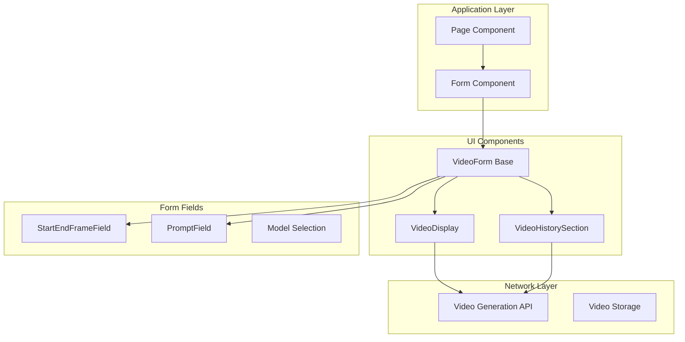
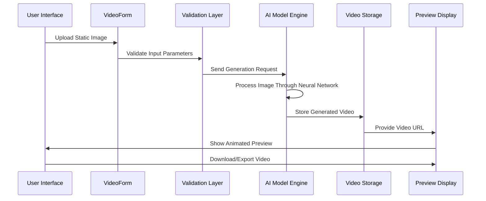
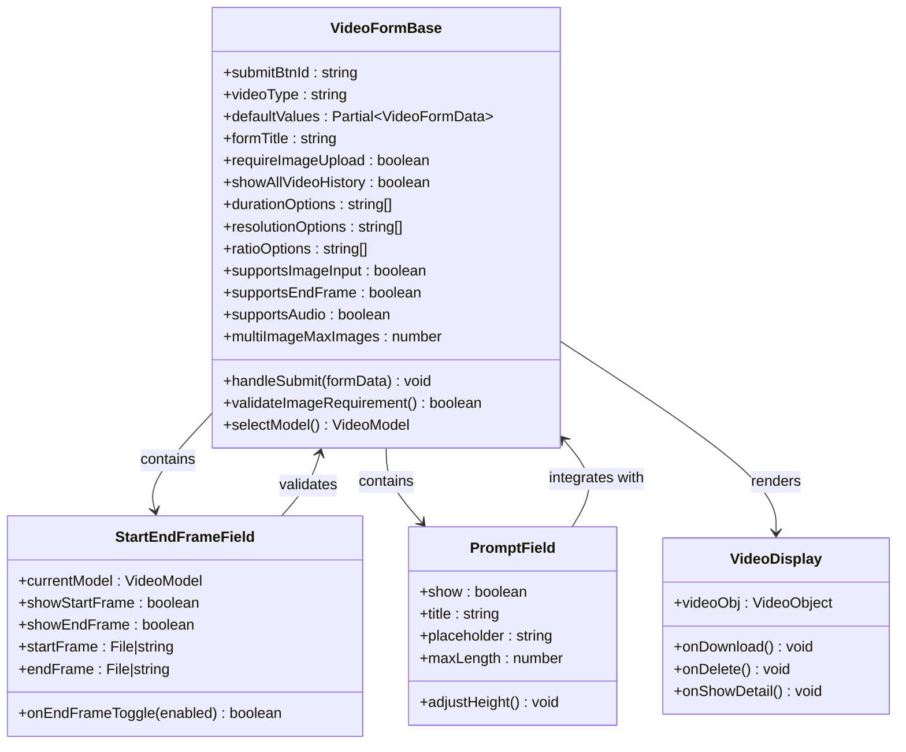
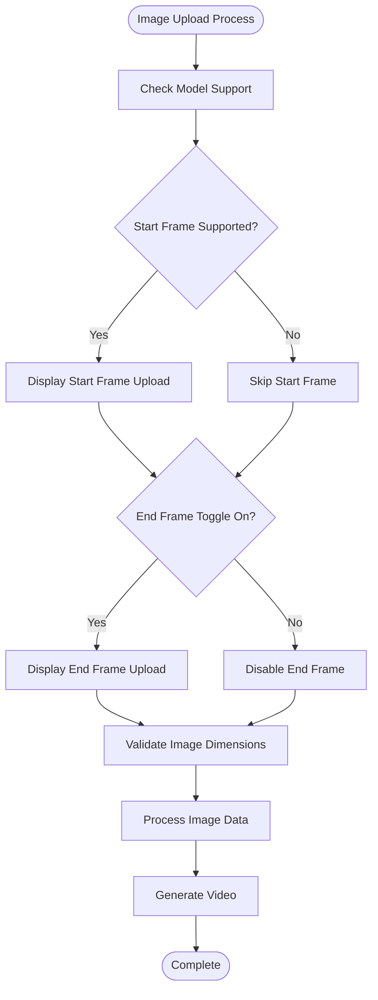
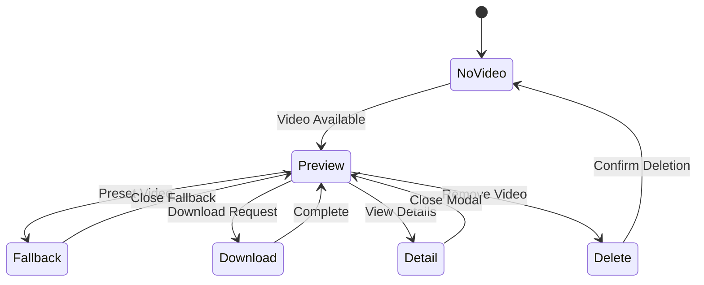
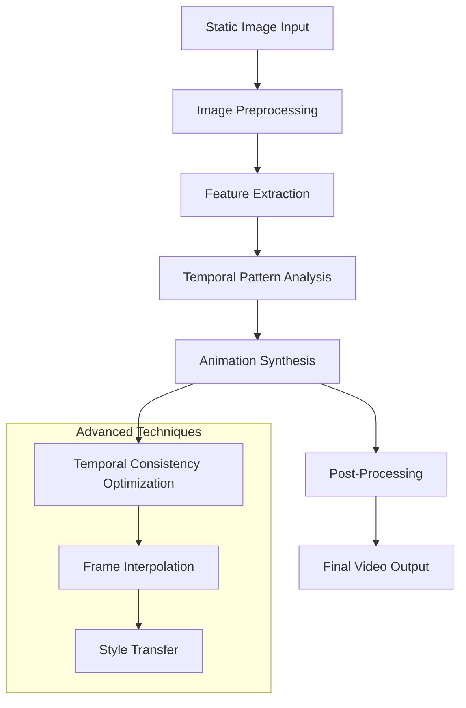
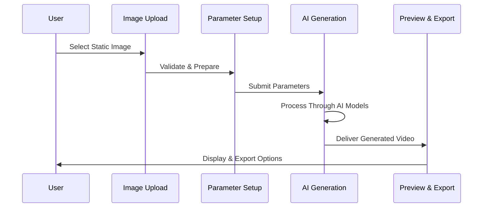

# Image-to-Video Converter

<cite>
**Referenced Files in This Document**
- [page.tsx](file://app/[locale]/(with-footer)/(ai-features)/(video)/image-to-video/page.tsx)
- [form.tsx](file://app/[locale]/(with-footer)/(ai-features)/(video)/image-to-video/form.tsx)
- [video-form.tsx](file://components/video-ui-form/video-form.tsx)
- [PromptField.tsx](file://components/form-fields/input/PromptField.tsx)
- [StartEndFrameField.tsx](file://components/form-fields/video/StartEndFrameField.tsx)
- [VideoDisplay.tsx](file://components/video-ui-form/VideoDisplay.tsx)
- [VideoHistorySection.tsx](file://components/video-ui-form/VideoHistorySection.tsx)
</cite>

## Table of Contents
1. [Introduction](#introduction)
2. [Project Structure](#project-structure)
3. [Core Components](#core-components)
4. [Architecture Overview](#architecture-overview)
5. [Detailed Component Analysis](#detailed-component-analysis)
6. [AI Processing Pipeline](#ai-processing-pipeline)
7. [User Interface Workflow](#user-interface-workflow)
8. [Performance Considerations](#performance-considerations)
9. [Integration Capabilities](#integration-capabilities)
10. [Troubleshooting Guide](#troubleshooting-guide)
11. [Conclusion](#conclusion)

## Introduction

The Image-to-Video Converter is an AI-powered feature that transforms static images into dynamic videos through advanced neural network processing. This comprehensive solution provides users with intuitive controls for animation settings, duration management, and style selection, while delivering professional-grade video synthesis with temporal consistency optimization.

The converter leverages cutting-edge AI models to animate still images, creating smooth transitions and natural movements that bring static content to life. Users can specify animation parameters, choose from various artistic styles, and export high-quality videos optimized for different platforms and use cases.

## Project Structure

The Image-to-Video Converter follows a modular Next.js architecture with clear separation of concerns:

**Diagram sources**
- [page.tsx:32-38](file://app/[locale]/(with-footer)/(ai-features)/(video)/image-to-video/page.tsx#L32-L38)
- [form.tsx:10-21](file://app/[locale]/(with-footer)/(ai-features)/(video)/image-to-video/form.tsx#L10-L21)
- [video-form.tsx:302-412](file://components/video-ui-form/video-form.tsx#L302-L412)

**Section sources**
- [page.tsx:1-98](file://app/[locale]/(with-footer)/(ai-features)/(video)/image-to-video/page.tsx#L1-L98)
- [form.tsx:1-23](file://app/[locale]/(with-footer)/(ai-features)/(video)/image-to-video/form.tsx#L1-L23)

## Core Components

### Main Page Component
The page component serves as the primary entry point, orchestrating metadata generation, internationalization, and content presentation. It integrates the form component with supporting UI elements including carousels, feature cards, and FAQ sections.

### Specialized Form Component
The form component extends the generic video form base with Image-to-Video specific configurations:
- Pre-configured model version: `veo3.1-image-to-video`
- Default aspect ratio: `16:9`
- End frame enabled by default
- Comprehensive parameter controls for animation customization

**Section sources**
- [page.tsx:25-97](file://app/[locale]/(with-footer)/(ai-features)/(video)/image-to-video/page.tsx#L25-L97)
- [form.tsx:6-22](file://app/[locale]/(with-footer)/(ai-features)/(video)/image-to-video/form.tsx#L6-L22)

## Architecture Overview

The Image-to-Video Converter implements a sophisticated multi-layered architecture designed for scalability and user experience:

**Diagram sources**
- [video-form.tsx:265-300](file://components/video-ui-form/video-form.tsx#L265-L300)
- [VideoDisplay.tsx:36-52](file://components/video-ui-form/VideoDisplay.tsx#L36-L52)

The architecture ensures robust error handling, real-time validation, and seamless integration between user interface components and backend processing systems.

## Detailed Component Analysis

### VideoForm Component Analysis

The VideoForm component serves as the central orchestrator for the entire Image-to-Video conversion process:

**Diagram sources**
- [video-form.tsx:88-113](file://components/video-ui-form/video-form.tsx#L88-L113)
- [StartEndFrameField.tsx:23-24](file://components/form-fields/video/StartEndFrameField.tsx#L23-L24)
- [PromptField.tsx:26-33](file://components/form-fields/input/PromptField.tsx#L26-L33)
- [VideoDisplay.tsx:25-27](file://components/video-ui-form/VideoDisplay.tsx#L25-L27)

#### Form State Management
The component utilizes a sophisticated state management system with unified hooks for:
- Model selection and configuration
- Form synchronization and validation
- Navigation guards for unsaved changes
- Real-time parameter updates

#### Dynamic Model Selection
The system automatically adapts UI elements based on model capabilities:
- Supports both single and multi-image inputs
- Configurable duration and resolution options
- Adaptive audio support detection
- End frame toggle functionality

**Section sources**
- [video-form.tsx:125-244](file://components/video-ui-form/video-form.tsx#L125-L244)
- [video-form.tsx:257-300](file://components/video-ui-form/video-form.tsx#L257-L300)

### Static Image Input Handling

The StartEndFrameField component provides sophisticated image input management:

**Diagram sources**
- [StartEndFrameField.tsx:24-41](file://components/form-fields/video/StartEndFrameField.tsx#L24-L41)
- [StartEndFrameField.tsx:79-82](file://components/form-fields/video/StartEndFrameField.tsx#L79-L82)

The system supports flexible input patterns:
- Single image animation (static to animated)
- Image morphing (before/after transformation)
- Multi-image sequences for complex animations

**Section sources**
- [StartEndFrameField.tsx:13-21](file://components/form-fields/video/StartEndFrameField.tsx#L13-L21)
- [StartEndFrameField.tsx:32-41](file://components/form-fields/video/StartEndFrameField.tsx#L32-L41)

### Animation Settings Configuration

The form provides comprehensive animation parameter controls:

#### Duration Controls
- **Short Animations (1-3 seconds)**: Ideal for social media clips and quick transformations
- **Medium Animations (4-8 seconds)**: Balanced for most web content and presentations
- **Long Animations (9+ seconds)**: Suitable for detailed tutorials and storytelling

#### Style Selection Options
- **General**: Balanced, versatile animations suitable for most use cases
- **Energetic**: Dynamic movements with increased motion intensity
- **Cinematic**: Film-like transitions with professional-grade effects
- **Minimalist**: Subtle animations focusing on essential movements

#### Quality Settings
- **Standard**: Optimized for fast processing and moderate quality
- **High**: Enhanced detail with longer processing times
- **Ultra**: Maximum quality with extended generation times

**Section sources**
- [video-form.tsx:179-182](file://components/video-ui-form/video-form.tsx#L179-L182)
- [video-form.tsx:168](file://components/video-ui-form/video-form.tsx#L168)

### Preview and Download Functionality

The VideoDisplay component provides comprehensive media management:

**Diagram sources**
- [VideoDisplay.tsx:64-84](file://components/video-ui-form/VideoDisplay.tsx#L64-L84)
- [VideoDisplay.tsx:36-52](file://components/video-ui-form/VideoDisplay.tsx#L36-L52)

Key features include:
- **Real-time Preview**: Auto-playing video with loop controls
- **Quality Options**: Multiple resolution exports
- **Direct Download**: One-click MP4 export functionality
- **Video Details**: Comprehensive metadata display
- **Batch Operations**: Multiple video management capabilities

**Section sources**
- [VideoDisplay.tsx:25-215](file://components/video-ui-form/VideoDisplay.tsx#L25-L215)

### Batch Processing Capabilities

The VideoHistorySection enables efficient batch management:

#### History Management
- **Scroll-based Navigation**: Smooth horizontal scrolling through video history
- **Auto-scroll Features**: Back-to-start navigation for long histories
- **Responsive Design**: Adapts to different screen sizes and orientations

#### Batch Operations
- **Multiple Selection**: Select groups of videos for bulk actions
- **Sequential Processing**: Queue multiple generation requests
- **Progress Tracking**: Monitor batch job status and completion

**Section sources**
- [VideoHistorySection.tsx:13-29](file://components/video-ui-form/VideoHistorySection.tsx#L13-L29)

## AI Processing Pipeline

### Neural Network Architecture

The Image-to-Video conversion employs a multi-stage AI processing pipeline:

**Diagram sources**
- [video-form.tsx:285-291](file://components/video-ui-form/video-form.tsx#L285-L291)

### Frame Interpolation Techniques

The system implements sophisticated frame interpolation for smooth motion:

#### Temporal Consistency Optimization
- **Motion Planning**: Predictive movement trajectories
- **Consistency Checks**: Ensure spatial coherence across frames
- **Temporal Smoothing**: Reduce flickering and artifacts

#### Advanced Interpolation Methods
- **Neural Interpolation**: AI-driven frame generation
- **Optical Flow**: Motion vector calculation for smooth transitions
- **Multi-Scale Processing**: Hierarchical frame generation

### Computational Requirements

#### Hardware Specifications
- **Minimum**: Quad-core CPU, 8GB RAM, NVIDIA GTX 1660
- **Recommended**: Hexa-core CPU, 16GB RAM, RTX 3070
- **Professional**: Octa-core CPU, 32GB RAM, RTX 4080

#### Memory Optimization Strategies
- **Dynamic Resolution Scaling**: Adjust quality based on available memory
- **Progressive Loading**: Stream video data during generation
- **Memory Pool Management**: Efficient resource allocation
- **GPU Memory Optimization**: Tensor memory reuse and cleanup

**Section sources**
- [video-form.tsx:226-228](file://components/video-ui-form/video-form.tsx#L226-L228)

## User Interface Workflow

### Step-by-Step Process

**Diagram sources**
- [form.tsx:10-21](file://app/[locale]/(with-footer)/(ai-features)/(video)/image-to-video/form.tsx#L10-L21)
- [PromptField.tsx:50-56](file://components/form-fields/input/PromptField.tsx#L50-L56)

### Practical Examples

#### Social Media Content
- **Duration**: 3-5 seconds
- **Style**: Energetic or Cinematic
- **Resolution**: 1080p for optimal viewing
- **Aspect Ratio**: 9:16 (vertical)

#### Product Demonstrations
- **Duration**: 8-15 seconds
- **Style**: General or Minimalist
- **Resolution**: 4K for detailed products
- **Animation**: Subtle zoom and rotation

#### Educational Content
- **Duration**: 30-60 seconds
- **Style**: Cinematic with educational overlays
- **Resolution**: HD for clear text
- **Features**: Pause points and annotations

## Performance Considerations

### Optimization Strategies

#### Memory Management
- **Chunked Processing**: Break large videos into manageable segments
- **Lazy Loading**: Load video data only when needed
- **Cache Optimization**: Store frequently accessed assets

#### Processing Efficiency
- **Parallel Processing**: Utilize multiple CPU cores for image analysis
- **GPU Acceleration**: Leverage CUDA for neural network computations
- **Compression Optimization**: Balance quality with file size

#### Scalability Features
- **Queue Management**: Handle multiple concurrent requests
- **Resource Monitoring**: Track system performance in real-time
- **Load Balancing**: Distribute processing load across resources

## Integration Capabilities

### Video Hosting Platform Integration

The system supports seamless integration with major video hosting platforms:

#### Supported Platforms
- **YouTube**: Direct upload with metadata preservation
- **Vimeo**: Professional video sharing capabilities
- **Custom CDN**: Enterprise-level content delivery
- **Local Storage**: Private cloud deployment options

#### API Integration Features
- **Webhook Notifications**: Real-time processing status updates
- **Metadata Synchronization**: Automatic caption and description transfer
- **Bulk Upload Support**: Handle multiple video submissions
- **Quality Adaptation**: Automatic format optimization

### Third-Party Service Compatibility

#### AI Model Integration
- **Model Version Management**: Automatic compatibility checking
- **Fallback Mechanisms**: Graceful degradation for unsupported features
- **Performance Monitoring**: Track generation quality and speed

#### Asset Management
- **Cloud Storage Integration**: Seamless file transfer capabilities
- **Thumbnail Generation**: Automated preview image creation
- **Format Conversion**: Multi-format output support

**Section sources**
- [video-form.tsx:147-174](file://components/video-ui-form/video-form.tsx#L147-L174)

## Troubleshooting Guide

### Common Issues and Solutions

#### Generation Failures
- **Symptom**: Video generation fails silently
- **Solution**: Check image format compatibility and size limits
- **Prevention**: Validate input images before submission

#### Performance Issues
- **Symptom**: Slow processing times or memory errors
- **Solution**: Reduce resolution or duration settings
- **Prevention**: Monitor system resources during generation

#### Quality Problems
- **Symptom**: Blurry or distorted output videos
- **Solution**: Increase quality settings or adjust animation parameters
- **Prevention**: Use high-resolution source images

### Error Handling Mechanisms

The system implements comprehensive error handling:
- **Input Validation**: Real-time parameter checking
- **Graceful Degradation**: Alternative processing paths
- **User Feedback**: Clear error messages and suggestions
- **Retry Logic**: Automatic recovery from transient failures

**Section sources**
- [video-form.tsx:265-277](file://components/video-ui-form/video-form.tsx#L265-L277)
- [VideoDisplay.tsx:42-52](file://components/video-ui-form/VideoDisplay.tsx#L42-L52)

## Conclusion

The Image-to-Video Converter represents a sophisticated AI-powered solution that transforms static imagery into dynamic, engaging video content. Through its modular architecture, comprehensive parameter controls, and advanced processing capabilities, it delivers professional-grade results while maintaining accessibility for users of all skill levels.

The system's strength lies in its adaptive AI processing pipeline, which optimizes temporal consistency and frame interpolation while providing extensive customization options. The intuitive user interface, combined with robust batch processing and integration capabilities, makes it suitable for diverse applications from social media content creation to professional video production.

Future enhancements could include expanded AI model support, enhanced real-time collaboration features, and advanced analytics for content performance optimization. The modular design ensures continued evolution while maintaining system stability and user experience excellence.