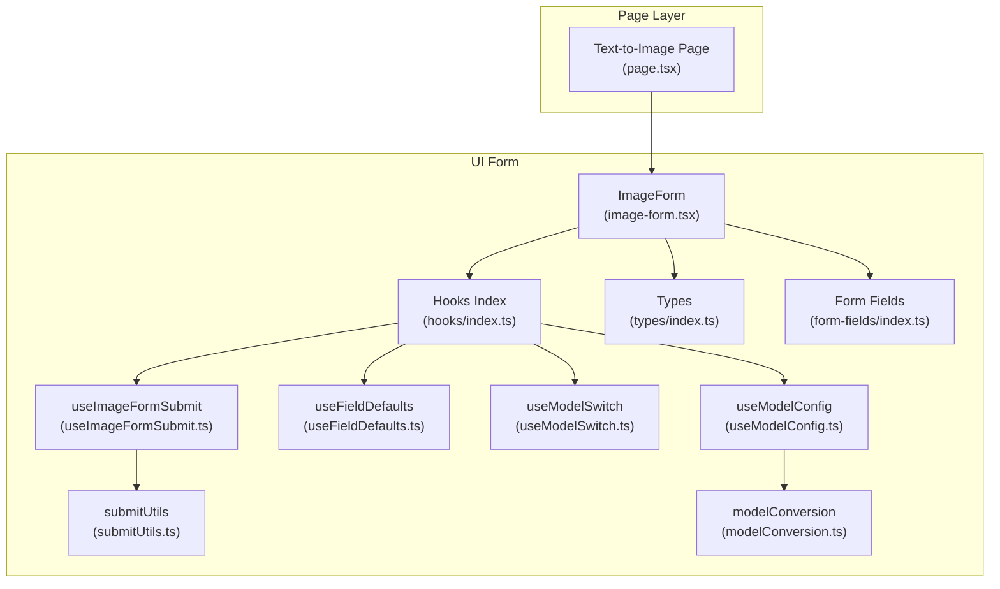
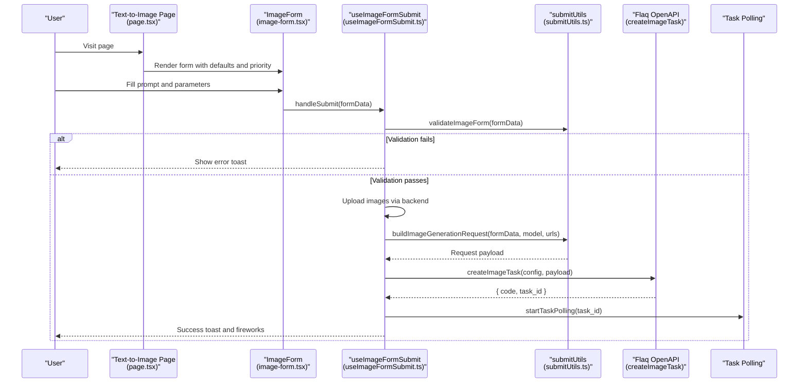
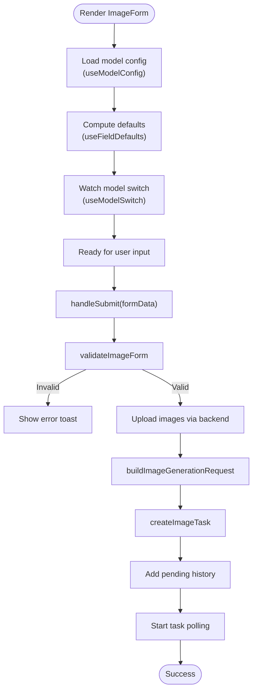
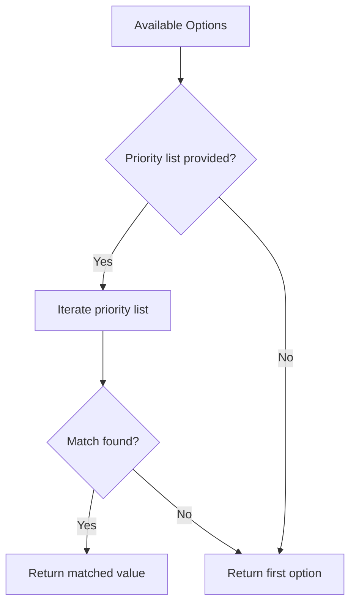
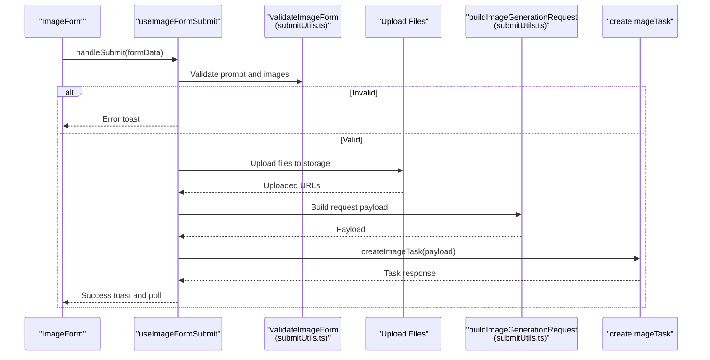
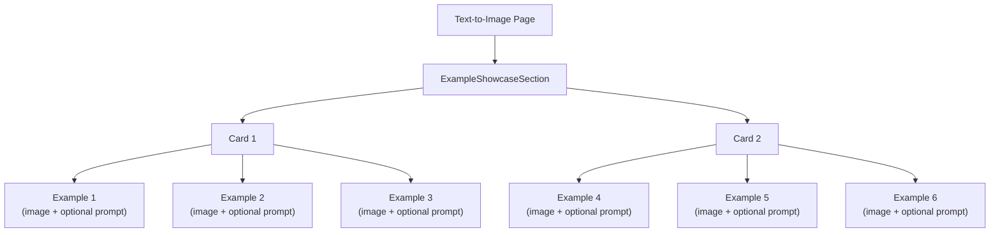
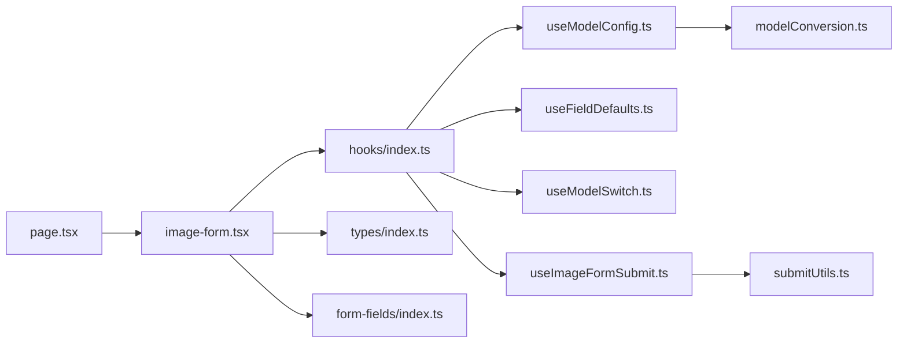

# Text-to-Image Generator

<cite>
**Referenced Files in This Document**
- [README.md](file://README.md)
- [page.tsx](file://app/[locale]/(with-footer)/(ai-features)/(image)/text-to-image/page.tsx)
- [image-form.tsx](file://components/image-ui-form/image-form.tsx)
- [index.ts](file://components/image-ui-form/hooks/index.ts)
- [useImageFormSubmit.ts](file://components/image-ui-form/hooks/useImageFormSubmit.ts)
- [useFieldDefaults.ts](file://components/image-ui-form/hooks/useFieldDefaults.ts)
- [useModelConfig.ts](file://components/image-ui-form/hooks/useModelConfig.ts)
- [useModelSwitch.ts](file://components/image-ui-form/hooks/useModelSwitch.ts)
- [submitUtils.ts](file://components/image-ui-form/utils/submitUtils.ts)
- [modelConversion.ts](file://components/image-ui-form/utils/modelConversion.ts)
- [index.ts](file://components/image-ui-form/types/index.ts)
- [index.ts](file://components/form-fields/index.ts)
</cite>

## Table of Contents
1. [Introduction](#introduction)
2. [Project Structure](#project-structure)
3. [Core Components](#core-components)
4. [Architecture Overview](#architecture-overview)
5. [Detailed Component Analysis](#detailed-component-analysis)
6. [Dependency Analysis](#dependency-analysis)
7. [Performance Considerations](#performance-considerations)
8. [Troubleshooting Guide](#troubleshooting-guide)
9. [Conclusion](#conclusion)
10. [Appendices](#appendices)

## Introduction
This document explains the Text-to-Image Generator feature built with Next.js and the flaq.ai SaaS template. It covers the AI-powered text-to-image generation workflow, including prompt input handling, aspect ratio selection, resolution settings, and quality controls. It documents the ImageForm component implementation with its form validation, default value priority system, and submission handling. It also describes the example showcase gallery featuring real-world use cases and prompt examples, along with practical guidance for prompt construction, parameter tuning, best practices, external service integration, AWS S3 asset management, and performance considerations for batch processing.

## Project Structure
The Text-to-Image feature is implemented as a page that renders the ImageForm component and displays example galleries. The ImageForm integrates multiple hooks and utilities to manage model configuration, default values, validation, and submission to the flaq.ai OpenAPI.

**Diagram sources**
- [page.tsx:76-156](file://app/[locale]/(with-footer)/(ai-features)/(image)/text-to-image/page.tsx#L76-L156)
- [image-form.tsx](file://components/image-ui-form/image-form.tsx)
- [index.ts:1-14](file://components/image-ui-form/hooks/index.ts#L1-L14)
- [useModelConfig.ts:1-94](file://components/image-ui-form/hooks/useModelConfig.ts#L1-L94)
- [useFieldDefaults.ts:1-81](file://components/image-ui-form/hooks/useFieldDefaults.ts#L1-L81)
- [useModelSwitch.ts:1-161](file://components/image-ui-form/hooks/useModelSwitch.ts#L1-L161)
- [useImageFormSubmit.ts:1-245](file://components/image-ui-form/hooks/useImageFormSubmit.ts#L1-L245)
- [submitUtils.ts:1-142](file://components/image-ui-form/utils/submitUtils.ts#L1-L142)
- [modelConversion.ts:1-24](file://components/image-ui-form/utils/modelConversion.ts#L1-L24)
- [index.ts:1-125](file://components/image-ui-form/types/index.ts#L1-L125)
- [index.ts:1-52](file://components/form-fields/index.ts#L1-L52)

**Section sources**
- [README.md:1-3](file://README.md#L1-L3)
- [page.tsx:76-156](file://app/[locale]/(with-footer)/(ai-features)/(image)/text-to-image/page.tsx#L76-L156)

## Core Components
- Text-to-Image Page: Renders the ImageForm with default values and priority rules, and displays example showcases and feature sections.
- ImageForm: A reusable form component that composes prompt input, aspect ratio, resolution, quality, and optional image uploads. It integrates with hooks for model configuration, defaults, switching, and submission.
- Hooks:
  - useModelConfig: Parses model version configuration and exposes UI options and model selection logic.
  - useFieldDefaults: Computes default aspect ratio and resolution based on priority lists.
  - useModelSwitch: Detects model version switches and signals when fields need resetting.
  - useImageFormSubmit: Handles validation, image uploads, request building, API call, and polling.
- Utilities:
  - submitUtils: Validates forms, parses aspect ratios, builds requests, and validates images.
  - modelConversion: Converts model arrays to version-config format for custom model lists.
- Types: Defines ImageFormData, ImageFormProps, validation and parsing results.

**Section sources**
- [page.tsx:11-24](file://app/[locale]/(with-footer)/(ai-features)/(image)/text-to-image/page.tsx#L11-L24)
- [page.tsx:83-89](file://app/[locale]/(with-footer)/(ai-features)/(image)/text-to-image/page.tsx#L83-L89)
- [index.ts:1-14](file://components/image-ui-form/hooks/index.ts#L1-L14)
- [useModelConfig.ts:14-93](file://components/image-ui-form/hooks/useModelConfig.ts#L14-L93)
- [useFieldDefaults.ts:11-79](file://components/image-ui-form/hooks/useFieldDefaults.ts#L11-L79)
- [useModelSwitch.ts:16-48](file://components/image-ui-form/hooks/useModelSwitch.ts#L16-L48)
- [useImageFormSubmit.ts:57-244](file://components/image-ui-form/hooks/useImageFormSubmit.ts#L57-L244)
- [submitUtils.ts:9-40](file://components/image-ui-form/utils/submitUtils.ts#L9-L40)
- [submitUtils.ts:70-94](file://components/image-ui-form/utils/submitUtils.ts#L70-L94)
- [modelConversion.ts:7-23](file://components/image-ui-form/utils/modelConversion.ts#L7-L23)
- [index.ts:11-107](file://components/image-ui-form/types/index.ts#L11-L107)

## Architecture Overview
The Text-to-Image workflow orchestrates user input, model selection, validation, image upload, request construction, and asynchronous task polling.

**Diagram sources**
- [page.tsx:76-156](file://app/[locale]/(with-footer)/(ai-features)/(image)/text-to-image/page.tsx#L76-L156)
- [useImageFormSubmit.ts:77-224](file://components/image-ui-form/hooks/useImageFormSubmit.ts#L77-L224)
- [submitUtils.ts:9-40](file://components/image-ui-form/utils/submitUtils.ts#L9-L40)
- [submitUtils.ts:70-94](file://components/image-ui-form/utils/submitUtils.ts#L70-L94)

## Detailed Component Analysis

### ImageForm Component Implementation
The ImageForm composes prompt input, aspect ratio, resolution, quality, and optional image uploads. It integrates:
- Model configuration and selection via useModelConfig.
- Default value computation via useFieldDefaults.
- Model switching and field reset via useModelSwitch.
- Submission pipeline via useImageFormSubmit.

Key behaviors:
- Prompt input is validated when enabled.
- Image uploads support both File and URL inputs.
- Request payload is built with filtered empty fields.
- On success, a pending history item is recorded and polling starts.

**Diagram sources**
- [useModelConfig.ts:20-93](file://components/image-ui-form/hooks/useModelConfig.ts#L20-L93)
- [useFieldDefaults.ts:43-74](file://components/image-ui-form/hooks/useFieldDefaults.ts#L43-L74)
- [useModelSwitch.ts:24-48](file://components/image-ui-form/hooks/useModelSwitch.ts#L24-L48)
- [useImageFormSubmit.ts:77-224](file://components/image-ui-form/hooks/useImageFormSubmit.ts#L77-L224)
- [submitUtils.ts:9-40](file://components/image-ui-form/utils/submitUtils.ts#L9-L40)
- [submitUtils.ts:70-94](file://components/image-ui-form/utils/submitUtils.ts#L70-L94)

**Section sources**
- [page.tsx:83-89](file://app/[locale]/(with-footer)/(ai-features)/(image)/text-to-image/page.tsx#L83-L89)
- [useImageFormSubmit.ts:77-224](file://components/image-ui-form/hooks/useImageFormSubmit.ts#L77-L224)
- [submitUtils.ts:70-94](file://components/image-ui-form/utils/submitUtils.ts#L70-L94)

### Default Value Priority System
The priority system selects the best default values for aspect ratio and resolution based on configured priority lists. If no priority matches, it falls back to the first available option.

**Diagram sources**
- [useFieldDefaults.ts:18-38](file://components/image-ui-form/hooks/useFieldDefaults.ts#L18-L38)
- [useModelSwitch.ts:83-103](file://components/image-ui-form/hooks/useModelSwitch.ts#L83-L103)

**Section sources**
- [useFieldDefaults.ts:18-38](file://components/image-ui-form/hooks/useFieldDefaults.ts#L18-L38)
- [useModelSwitch.ts:83-103](file://components/image-ui-form/hooks/useModelSwitch.ts#L83-L103)

### Submission Handling and Validation
Submission logic:
- Prevents concurrent submissions.
- Selects model based on presence of images.
- Validates prompt presence and image upload requirements.
- Uploads files via backend and merges existing URLs.
- Builds request payload and calls createImageTask.
- Records pending history and starts polling.

**Diagram sources**
- [useImageFormSubmit.ts:77-224](file://components/image-ui-form/hooks/useImageFormSubmit.ts#L77-L224)
- [submitUtils.ts:9-40](file://components/image-ui-form/utils/submitUtils.ts#L9-L40)
- [submitUtils.ts:70-94](file://components/image-ui-form/utils/submitUtils.ts#L70-L94)

**Section sources**
- [useImageFormSubmit.ts:77-224](file://components/image-ui-form/hooks/useImageFormSubmit.ts#L77-L224)
- [submitUtils.ts:9-40](file://components/image-ui-form/utils/submitUtils.ts#L9-L40)
- [submitUtils.ts:70-94](file://components/image-ui-form/utils/submitUtils.ts#L70-L94)

### Example Showcase Gallery
The page renders an example showcase gallery with curated images and prompts. Each card contains multiple examples with optional prompt content, enabling users to explore realistic use cases and inspiration.

**Diagram sources**
- [page.tsx:93-114](file://app/[locale]/(with-footer)/(ai-features)/(image)/text-to-image/page.tsx#L93-L114)

**Section sources**
- [page.tsx:26-65](file://app/[locale]/(with-footer)/(ai-features)/(image)/text-to-image/page.tsx#L26-L65)
- [page.tsx:93-114](file://app/[locale]/(with-footer)/(ai-features)/(image)/text-to-image/page.tsx#L93-L114)

## Dependency Analysis
The ImageForm relies on a modular hook architecture and shared utilities. The page supplies default values and priority rules, while hooks encapsulate model configuration, defaults, switching, and submission.

**Diagram sources**
- [page.tsx:76-156](file://app/[locale]/(with-footer)/(ai-features)/(image)/text-to-image/page.tsx#L76-L156)
- [index.ts:1-14](file://components/image-ui-form/hooks/index.ts#L1-L14)
- [useModelConfig.ts:1-94](file://components/image-ui-form/hooks/useModelConfig.ts#L1-L94)
- [useFieldDefaults.ts:1-81](file://components/image-ui-form/hooks/useFieldDefaults.ts#L1-L81)
- [useModelSwitch.ts:1-161](file://components/image-ui-form/hooks/useModelSwitch.ts#L1-L161)
- [useImageFormSubmit.ts:1-245](file://components/image-ui-form/hooks/useImageFormSubmit.ts#L1-L245)
- [submitUtils.ts:1-142](file://components/image-ui-form/utils/submitUtils.ts#L1-L142)
- [modelConversion.ts:1-24](file://components/image-ui-form/utils/modelConversion.ts#L1-L24)
- [index.ts:1-125](file://components/image-ui-form/types/index.ts#L1-L125)
- [index.ts:1-52](file://components/form-fields/index.ts#L1-L52)

**Section sources**
- [index.ts:1-14](file://components/image-ui-form/hooks/index.ts#L1-L14)
- [useModelConfig.ts:14-93](file://components/image-ui-form/hooks/useModelConfig.ts#L14-L93)
- [useFieldDefaults.ts:11-79](file://components/image-ui-form/hooks/useFieldDefaults.ts#L11-L79)
- [useModelSwitch.ts:16-48](file://components/image-ui-form/hooks/useModelSwitch.ts#L16-L48)
- [useImageFormSubmit.ts:57-244](file://components/image-ui-form/hooks/useImageFormSubmit.ts#L57-L244)
- [submitUtils.ts:1-142](file://components/image-ui-form/utils/submitUtils.ts#L1-L142)
- [modelConversion.ts:7-23](file://components/image-ui-form/utils/modelConversion.ts#L7-L23)
- [index.ts:11-107](file://components/image-ui-form/types/index.ts#L11-L107)
- [index.ts:1-52](file://components/form-fields/index.ts#L1-L52)

## Performance Considerations
- Asynchronous polling: After submission, the system starts polling for task completion to avoid blocking the UI and to handle long-running tasks efficiently.
- Batch processing: For multiple generations, leverage the polling store to track tasks and avoid redundant submissions. Consider batching requests to minimize network overhead.
- Image upload optimization: Upload files through the backend to offload client bandwidth and reduce memory pressure. Merge existing URLs with newly uploaded ones to avoid duplication.
- Request filtering: Empty fields are removed from the request payload to prevent unnecessary backend processing and potential integration errors.

[No sources needed since this section provides general guidance]

## Troubleshooting Guide
Common issues and resolutions:
- Missing prompt: When prompt input is enabled, the form validates its presence and shows an error toast if absent.
- Missing image uploads: When image upload is required, the form validates that images are provided; otherwise, it shows an error toast.
- Model selection: If no model is selected, the form shows an error toast and halts submission.
- Upload failures: Errors during upload or image validation are surfaced via toast messages.
- Polling cleanup: On submission failure, the system removes the task from the polling store to keep state consistent.

**Section sources**
- [useImageFormSubmit.ts:97-115](file://components/image-ui-form/hooks/useImageFormSubmit.ts#L97-L115)
- [useImageFormSubmit.ts:215-223](file://components/image-ui-form/hooks/useImageFormSubmit.ts#L215-L223)
- [submitUtils.ts:9-40](file://components/image-ui-form/utils/submitUtils.ts#L9-L40)

## Conclusion
The Text-to-Image Generator integrates a robust form layer with model-aware defaults, validation, and submission handling. It supports prompt-driven generation, flexible aspect ratio and resolution controls, and optional image uploads. The architecture emphasizes modularity, scalability, and user feedback through toasts and animations. The example showcase gallery provides real-world inspiration, and the underlying hooks and utilities enable efficient batch processing and reliable integration with external AI services.

[No sources needed since this section summarizes without analyzing specific files]

## Appendices

### Practical Prompt Construction and Parameter Tuning
- Effective prompts: Combine descriptive subjects, styles, lighting, and compositions. Use specific adjectives and contextual details to guide the model toward desired outcomes.
- Parameter tuning:
  - Aspect ratio: Choose ratios aligned with your output use case (e.g., 16:9 for banners, 1:1 for social posts).
  - Resolution: Prefer higher resolutions for detailed outputs; balance quality against generation time.
  - Quality: Adjust quality to meet visual fidelity needs; lower quality can speed up generation for drafts.
- Best practices:
  - Start with concise, clear prompts and iterate by adding modifiers.
  - Use consistent styles and references (artists, genres, mediums) for reproducible results.
  - For batch runs, maintain a consistent set of parameters except the prompt to compare outputs effectively.

[No sources needed since this section provides general guidance]

### Integration with External AI Services and Asset Management
- External AI services: The form submits tasks to the Flaq OpenAPI endpoint. Ensure proper configuration and credentials are provided via the client fetch utility.
- AWS S3 asset management: Images are uploaded through the backend to storage, returning URLs included in the request payload. This pattern can be adapted to S3-compatible backends by configuring the upload utility accordingly.

[No sources needed since this section provides general guidance]