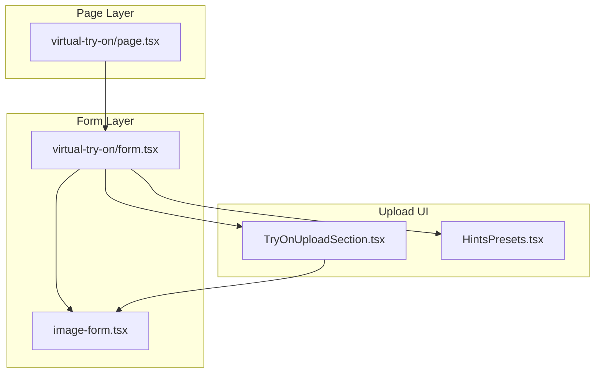
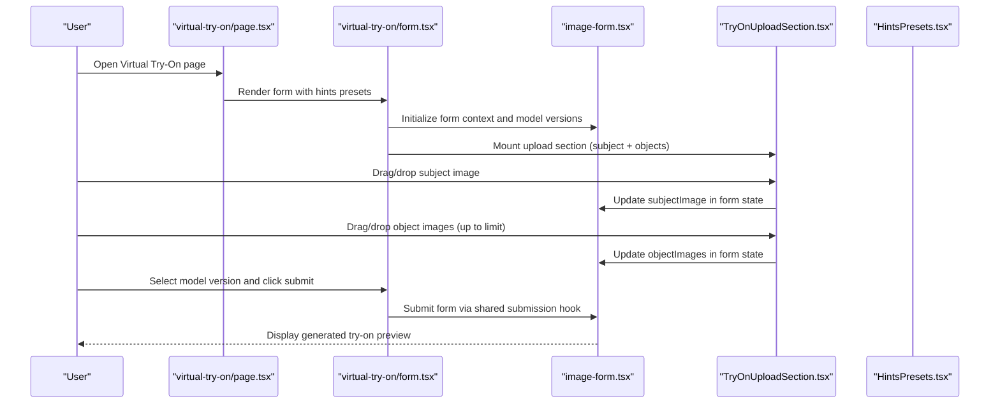
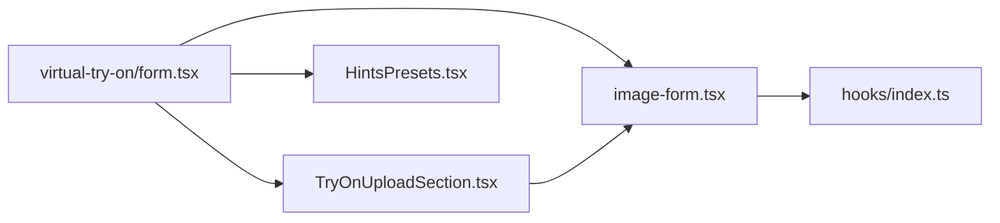

# Virtual Try-On

<cite>
**Referenced Files in This Document**
- [page.tsx](file://app/[locale]/(with-footer)/(ai-features)/(image)/virtual-try-on/page.tsx)
- [form.tsx](file://app/[locale]/(with-footer)/(ai-features)/(image)/virtual-try-on/form.tsx)
- [TryOnUploadSection.tsx](file://components/generation-modal/TryOnUploadSection.tsx)
- [HintsPresets.tsx](file://components/generation-modal/HintsPresets.tsx)
- [image-form.tsx](file://components/image-ui-form/image-form.tsx)
- [index.ts](file://components/image-ui-form/hooks/index.ts)
</cite>

## Table of Contents
1. [Introduction](#introduction)
2. [Project Structure](#project-structure)
3. [Core Components](#core-components)
4. [Architecture Overview](#architecture-overview)
5. [Detailed Component Analysis](#detailed-component-analysis)
6. [Dependency Analysis](#dependency-analysis)
7. [Performance Considerations](#performance-considerations)
8. [Troubleshooting Guide](#troubleshooting-guide)
9. [Conclusion](#conclusion)
10. [Appendices](#appendices)

## Introduction
This document explains the Virtual Try-On feature built into the SaaS template. It focuses on the AR-powered clothing visualization and fitting system, covering the try-on workflow, image upload process, body measurement input handling, fit preview functionality, specialized form components, measurement validation, size recommendation algorithms, sharing capabilities, AR/VR integration, body scanning requirements, fit accuracy optimization, privacy considerations, performance optimization for real-time previews, and e-commerce integration.

## Project Structure
The Virtual Try-On feature is organized around a dedicated page and form, with reusable UI components for uploading subject and object images, preset hints, and a generic image form framework.

**Diagram sources**
- [page.tsx](file://app/[locale]/(with-footer)/(ai-features)/(image)/virtual-try-on/page.tsx#L1-L170)
- [form.tsx](file://app/[locale]/(with-footer)/(ai-features)/(image)/virtual-try-on/form.tsx#L1-L122)
- [image-form.tsx:1-478](file://components/image-ui-form/image-form.tsx#L1-L478)
- [TryOnUploadSection.tsx:1-272](file://components/generation-modal/TryOnUploadSection.tsx#L1-L272)
- [HintsPresets.tsx:1-147](file://components/generation-modal/HintsPresets.tsx#L1-L147)

**Section sources**
- [page.tsx](file://app/[locale]/(with-footer)/(ai-features)/(image)/virtual-try-on/page.tsx#L1-L170)
- [form.tsx](file://app/[locale]/(with-footer)/(ai-features)/(image)/virtual-try-on/form.tsx#L1-L122)

## Core Components
- Virtual Try-On Page: Renders the feature page, showcases example outputs, and wires the form with preset hints.
- Virtual Try-On Form: Configures the form context, model versions, default priorities, and integrates the specialized upload section and hints presets.
- Try-On Upload Section: Manages subject and object image uploads, drag-and-drop support, preview rendering, and controlled maximum object images.
- Hints Presets: Provides curated subject-object-AI generation combinations for quick try-on experiments.
- Image Form Framework: Provides the shared form scaffolding, validation, model switching, and submission pipeline.

Key responsibilities:
- Upload handling: Accepts supported image formats, enforces maximum counts, and updates form state.
- Preview and UX: Displays previews for subject and multiple object images, supports removal and drag-and-drop.
- Model selection: Filters and prioritizes model versions suitable for editing and multi-image-to-image tasks.
- Submission: Integrates with the shared submission hook to orchestrate generation.

**Section sources**
- [page.tsx](file://app/[locale]/(with-footer)/(ai-features)/(image)/virtual-try-on/page.tsx#L1-L170)
- [form.tsx](file://app/[locale]/(with-footer)/(ai-features)/(image)/virtual-try-on/form.tsx#L1-L122)
- [TryOnUploadSection.tsx:1-272](file://components/generation-modal/TryOnUploadSection.tsx#L1-L272)
- [HintsPresets.tsx:1-147](file://components/generation-modal/HintsPresets.tsx#L1-L147)
- [image-form.tsx:1-478](file://components/image-ui-form/image-form.tsx#L1-L478)

## Architecture Overview
The Virtual Try-On feature follows a layered architecture:
- Presentation: Page and Form components define the UI and workflow.
- Upload: TryOnUploadSection encapsulates subject and object image handling.
- Hints: HintsPresets provides curated combinations to accelerate try-on creation.
- Form Engine: image-form.tsx manages form state, validation, model selection, and submission.

**Diagram sources**
- [page.tsx](file://app/[locale]/(with-footer)/(ai-features)/(image)/virtual-try-on/page.tsx#L97-L169)
- [form.tsx](file://app/[locale]/(with-footer)/(ai-features)/(image)/virtual-try-on/form.tsx#L99-L121)
- [image-form.tsx:252-291](file://components/image-ui-form/image-form.tsx#L252-L291)
- [TryOnUploadSection.tsx:53-140](file://components/generation-modal/TryOnUploadSection.tsx#L53-L140)

## Detailed Component Analysis

### Virtual Try-On Page
- Purpose: Hosts the feature page, metadata, example showcases, advantages, manual steps, use cases, and FAQ.
- Behavior: Passes curated hints presets to the form for quick-start try-ons.

Practical usage:
- Use the page to present the try-on capability to users and guide them through the workflow.
- Leverage example showcases to demonstrate typical outcomes.

**Section sources**
- [page.tsx](file://app/[locale]/(with-footer)/(ai-features)/(image)/virtual-try-on/page.tsx#L1-L170)

### Virtual Try-On Form
- Purpose: Configure the form context, model versions, default priorities, and integrate the upload section and hints presets.
- Key logic:
  - Defines allowed model versions for try-on.
  - Sets default priorities for aspect ratio, resolution, and quality.
  - Wires the upload section and hints presets.
  - Applies a standardized try-on prompt and manages preset-driven image loading.

Validation and defaults:
- Uses the shared form framework’s validation and default-value priority system.
- Ensures required image inputs are enforced during submission.

**Section sources**
- [form.tsx](file://app/[locale]/(with-footer)/(ai-features)/(image)/virtual-try-on/form.tsx#L1-L122)

### Try-On Upload Section
- Purpose: Specialized component for uploading the subject (person) and multiple clothing/object images.
- Features:
  - Subject image: Single-file upload with drag-and-drop and preview.
  - Object images: Multi-file upload with preview grid, max count enforcement, and per-item removal.
  - Controlled maximum object images to balance performance and UX.
  - Ref methods to programmatically set subject and object images for preset workflows.

Upload constraints:
- Accepted formats: jpg, png, webp.
- Max object images configurable via props.
- Toast notifications for exceeding limits.

Preview and UX:
- Displays previews immediately after upload.
- Supports clearing subject and removing individual object images.
- Keyboard accessibility for interactive elements.

**Section sources**
- [TryOnUploadSection.tsx:1-272](file://components/generation-modal/TryOnUploadSection.tsx#L1-L272)

### Hints Presets
- Purpose: Provide curated subject-object-AI generation combinations for quick try-on experiments.
- Features:
  - Hover preview of the combination layout (subject, objects, AI generation).
  - Click to load preset images into the upload section.
  - Dynamic tooltip positioning and responsive layout sizing.

Integration:
- Connects to the upload section via imperative ref to set subject and object images.
- Updates form state for prompt and object images.

**Section sources**
- [HintsPresets.tsx:1-147](file://components/generation-modal/HintsPresets.tsx#L1-L147)

### Image Form Framework
- Purpose: Shared form engine for image generation tasks, including Virtual Try-On.
- Responsibilities:
  - Form initialization with defaults and translations.
  - Model configuration parsing and UI config derivation.
  - Validation of uploaded images and submission orchestration.
  - Reset logic on model switches and configuration changes.
  - Rendering of model selection, prompt input, quality, and action area.

Try-On-specific behavior:
- Filters model versions to those supporting editing and multi-image-to-image.
- Enforces required image uploads when enabled.
- Exposes hooks for model switching and field resets.

**Section sources**
- [image-form.tsx:1-478](file://components/image-ui-form/image-form.tsx#L1-L478)
- [index.ts:1-14](file://components/image-ui-form/hooks/index.ts#L1-L14)

## Dependency Analysis
The Virtual Try-On feature depends on the shared image form framework and reusable UI components. The dependencies are intentionally decoupled to support reuse across other image generation features.

**Diagram sources**
- [form.tsx](file://app/[locale]/(with-footer)/(ai-features)/(image)/virtual-try-on/form.tsx#L1-L122)
- [image-form.tsx:1-478](file://components/image-ui-form/image-form.tsx#L1-L478)
- [TryOnUploadSection.tsx:1-272](file://components/generation-modal/TryOnUploadSection.tsx#L1-L272)
- [HintsPresets.tsx:1-147](file://components/generation-modal/HintsPresets.tsx#L1-L147)
- [index.ts:1-14](file://components/image-ui-form/hooks/index.ts#L1-L14)

**Section sources**
- [form.tsx](file://app/[locale]/(with-footer)/(ai-features)/(image)/virtual-try-on/form.tsx#L1-L122)
- [image-form.tsx:1-478](file://components/image-ui-form/image-form.tsx#L1-L478)

## Performance Considerations
- Limit object images: The upload section enforces a maximum number of object images to reduce memory and computation overhead.
- Preview URLs: Previews are created via object URLs; ensure cleanup to avoid memory leaks.
- Model filtering: Only models supporting editing and multi-image-to-image are presented, reducing unnecessary retries.
- Validation early: Validate image formats and constraints before submission to minimize backend errors.
- Debounce or throttle: Consider throttling drag-and-drop events if extended lists are supported later.
- Lazy loading: Use lazy loading for previews and tooltips to improve initial render performance.

[No sources needed since this section provides general guidance]

## Troubleshooting Guide
Common issues and resolutions:
- Exceeded maximum object images: The upload section prevents adding more than the configured limit and shows an error notification. Reduce the number of object images or adjust the limit.
- Unsupported image formats: Only jpg, png, and webp are accepted. Convert or choose another file.
- Subject image missing: The form requires a subject image for try-on. Upload a clear front-facing image of the person.
- No model selected: Ensure a model supporting editing or multi-image-to-image is chosen; otherwise, the form may not allow submission.
- Slow previews: Large images or many object images can slow down previews. Optimize image sizes and reduce object counts.

Privacy and security:
- Subject and object images are handled locally in the browser and stored temporarily as object URLs. Avoid persisting sensitive data unnecessarily.
- Prompt text is managed by the form; ensure it does not include personal data.

**Section sources**
- [TryOnUploadSection.tsx:90-122](file://components/generation-modal/TryOnUploadSection.tsx#L90-L122)
- [image-form.tsx:271-280](file://components/image-ui-form/image-form.tsx#L271-L280)

## Conclusion
The Virtual Try-On feature leverages a modular, reusable architecture to deliver an AR-powered clothing visualization experience. The specialized upload section, hints presets, and shared image form framework combine to provide a robust, extensible solution. By enforcing constraints, validating inputs, and integrating with model selection, the system supports accurate and efficient try-on previews suitable for e-commerce workflows.

[No sources needed since this section summarizes without analyzing specific files]

## Appendices

### Practical Examples of Successful Try-On Scenarios
- Scenario 1: Casual wear
  - Subject: Front-facing photo with good lighting and neutral background.
  - Objects: Multiple casual tops/shirts to compare fits.
  - Outcome: Realistic integration with natural folds and proportions.
- Scenario 2: Formal wear
  - Subject: Profile and front views captured separately.
  - Objects: Formal shirts, blazers, or dresses.
  - Outcome: Slimming and contouring effects applied while preserving pose and shape.

[No sources needed since this section provides general guidance]

### Measurement Input Best Practices
- Body scanning: Use structured light or photogrammetry to capture accurate 3D scans for precise fit.
- Standard measurements: Record bust/chest, waist, hips, inseam, sleeve length, and dress length.
- Image quality: Prefer high-resolution, well-lit photos with minimal background clutter.
- Consistency: Keep the same posture and camera distance across scans.

[No sources needed since this section provides general guidance]

### Privacy Considerations for Body Measurements
- Data minimization: Collect only necessary measurements for fit prediction.
- Consent: Clearly explain how measurements will be used and obtain explicit consent.
- Storage: Avoid storing raw scans or images longer than necessary; delete upon completion.
- Anonymization: Remove personally identifiable information from datasets.

[No sources needed since this section provides general guidance]

### Fit Accuracy Optimization
- Model selection: Choose models optimized for editing and multi-image-to-image tasks.
- Prompt engineering: Provide clear, specific prompts emphasizing proportion, pose, and fabric behavior.
- Validation: Verify previews against known standards; iterate on prompts and inputs.
- Feedback loop: Allow users to report fit issues to refine future generations.

[No sources needed since this section provides general guidance]

### Sharing Capabilities
- Shareable previews: Once generated, previews can be shared via links or embedded assets.
- Social proof: Use example showcases to demonstrate successful try-ons and build trust.

[No sources needed since this section provides general guidance]

### Integration with E-commerce Workflows
- Product catalog: Integrate object images from product galleries as try-on candidates.
- Size recommendations: Use measurement data to suggest sizes and display try-on previews.
- Checkout: Offer “Add to Cart” actions tied to selected items and validated fits.

[No sources needed since this section provides general guidance]