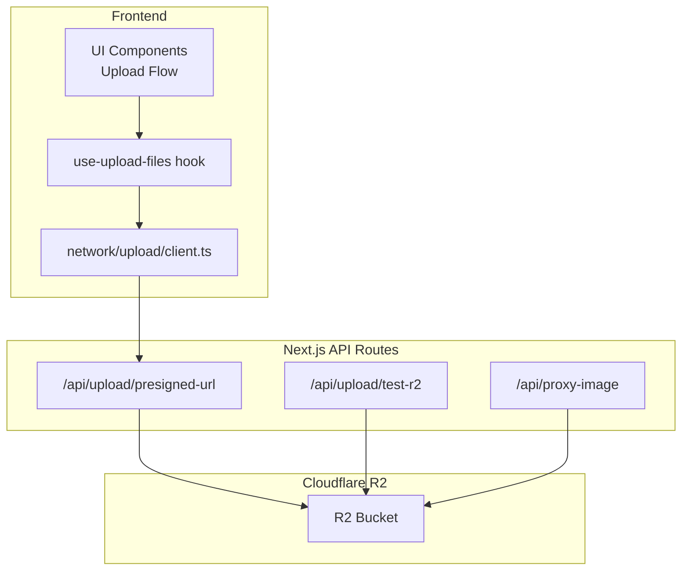
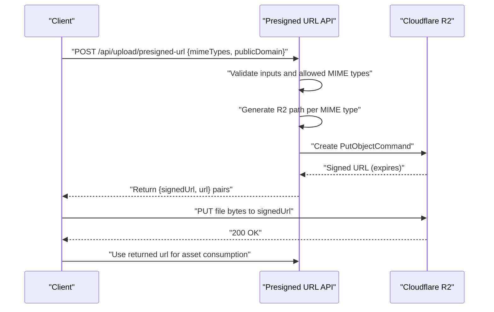
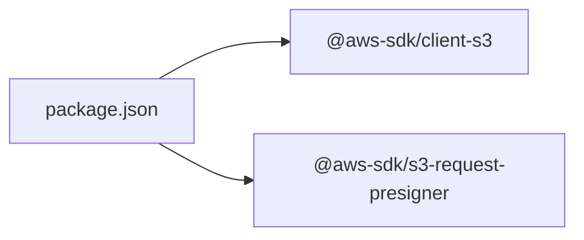

# AWS Integration

<cite>
**Referenced Files in This Document**
- [README.md](file://README.md)
- [app/api/upload/presigned-url/route.ts](file://app/api/upload/presigned-url/route.ts)
- [app/api/upload/test-r2/route.ts](file://app/api/upload/test-r2/route.ts)
- [app/api/proxy-image/route.ts](file://app/api/proxy-image/route.ts)
- [network/upload/client.ts](file://network/upload/client.ts)
- [hooks/use-upload-files.ts](file://hooks/use-upload-files.ts)
- [lib/utils/r2PathUtils.ts](file://lib/utils/r2PathUtils.ts)
- [package.json](file://package.json)
</cite>

## Table of Contents
1. [Introduction](#introduction)
2. [Project Structure](#project-structure)
3. [Core Components](#core-components)
4. [Architecture Overview](#architecture-overview)
5. [Detailed Component Analysis](#detailed-component-analysis)
6. [Dependency Analysis](#dependency-analysis)
7. [Performance Considerations](#performance-considerations)
8. [Troubleshooting Guide](#troubleshooting-guide)
9. [Conclusion](#conclusion)
10. [Appendices](#appendices)

## Introduction
This document explains the AWS-compatible S3 integration used by the Flaq SaaS Template for secure asset uploads and delivery. The implementation leverages Cloudflare R2 as the object storage backend via the AWS SDK for JavaScript. It covers SDK configuration, presigned URL generation, upload workflows, asset metadata handling, and delivery optimization. Security considerations such as IAM-like credentials, bucket endpoint configuration, and access control are addressed, along with practical guidance for error handling, performance tuning for large files, and operational monitoring.

## Project Structure
The AWS integration spans a small set of focused modules:
- API routes for generating presigned URLs and testing connectivity
- Frontend client for requesting signed URLs and uploading assets
- Utility for generating storage paths with date-based folders and hashed filenames
- A proxy route for fetching external images into the application

**Diagram sources**
- [app/api/upload/presigned-url/route.ts:1-81](file://app/api/upload/presigned-url/route.ts#L1-L81)
- [app/api/upload/test-r2/route.ts:1-55](file://app/api/upload/test-r2/route.ts#L1-L55)
- [app/api/proxy-image/route.ts:1-33](file://app/api/proxy-image/route.ts#L1-L33)
- [network/upload/client.ts:1-57](file://network/upload/client.ts#L1-L57)
- [hooks/use-upload-files.ts:1-45](file://hooks/use-upload-files.ts#L1-L45)
- [lib/utils/r2PathUtils.ts:1-47](file://lib/utils/r2PathUtils.ts#L1-L47)

**Section sources**
- [README.md:1-3](file://README.md#L1-L3)
- [package.json:22-25](file://package.json#L22-L25)

## Core Components
- Presigned URL API: Generates per-file signed URLs and final asset URLs for immediate client-side upload.
- Upload client: Requests signed URLs from the backend and performs direct uploads to R2.
- Path utility: Creates structured, date-based keys with short hashes to avoid collisions and improve organization.
- Connectivity test API: Validates R2 credentials and write permissions via a short-lived signed URL.
- Image proxy: Fetches external images and serves them with caching headers.

Key responsibilities:
- Validate allowed MIME types and enforce content type safety
- Construct R2 endpoint using account ID and bucket name
- Generate signed URLs with controlled expiration
- Upload assets directly from the browser to R2
- Provide a test endpoint to verify configuration and connectivity

**Section sources**
- [app/api/upload/presigned-url/route.ts:7-19](file://app/api/upload/presigned-url/route.ts#L7-L19)
- [app/api/upload/presigned-url/route.ts:21-35](file://app/api/upload/presigned-url/route.ts#L21-L35)
- [app/api/upload/presigned-url/route.ts:37-80](file://app/api/upload/presigned-url/route.ts#L37-L80)
- [network/upload/client.ts:29-56](file://network/upload/client.ts#L29-L56)
- [lib/utils/r2PathUtils.ts:9-26](file://lib/utils/r2PathUtils.ts#L9-L26)
- [app/api/upload/test-r2/route.ts:19-54](file://app/api/upload/test-r2/route.ts#L19-L54)
- [app/api/proxy-image/route.ts:3-32](file://app/api/proxy-image/route.ts#L3-L32)

## Architecture Overview
The upload pipeline uses a serverless, presigned URL pattern:
- The frontend requests signed URLs from the backend
- The backend validates inputs, constructs an S3-compatible client, and generates signed PUT URLs
- The frontend uploads files directly to R2 using the signed URLs
- Asset URLs are returned for downstream use

**Diagram sources**
- [app/api/upload/presigned-url/route.ts:37-80](file://app/api/upload/presigned-url/route.ts#L37-L80)
- [lib/utils/r2PathUtils.ts:9-26](file://lib/utils/r2PathUtils.ts#L9-L26)
- [network/upload/client.ts:29-56](file://network/upload/client.ts#L29-L56)

## Detailed Component Analysis

### Presigned URL Generation API
Responsibilities:
- Validate request payload (mimeTypes array and publicDomain)
- Enforce allowed MIME types
- Build R2 endpoint using environment-provided account ID
- Generate per-MIME path and signed URL with 1-hour expiry
- Return both the signed URL for upload and the final asset URL

Security and correctness:
- Uses a fixed set of allowed MIME types to prevent arbitrary uploads
- Requires bucket name and credentials to be present
- Constructs a domain-aware final URL for client-side consumption

Operational notes:
- Expiration is set to 1 hour; adjust as needed for your workflow
- Paths are generated with date-based folders and short hashes

**Section sources**
- [app/api/upload/presigned-url/route.ts:7-19](file://app/api/upload/presigned-url/route.ts#L7-L19)
- [app/api/upload/presigned-url/route.ts:21-35](file://app/api/upload/presigned-url/route.ts#L21-L35)
- [app/api/upload/presigned-url/route.ts:37-80](file://app/api/upload/presigned-url/route.ts#L37-L80)

### Upload Client and Hook
Responsibilities:
- Request signed URLs from the backend
- Perform direct uploads to R2 using the signed URLs
- Aggregate final asset URLs for downstream use

Error handling:
- Throws descriptive errors if called outside the browser or if the public domain is missing
- Propagates HTTP errors from the backend with meaningful messages

Concurrency:
- Uploads are executed concurrently for multiple files

**Section sources**
- [network/upload/client.ts:29-56](file://network/upload/client.ts#L29-L56)
- [hooks/use-upload-files.ts:6-42](file://hooks/use-upload-files.ts#L6-L42)

### Path Generation Utility
Responsibilities:
- Generate date-based storage paths with daily granularity
- Produce a short cryptographic hash to minimize collisions
- Map MIME types to appropriate file extensions

Design rationale:
- Daily folders aid in lifecycle and cleanup strategies
- Short hash reduces key length while maintaining uniqueness
- MIME-to-extension mapping ensures correct file extensions

**Section sources**
- [lib/utils/r2PathUtils.ts:9-26](file://lib/utils/r2PathUtils.ts#L9-L26)
- [lib/utils/r2PathUtils.ts:31-46](file://lib/utils/r2PathUtils.ts#L31-L46)

### Connectivity Test API
Responsibilities:
- Validate R2 configuration and write permissions
- Create a temporary object key and obtain a short-lived signed URL
- Perform a quick PUT and verify success

Usage:
- Useful during deployment or settings updates to confirm connectivity

**Section sources**
- [app/api/upload/test-r2/route.ts:19-54](file://app/api/upload/test-r2/route.ts#L19-L54)

### Image Proxy API
Responsibilities:
- Fetch images from external URLs and serve them through the application
- Apply long-term caching headers for immutable assets
- Return binary content with appropriate content-type

Use cases:
- Serving third-party images under your domain
- Centralizing image delivery for performance and privacy

**Section sources**
- [app/api/proxy-image/route.ts:3-32](file://app/api/proxy-image/route.ts#L3-L32)

## Dependency Analysis
External dependencies involved in AWS-compatible S3 integration:
- @aws-sdk/client-s3: S3-compatible client for R2
- @aws-sdk/s3-request-presigner: Presigner for generating signed URLs

These are declared in the project’s package manifest.

**Diagram sources**
- [package.json:22-25](file://package.json#L22-L25)

**Section sources**
- [package.json:22-25](file://package.json#L22-L25)

## Performance Considerations
- Upload concurrency: The hook uploads multiple files concurrently. For very large batches, consider batching to reduce memory pressure and improve stability.
- Large file uploads: For large assets, prefer multipart uploads. The current implementation uses single-part uploads via signed URLs. If needed, extend the backend to support multipart pre-signing and completion.
- Network resilience: The upload client uses a retry utility. Configure retry count and backoff based on observed network conditions.
- CDN and caching: Serve assets via a CDN or R2’s global edge. The proxy route sets long cache headers for immutable content.
- Content-type enforcement: Restricting MIME types prevents unnecessary conversions and ensures clients receive correct content types.

[No sources needed since this section provides general guidance]

## Troubleshooting Guide
Common issues and resolutions:
- Missing environment variables:
  - Symptoms: Backend returns a configuration error
  - Resolution: Ensure R2 credentials and bucket name are set
- Unsupported MIME type:
  - Symptoms: Validation error indicating unsupported file type
  - Resolution: Use one of the allowed MIME types
- Public domain not configured:
  - Symptoms: Client throws an error when requesting signed URLs
  - Resolution: Set the public domain in secure storage before initiating uploads
- Upload test failure:
  - Symptoms: Test endpoint reports failure
  - Resolution: Verify credentials, bucket name, and network connectivity; check R2 bucket policies and CORS settings
- Network failures:
  - Symptoms: Uploads fail intermittently
  - Resolution: Enable retries and consider exponential backoff; monitor latency and timeouts

**Section sources**
- [app/api/upload/presigned-url/route.ts:41-54](file://app/api/upload/presigned-url/route.ts#L41-L54)
- [network/upload/client.ts:35-42](file://network/upload/client.ts#L35-L42)
- [app/api/upload/test-r2/route.ts:23-25](file://app/api/upload/test-r2/route.ts#L23-L25)
- [app/api/upload/test-r2/route.ts:42-47](file://app/api/upload/test-r2/route.ts#L42-L47)

## Conclusion
The Flaq SaaS Template implements a robust, serverless S3-compatible upload pipeline using Cloudflare R2. By leveraging presigned URLs, it achieves secure, scalable uploads with minimal backend load. The design emphasizes content-type safety, structured storage paths, and straightforward connectivity verification. Extending the implementation to support multipart uploads and CDN-backed delivery further optimizes performance and reliability for AI-generated assets.

[No sources needed since this section summarizes without analyzing specific files]

## Appendices

### Security Considerations
- Credentials and endpoints:
  - R2 endpoint is constructed from the account ID; ensure only trusted environments can access the backend
  - Keep R2 credentials secret and scoped to the minimum required permissions
- Access control:
  - Use R2 bucket policies to restrict origins and IP ranges
  - Limit object ACLs to private and rely on signed URLs for access
- Transport security:
  - Enforce HTTPS for all endpoints and asset delivery
- Input validation:
  - Continue restricting MIME types and sanitizing filenames to prevent path traversal and invalid content

[No sources needed since this section provides general guidance]

### Cost Management and Lifecycle Policies
- Storage tiers:
  - Choose appropriate R2 storage classes if offered by your provider
- Lifecycle policies:
  - Archive or delete stale assets after a retention period
- Monitoring:
  - Track request counts, bandwidth, and storage usage via your provider’s metrics dashboard
- Optimization:
  - Compress assets before upload when feasible
  - Use CDN edge caching to reduce origin traffic

[No sources needed since this section provides general guidance]

### Practical Examples

- Upload workflow overview:
  - Request signed URLs for desired MIME types
  - Upload files directly to R2 using the returned signed URLs
  - Use the returned asset URLs for downstream processing or display

- Error handling for network failures:
  - Retry failed uploads with backoff
  - Surface user-friendly messages and allow reattempts

- Performance optimization for large transfers:
  - Consider multipart uploads for large files
  - Batch uploads to manage memory and concurrency
  - Use CDN for global distribution of assets

[No sources needed since this section provides general guidance]