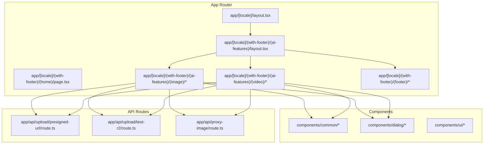
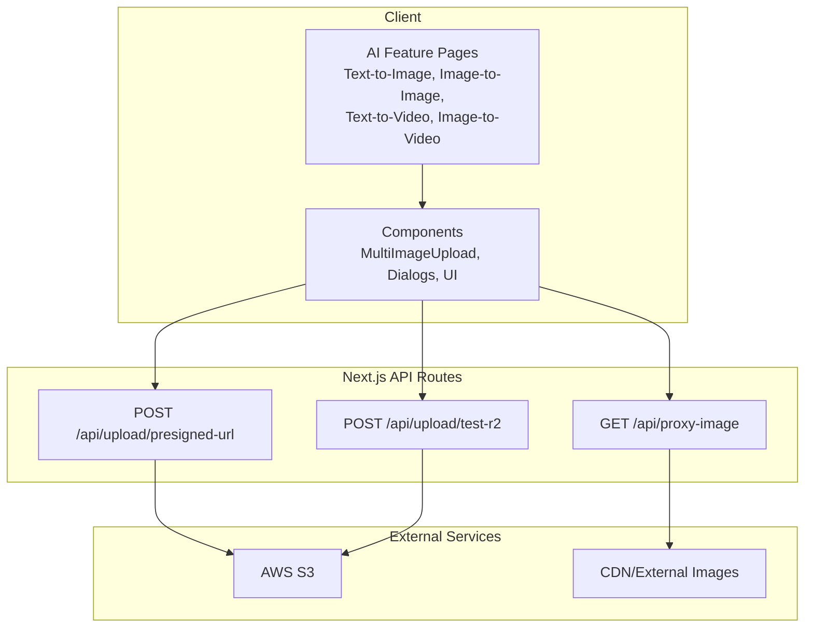
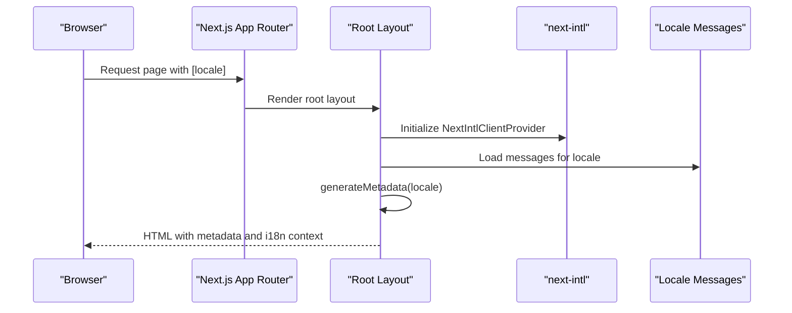
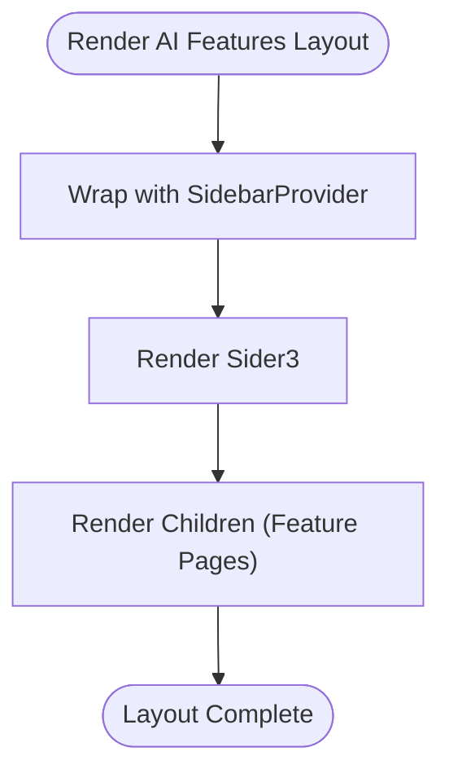
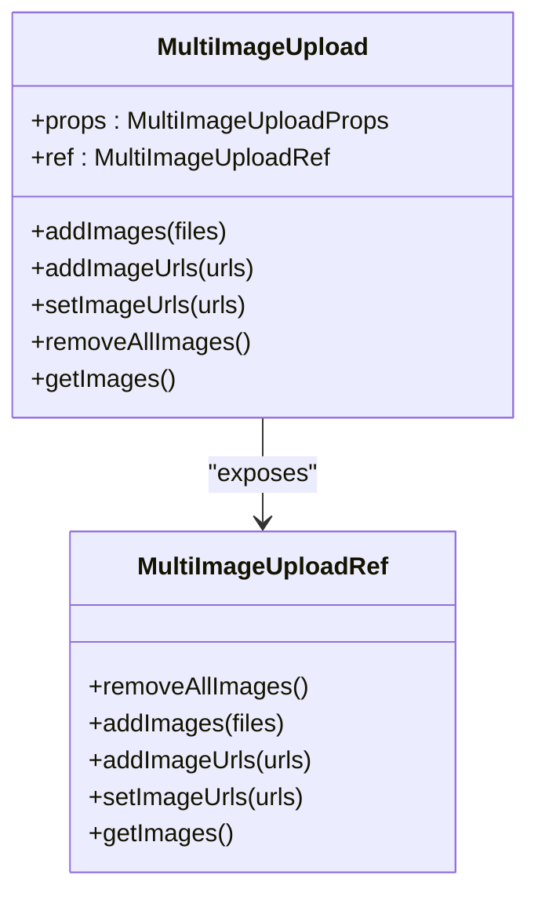
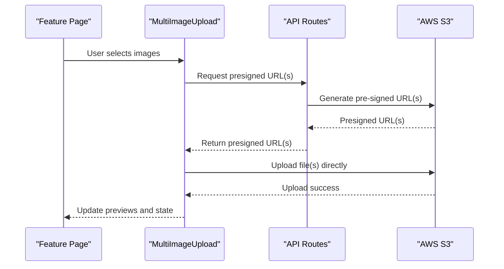
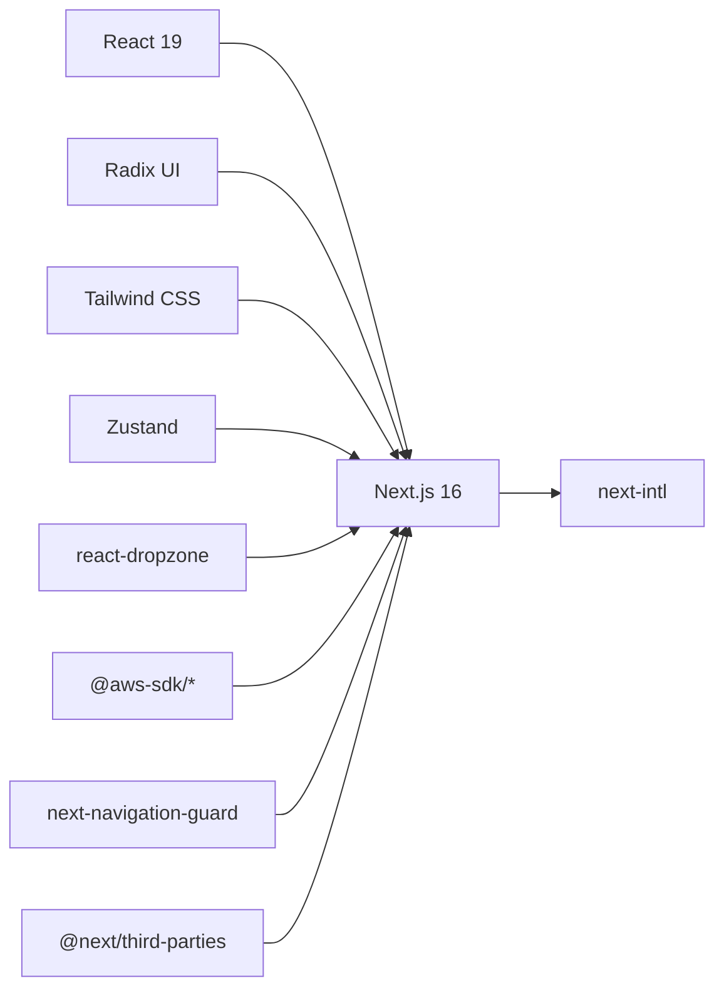

# Architecture Overview

<cite>
**Referenced Files in This Document**
- [README.md](file://README.md)
- [next.config.mjs](file://next.config.mjs)
- [package.json](file://package.json)
- [app/[locale]/layout.tsx](file://app/[locale]/layout.tsx)
- [app/[locale]/(with-footer)/(ai-features)/layout.tsx](file://app/[locale]/(with-footer)/(ai-features)/layout.tsx)
- [components/common/MultiImageUpload.tsx](file://components/common/MultiImageUpload.tsx)
- [app/api/upload/presigned-url/route.ts](file://app/api/upload/presigned-url/route.ts)
- [app/api/upload/test-r2/route.ts](file://app/api/upload/test-r2/route.ts)
- [app/api/proxy-image/route.ts](file://app/api/proxy-image/route.ts)
</cite>

## Table of Contents
1. [Introduction](#introduction)
2. [Project Structure](#project-structure)
3. [Core Components](#core-components)
4. [Architecture Overview](#architecture-overview)
5. [Detailed Component Analysis](#detailed-component-analysis)
6. [Dependency Analysis](#dependency-analysis)
7. [Performance Considerations](#performance-considerations)
8. [Troubleshooting Guide](#troubleshooting-guide)
9. [Conclusion](#conclusion)

## Introduction
This document describes the architecture of the Flaq SaaS Template, a Next.js 16 App Router–based SaaS product designed to accelerate building AIGC tools. It focuses on the route-based organization with locale-aware pages, layout hierarchies, internationalization with next-intl, and a component-based design system. It also outlines the technology stack, system boundaries, data flows for AI features, and integration patterns with AWS S3 and related services.

## Project Structure
The repository follows Next.js 16’s App Router conventions with:
- Route groups for layout scoping and navigation structure
- Locale-aware dynamic routes under [locale]
- Feature-specific pages under AI categories (image/video)
- Shared components organized by domain concerns (common, dialog, ui)
- API routes for upload workflows and image proxying

**Diagram sources**
- [app/[locale]/layout.tsx](file://app/[locale]/layout.tsx#L1-L119)
- [app/[locale]/(with-footer)/(ai-features)/layout.tsx](file://app/[locale]/(with-footer)/(ai-features)/layout.tsx#L1-L13)
- [components/common/MultiImageUpload.tsx:1-204](file://components/common/MultiImageUpload.tsx#L1-L204)
- [app/api/upload/presigned-url/route.ts](file://app/api/upload/presigned-url/route.ts)
- [app/api/upload/test-r2/route.ts](file://app/api/upload/test-r2/route.ts)
- [app/api/proxy-image/route.ts](file://app/api/proxy-image/route.ts)

**Section sources**
- [README.md:1-3](file://README.md#L1-L3)
- [next.config.mjs:1-58](file://next.config.mjs#L1-L58)
- [package.json:1-124](file://package.json#L1-L124)

## Core Components
- Internationalization and metadata: Root layout configures next-intl and generates metadata per locale, including alternate language links and Open Graph/Twitter tags.
- Layout hierarchy: A nested layout structure scopes AI features with a sidebar provider and shared footer pages.
- Component system: Reusable UI and form components (e.g., image upload) encapsulate behavior and styling, enabling consistent composition across AI features.
- Upload and proxy APIs: Dedicated API routes handle presigned URLs for AWS S3 uploads and image proxying for external assets.

Key implementation anchors:
- Root layout and metadata generation: [app/[locale]/layout.tsx](file://app/[locale]/layout.tsx#L28-L78)
- AI features layout with sidebar: [app/[locale]/(with-footer)/(ai-features)/layout.tsx](file://app/[locale]/(with-footer)/(ai-features)/layout.tsx#L1-L13)
- Multi-image upload component: [components/common/MultiImageUpload.tsx:1-204](file://components/common/MultiImageUpload.tsx#L1-L204)
- Presigned URL API: [app/api/upload/presigned-url/route.ts](file://app/api/upload/presigned-url/route.ts)
- Test R2 upload API: [app/api/upload/test-r2/route.ts](file://app/api/upload/test-r2/route.ts)
- Proxy image API: [app/api/proxy-image/route.ts](file://app/api/proxy-image/route.ts)

**Section sources**
- [app/[locale]/layout.tsx](file://app/[locale]/layout.tsx#L1-L119)
- [app/[locale]/(with-footer)/(ai-features)/layout.tsx](file://app/[locale]/(with-footer)/(ai-features)/layout.tsx#L1-L13)
- [components/common/MultiImageUpload.tsx:1-204](file://components/common/MultiImageUpload.tsx#L1-L204)
- [app/api/upload/presigned-url/route.ts](file://app/api/upload/presigned-url/route.ts)
- [app/api/upload/test-r2/route.ts](file://app/api/upload/test-r2/route.ts)
- [app/api/proxy-image/route.ts](file://app/api/proxy-image/route.ts)

## Architecture Overview
High-level system boundaries and flows:
- Frontend boundary: Next.js App Router pages and components render localized UI and orchestrate AI feature interactions.
- Backend boundary: API routes implement upload workflows and image proxying.
- External services: AWS S3 for storage and CDN-like image proxying for external resources.

**Diagram sources**
- [app/api/upload/presigned-url/route.ts](file://app/api/upload/presigned-url/route.ts)
- [app/api/upload/test-r2/route.ts](file://app/api/upload/test-r2/route.ts)
- [app/api/proxy-image/route.ts](file://app/api/proxy-image/route.ts)

## Detailed Component Analysis

### Internationalization and Metadata Pipeline
The root layout configures next-intl and generates localized metadata dynamically per locale. It sets alternate language links and canonical URLs, ensuring SEO-friendly multilingual routing.

**Diagram sources**
- [app/[locale]/layout.tsx](file://app/[locale]/layout.tsx#L28-L78)
- [app/[locale]/layout.tsx](file://app/[locale]/layout.tsx#L80-L119)

**Section sources**
- [app/[locale]/layout.tsx](file://app/[locale]/layout.tsx#L1-L119)

### AI Features Layout and Sidebar Composition
The AI features layout wraps children with a sidebar provider and renders a persistent sidebar, enabling consistent navigation and feature grouping across image and video tools.

**Diagram sources**
- [app/[locale]/(with-footer)/(ai-features)/layout.tsx](file://app/[locale]/(with-footer)/(ai-features)/layout.tsx#L1-L13)

**Section sources**
- [app/[locale]/(with-footer)/(ai-features)/layout.tsx](file://app/[locale]/(with-footer)/(ai-features)/layout.tsx#L1-L13)

### Multi-Image Upload Component
The MultiImageUpload component encapsulates drag-and-drop image selection, preview rendering, and controlled state updates. It exposes imperative methods for programmatic manipulation and integrates with internationalized labels.

**Diagram sources**
- [components/common/MultiImageUpload.tsx:24-37](file://components/common/MultiImageUpload.tsx#L24-L37)
- [components/common/MultiImageUpload.tsx:112-118](file://components/common/MultiImageUpload.tsx#L112-L118)

**Section sources**
- [components/common/MultiImageUpload.tsx:1-204](file://components/common/MultiImageUpload.tsx#L1-L204)

### Upload Workflows and AWS S3 Integration
Two primary API routes support uploads:
- Presigned URL generation for direct S3 uploads
- Test R2 endpoint for upload testing scenarios
- Proxy image endpoint for serving external images safely

**Diagram sources**
- [components/common/MultiImageUpload.tsx:100-110](file://components/common/MultiImageUpload.tsx#L100-L110)
- [app/api/upload/presigned-url/route.ts](file://app/api/upload/presigned-url/route.ts)
- [app/api/upload/test-r2/route.ts](file://app/api/upload/test-r2/route.ts)

**Section sources**
- [app/api/upload/presigned-url/route.ts](file://app/api/upload/presigned-url/route.ts)
- [app/api/upload/test-r2/route.ts](file://app/api/upload/test-r2/route.ts)
- [app/api/proxy-image/route.ts](file://app/api/proxy-image/route.ts)

## Dependency Analysis
Technology stack and module-level relationships:
- Runtime: React 19, Next.js 16, next-intl for i18n
- UI primitives: Radix UI components for accessible base widgets
- Styling: Tailwind-based design tokens and utilities
- State: Zustand for lightweight global stores
- Media: react-dropzone for drag-and-drop, browser-image-compression for optimization
- Charts and UX: Recharts, Framer Motion, Sonner, Lucide React
- AWS: @aws-sdk/client-s3 and @aws-sdk/s3-request-presigner for S3 operations
- Routing and guards: Next.js App Router, next-navigation-guard for route transitions
- Analytics and third-party integrations: @next/third-parties

**Diagram sources**
- [package.json:22-91](file://package.json#L22-L91)

**Section sources**
- [package.json:1-124](file://package.json#L1-L124)

## Performance Considerations
- Build-time and runtime optimizations:
  - Console removal in production via compiler settings
  - Trailing slash normalization for predictable routing
  - Image optimization enabled with configurable remote patterns and optional local IP allowance
- Client-side UX:
  - Lazy loading of global UI scaffolding
  - Imperative component APIs reduce re-renders by updating state efficiently
- Internationalization:
  - Preloaded messages per locale minimize hydration overhead
- Scalability:
  - API routes isolate heavy operations (presigned URL generation, proxying)
  - External CDN for images reduces origin load

**Section sources**
- [next.config.mjs:28-58](file://next.config.mjs#L28-L58)
- [app/[locale]/layout.tsx](file://app/[locale]/layout.tsx#L80-L119)
- [components/common/MultiImageUpload.tsx:1-204](file://components/common/MultiImageUpload.tsx#L1-L204)

## Troubleshooting Guide
- Image optimization issues:
  - Verify IMAGE_REMOTE_PATTERNS environment variable and ALLOW_LOCAL_IMAGE_OPTIMIZATION setting
- Upload failures:
  - Confirm AWS credentials and bucket policies for presigned URL generation
  - Validate CORS and region settings for S3/R2 endpoints
- Internationalization errors:
  - Ensure locale-specific messages are present and next-intl plugin is applied
- Navigation guard conflicts:
  - Review guard configuration and route group nesting

**Section sources**
- [next.config.mjs:5-26](file://next.config.mjs#L5-L26)
- [app/[locale]/layout.tsx](file://app/[locale]/layout.tsx#L80-L119)

## Conclusion
The Flaq SaaS Template leverages Next.js 16’s App Router to deliver a scalable, internationalized SaaS product. Its route-based organization with locale-aware pages, layered layout hierarchy, and reusable component system enable rapid iteration across AI features. The integration with AWS S3 via presigned URLs and a dedicated proxy API ensures robust media workflows. With thoughtful performance and scalability configurations, the architecture supports growth while maintaining developer productivity.