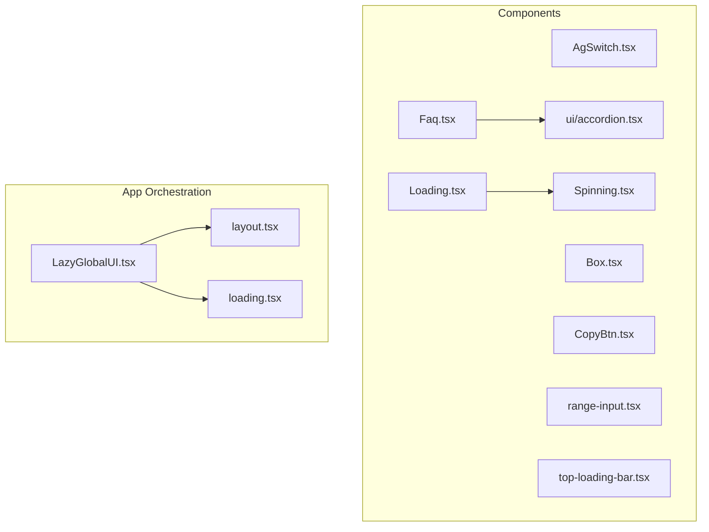
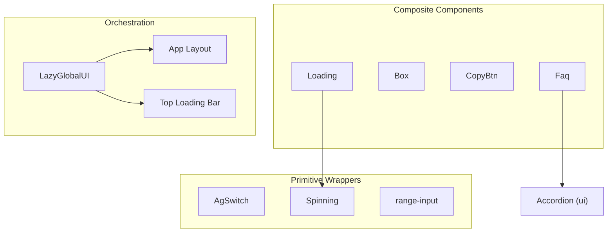
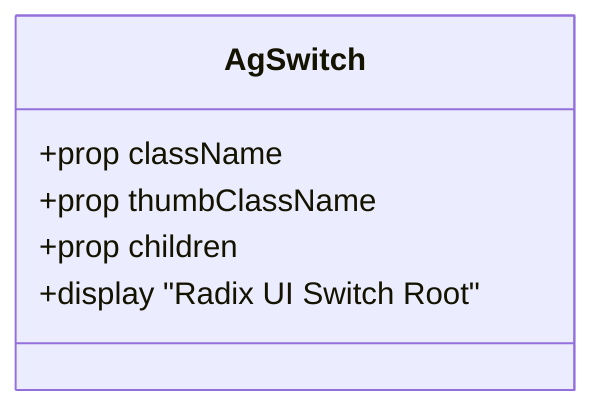
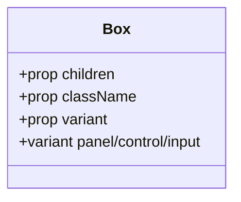
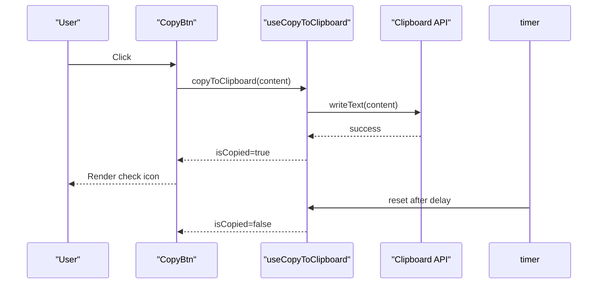
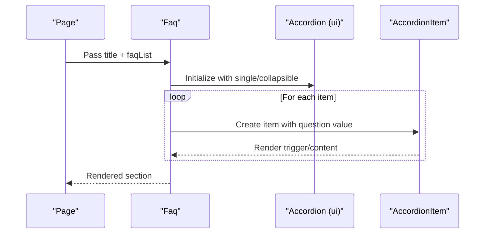
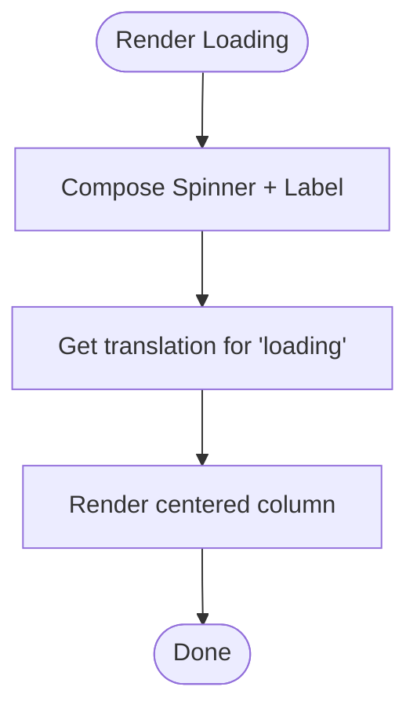
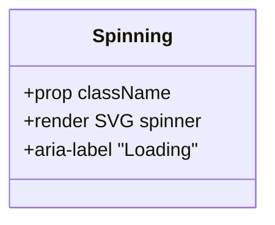
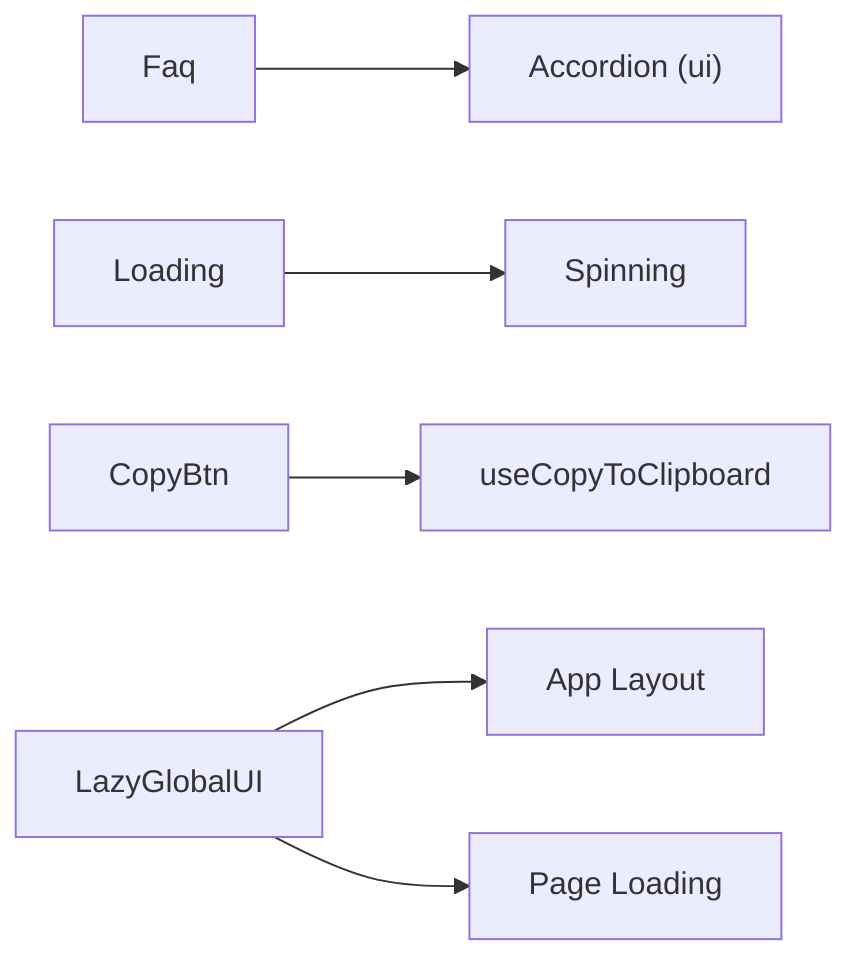

# Component Library

<cite>
**Referenced Files in This Document**
- [AgSwitch.tsx](file://components/AgSwitch.tsx)
- [Box.tsx](file://components/Box.tsx)
- [CopyBtn.tsx](file://components/CopyBtn.tsx)
- [Faq.tsx](file://components/Faq.tsx)
- [Loading.tsx](file://components/Loading.tsx)
- [Spinning.tsx](file://components/Spinning.tsx)
- [range-input.tsx](file://components/range-input.tsx)
- [top-loading-bar.tsx](file://components/top-loading-bar.tsx)
- [LazyGlobalUI.tsx](file://app/[locale]/LazyGlobalUI.tsx)
- [layout.tsx](file://app/[locale]/layout.tsx)
- [loading.tsx](file://app/[locale]/(without-footer)/loading.tsx)
- [ui/accordion.tsx](file://components/ui/accordion.tsx)
</cite>

## Table of Contents
1. [Introduction](#introduction)
2. [Project Structure](#project-structure)
3. [Core Components](#core-components)
4. [Architecture Overview](#architecture-overview)
5. [Detailed Component Analysis](#detailed-component-analysis)
6. [Dependency Analysis](#dependency-analysis)
7. [Performance Considerations](#performance-considerations)
8. [Accessibility Considerations](#accessibility-considerations)
9. [Responsive Design Implementation](#responsive-design-implementation)
10. [Customization and Styling with Tailwind CSS](#customization-and-styling-with-tailwind-css)
11. [Integration Patterns](#integration-patterns)
12. [Composition Techniques](#composition-technates)
13. [Best Practices for Extending the Component Library](#best-practices-for-extending-the-component-library)
14. [Troubleshooting Guide](#troubleshooting-guide)
15. [Conclusion](#conclusion)

## Introduction
This document describes the Component Library used in the Flaq SaaS Template. It focuses on reusable UI components and the design system, covering component architecture, shared patterns, and design tokens. It also explains the component hierarchy, including navigation, footer, sidebar, loading indicators, and dialog components. The guide covers component props, customization options, styling approaches using Tailwind CSS, and integration patterns. Practical examples, composition techniques, and best practices for extending the component library are included, along with accessibility, responsive design, and performance optimization guidance.

## Project Structure
The component library is primarily located under the components directory, with additional global UI hooks and pages that orchestrate loading and lazy initialization. The structure supports a modular, reusable design system with clear separation of concerns.

**Diagram sources**
- [AgSwitch.tsx:1-36](file://components/AgSwitch.tsx#L1-L36)
- [Box.tsx:1-22](file://components/Box.tsx#L1-L22)
- [CopyBtn.tsx:1-31](file://components/CopyBtn.tsx#L1-L31)
- [Faq.tsx:1-35](file://components/Faq.tsx#L1-L35)
- [Loading.tsx:1-17](file://components/Loading.tsx#L1-L17)
- [Spinning.tsx:1-26](file://components/Spinning.tsx#L1-L26)
- [range-input.tsx](file://components/range-input.tsx)
- [top-loading-bar.tsx](file://components/top-loading-bar.tsx)
- [ui/accordion.tsx](file://components/ui/accordion.tsx)
- [LazyGlobalUI.tsx](file://app/[locale]/LazyGlobalUI.tsx)
- [layout.tsx](file://app/[locale]/layout.tsx)
- [loading.tsx](file://app/[locale]/(without-footer)/loading.tsx)

**Section sources**
- [AgSwitch.tsx:1-36](file://components/AgSwitch.tsx#L1-L36)
- [Box.tsx:1-22](file://components/Box.tsx#L1-L22)
- [CopyBtn.tsx:1-31](file://components/CopyBtn.tsx#L1-L31)
- [Faq.tsx:1-35](file://components/Faq.tsx#L1-L35)
- [Loading.tsx:1-17](file://components/Loading.tsx#L1-L17)
- [Spinning.tsx:1-26](file://components/Spinning.tsx#L1-L26)
- [range-input.tsx](file://components/range-input.tsx)
- [top-loading-bar.tsx](file://components/top-loading-bar.tsx)
- [LazyGlobalUI.tsx](file://app/[locale]/LazyGlobalUI.tsx)
- [layout.tsx](file://app/[locale]/layout.tsx)
- [loading.tsx](file://app/[locale]/(without-footer)/loading.tsx)

## Core Components
This section highlights the primary reusable components and their roles in the design system.

- AgSwitch: A styled toggle switch built on Radix UI primitives with customizable thumb styling.
- Box: A versatile container with predefined variants for panels, controls, and inputs.
- CopyBtn: A button that copies content to the clipboard with feedback and optional delay.
- Faq: An accordion-based FAQ section using a shared accordion component.
- Loading: A composite loading indicator combining a spinner with localized text.
- Spinning: A standalone SVG spinner with accessible labeling and dark mode support.
- range-input: A slider-like numeric input component.
- top-loading-bar: A progress/loading bar positioned at the top of the viewport.

**Section sources**
- [AgSwitch.tsx:1-36](file://components/AgSwitch.tsx#L1-L36)
- [Box.tsx:1-22](file://components/Box.tsx#L1-L22)
- [CopyBtn.tsx:1-31](file://components/CopyBtn.tsx#L1-L31)
- [Faq.tsx:1-35](file://components/Faq.tsx#L1-L35)
- [Loading.tsx:1-17](file://components/Loading.tsx#L1-L17)
- [Spinning.tsx:1-26](file://components/Spinning.tsx#L1-L26)
- [range-input.tsx](file://components/range-input.tsx)
- [top-loading-bar.tsx](file://components/top-loading-bar.tsx)

## Architecture Overview
The component library follows a layered architecture:
- Primitive wrappers: Low-level components like AgSwitch and Spinning wrap accessible primitives.
- Composite components: Higher-level components like Loading combine primitives and i18n.
- Layout and orchestration: Global UI hooks and app layouts coordinate loading states and lazy initialization.

**Diagram sources**
- [AgSwitch.tsx:1-36](file://components/AgSwitch.tsx#L1-L36)
- [Spinning.tsx:1-26](file://components/Spinning.tsx#L1-L26)
- [range-input.tsx](file://components/range-input.tsx)
- [Loading.tsx:1-17](file://components/Loading.tsx#L1-L17)
- [Box.tsx:1-22](file://components/Box.tsx#L1-L22)
- [CopyBtn.tsx:1-31](file://components/CopyBtn.tsx#L1-L31)
- [Faq.tsx:1-35](file://components/Faq.tsx#L1-L35)
- [ui/accordion.tsx](file://components/ui/accordion.tsx)
- [LazyGlobalUI.tsx](file://app/[locale]/LazyGlobalUI.tsx)
- [layout.tsx](file://app/[locale]/layout.tsx)
- [top-loading-bar.tsx](file://components/top-loading-bar.tsx)

## Detailed Component Analysis

### AgSwitch
- Purpose: A toggle switch with accessible semantics and customizable thumb styling.
- Props:
  - className: Additional root class names.
  - thumbClassName: Additional class names for the thumb.
  - Other Radix UI Switch root props.
- Styling: Uses design tokens via Tailwind classes and conditional states (checked/unchecked).
- Accessibility: Inherits focus-visible ring and disabled state handling from Radix UI.

**Diagram sources**
- [AgSwitch.tsx:10-31](file://components/AgSwitch.tsx#L10-L31)

**Section sources**
- [AgSwitch.tsx:1-36](file://components/AgSwitch.tsx#L1-L36)

### Box
- Purpose: A flexible container with predefined variants for panels, controls, and inputs.
- Props:
  - children: Content to render inside the box.
  - className: Additional class names.
  - variant: One of panel, control, input.
- Styling: Variant-specific Tailwind classes define base styles; className composes overrides.

**Diagram sources**
- [Box.tsx:11-21](file://components/Box.tsx#L11-L21)

**Section sources**
- [Box.tsx:1-22](file://components/Box.tsx#L1-L22)

### CopyBtn
- Purpose: Copies content to the clipboard with visual feedback and optional delay.
- Props:
  - content: Text to copy.
  - className: Additional class names.
  - delay: Feedback duration before resetting.
- Hook integration: Uses a custom hook to manage copy state and debounce feedback.

**Diagram sources**
- [CopyBtn.tsx:8-30](file://components/CopyBtn.tsx#L8-L30)

**Section sources**
- [CopyBtn.tsx:1-31](file://components/CopyBtn.tsx#L1-L31)

### Faq
- Purpose: Renders a titled, scrollable FAQ section using an accordion component.
- Props:
  - title: Section title.
  - faqList: Array of question-answer pairs.
  - className: Additional class names.
- Composition: Uses a shared accordion component for expandable items.

**Diagram sources**
- [Faq.tsx:5-34](file://components/Faq.tsx#L5-L34)
- [ui/accordion.tsx](file://components/ui/accordion.tsx)

**Section sources**
- [Faq.tsx:1-35](file://components/Faq.tsx#L1-L35)

### Loading
- Purpose: Provides a centered loading indicator with localized label.
- Props:
  - className: Additional class names for the container.
- Composition: Wraps a spinner component and reads a translation key for the label.

**Diagram sources**
- [Loading.tsx:7-16](file://components/Loading.tsx#L7-L16)
- [Spinning.tsx:3-25](file://components/Spinning.tsx#L3-L25)

**Section sources**
- [Loading.tsx:1-17](file://components/Loading.tsx#L1-L17)
- [Spinning.tsx:1-26](file://components/Spinning.tsx#L1-L26)

### Spinning
- Purpose: A lightweight spinner with accessible labeling and dark mode support.
- Props:
  - className: Additional class names.
- Accessibility: Includes a screen-reader-only label and semantic role attributes.

**Diagram sources**
- [Spinning.tsx:3-25](file://components/Spinning.tsx#L3-L25)

**Section sources**
- [Spinning.tsx:1-26](file://components/Spinning.tsx#L1-L26)

### range-input
- Purpose: A numeric input with slider-like behavior.
- Notes: Component exists but is not analyzed further without specific implementation details.

**Section sources**
- [range-input.tsx](file://components/range-input.tsx)

### top-loading-bar
- Purpose: A top-of-viewport loading indicator.
- Notes: Component exists but is not analyzed further without specific implementation details.

**Section sources**
- [top-loading-bar.tsx](file://components/top-loading-bar.tsx)

## Dependency Analysis
The component library exhibits low coupling and high cohesion:
- Faq depends on a shared accordion component.
- Loading composes Spinning and i18n utilities.
- CopyBtn integrates a custom hook for clipboard operations.
- LazyGlobalUI orchestrates global UI behavior and integrates with app layout and page-level loading.

**Diagram sources**
- [Faq.tsx:3-3](file://components/Faq.tsx#L3-L3)
- [Loading.tsx:4-4](file://components/Loading.tsx#L4-L4)
- [CopyBtn.tsx:6-6](file://components/CopyBtn.tsx#L6-L6)
- [LazyGlobalUI.tsx](file://app/[locale]/LazyGlobalUI.tsx)
- [layout.tsx](file://app/[locale]/layout.tsx)
- [loading.tsx](file://app/[locale]/(without-footer)/loading.tsx)

**Section sources**
- [Faq.tsx:1-35](file://components/Faq.tsx#L1-L35)
- [Loading.tsx:1-17](file://components/Loading.tsx#L1-L17)
- [CopyBtn.tsx:1-31](file://components/CopyBtn.tsx#L1-L31)
- [LazyGlobalUI.tsx](file://app/[locale]/LazyGlobalUI.tsx)
- [layout.tsx](file://app/[locale]/layout.tsx)
- [loading.tsx](file://app/[locale]/(without-footer)/loading.tsx)

## Performance Considerations
- Prefer lightweight presentational components (e.g., Spinning) and compose them rather than duplicating logic.
- Use memoization and stable callbacks for frequently re-rendered components (e.g., CopyBtn).
- Defer heavy initialization to LazyGlobalUI to avoid blocking initial render.
- Keep animation durations reasonable to minimize layout thrashing.
- Avoid unnecessary re-renders by passing minimal props and using shallow comparisons where applicable.

## Accessibility Considerations
- Ensure interactive elements expose accessible names and roles (e.g., screen-reader-only labels).
- Preserve keyboard navigation and focus styles for interactive components.
- Maintain sufficient color contrast for text and controls against backgrounds.
- Provide visible focus indicators and ensure skip links where appropriate.

## Responsive Design Implementation
- Use responsive utilities (e.g., padding, spacing, typography) consistently across components.
- Favor percentage-based widths and max-width containers for adaptive layouts.
- Test components across breakpoints to ensure readability and usability.

## Customization and Styling with Tailwind CSS
- Base styles are defined per component; override via className prop to maintain composability.
- Use design tokens (colors, spacing, typography) consistently across variants.
- For stateful components (e.g., AgSwitch), leverage conditional classes for checked/unchecked states.
- Maintain a consistent palette and spacing scale to preserve visual coherence.

## Integration Patterns
- Orchestrate global UI behavior with LazyGlobalUI and integrate with app layout and page-level loading.
- Compose higher-level components from primitive wrappers for predictable behavior.
- Use shared hooks (e.g., clipboard) to reduce duplication and improve testability.

## Composition Techniques
- Build composite components (e.g., Loading) from smaller primitives (e.g., Spinning).
- Parameterize variants (e.g., Box) to encapsulate common patterns.
- Encapsulate cross-cutting concerns (e.g., i18n) at the boundary of composite components.

## Best Practices for Extending the Component Library
- Keep components small and focused with clear props contracts.
- Prefer composition over inheritance; favor wrapping primitives and sharing logic via hooks.
- Document props, variants, and accessibility behavior for discoverability.
- Add tests for critical user flows (e.g., copy-to-clipboard).
- Maintain a consistent naming scheme and folder structure for new components.

## Troubleshooting Guide
- If a component does not render correctly, verify className composition and ensure design tokens are applied.
- For i18n-related labels, confirm translation keys exist and are loaded by the internationalization provider.
- For clipboard operations, ensure browser permissions and HTTPS contexts are satisfied.
- For focus and keyboard navigation issues, inspect focus traps and ensure proper tab order.

## Conclusion
The Component Library in Flaq SaaS Template emphasizes modularity, accessibility, and composability. By leveraging primitive wrappers, shared patterns, and Tailwind-based styling, the library enables consistent UI development across the application. Following the integration patterns, composition techniques, and best practices outlined here will help maintain quality and scalability as the library evolves.