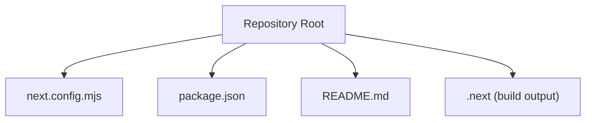
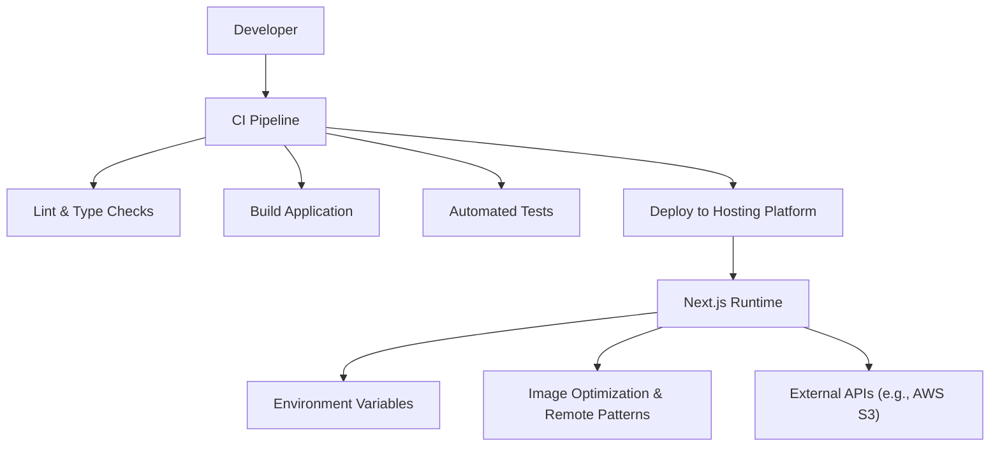
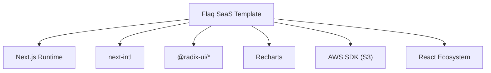

# Deployment & CI/CD

<cite>
**Referenced Files in This Document**
- [README.md](file://README.md)
- [next.config.mjs](file://next.config.mjs)
- [package.json](file://package.json)
</cite>

## Table of Contents
1. [Introduction](#introduction)
2. [Project Structure](#project-structure)
3. [Core Components](#core-components)
4. [Architecture Overview](#architecture-overview)
5. [Detailed Component Analysis](#detailed-component-analysis)
6. [Dependency Analysis](#dependency-analysis)
7. [Performance Considerations](#performance-considerations)
8. [Troubleshooting Guide](#troubleshooting-guide)
9. [Conclusion](#conclusion)
10. [Appendices](#appendices)

## Introduction
This document provides production-focused deployment and CI/CD guidance for the Flaq SaaS Template. It covers build configuration, environment variable management, deployment pipeline setup, hosting options, domain and SSL configuration, CI/CD automation, testing integration, release management, security, backups, disaster recovery, scaling, performance monitoring, and maintenance for AI-powered SaaS applications.

## Project Structure
The repository is a Next.js application configured for internationalization and optimized for production builds. Key configuration resides in the Next.js configuration file and npm scripts define the build and development lifecycle.

**Diagram sources**
- [next.config.mjs:1-58](file://next.config.mjs#L1-L58)
- [package.json:1-124](file://package.json#L1-L124)

**Section sources**
- [README.md:1-3](file://README.md#L1-L3)
- [next.config.mjs:1-58](file://next.config.mjs#L1-L58)
- [package.json:1-124](file://package.json#L1-L124)

## Core Components
- Build and runtime scripts: The project defines scripts for development, production build, start, linting, formatting, and type checking.
- Next.js configuration: Internationalization plugin integration, environment variables exposure, image optimization settings, console removal in production, and logging behavior.
- Dependencies: Includes AWS SDK clients for S3 and signing, UI libraries, charting, and React ecosystem packages.

Practical implications for deployment:
- Use the production build script to compile the application.
- Expose required environment variables at build and runtime.
- Configure image optimization and remote patterns for media delivery.
- Enable production logging and disable console logs to reduce noise.

**Section sources**
- [package.json:5-14](file://package.json#L5-L14)
- [next.config.mjs:28-55](file://next.config.mjs#L28-L55)

## Architecture Overview
The deployment architecture centers around a containerized or platform-hosted Next.js runtime. Environment variables are injected at build and runtime to configure API endpoints, site identifiers, and image optimization policies. CI/CD pipelines orchestrate linting, type checks, builds, and deployments to target platforms.

[No sources needed since this diagram shows conceptual workflow, not actual code structure]

## Detailed Component Analysis

### Build Configuration and Scripts
- Development: Starts the Next.js dev server with optional turbo mode.
- Production build: Compiles the application for production.
- Start: Runs the compiled production server.
- Quality gates: Linting, formatting, and TypeScript checks are available as scripts.

Operational guidance:
- Run lint and type checks in CI prior to building.
- Use the production build script for artifact generation.
- Ensure the runtime uses the start script for production traffic.

**Section sources**
- [package.json:5-14](file://package.json#L5-L14)

### Environment Variable Management
The Next.js configuration exposes selected environment variables to the client and controls image optimization and logging behavior. Critical variables include:
- API base URL and site identifier for client-side configuration.
- Image remote patterns and local optimization toggles for media handling.
- Logging behavior controlled by environment.

Security and operational notes:
- Avoid exposing sensitive secrets in client-side env variables.
- Use platform-managed secrets for credentials and tokens.
- Keep image remote patterns minimal and explicit.

**Section sources**
- [next.config.mjs:35-38](file://next.config.mjs#L35-L38)
- [next.config.mjs:25-26](file://next.config.mjs#L25-L26)
- [next.config.mjs:40-44](file://next.config.mjs#L40-L44)

### Image Optimization and Remote Patterns
The configuration supports:
- Parsing and validating remote image patterns from an environment variable.
- Enabling local IP image optimization only when explicitly requested.
- Unoptimized image handling and remote pattern enforcement.

Production considerations:
- Define strict remote patterns to prevent open redirect risks.
- Disable local IP optimization in production unless absolutely necessary.
- Monitor image optimization costs and CDN caching.

**Section sources**
- [next.config.mjs:5-23](file://next.config.mjs#L5-L23)
- [next.config.mjs:48-53](file://next.config.mjs#L48-L53)

### Logging and Console Behavior
- Logging includes URL visibility in development.
- Console statements are removed in production builds to reduce bundle size and noise.

Operational impact:
- Enable verbose logging during development; keep it minimal in production.
- Remove console statements to avoid leaking internal details.

**Section sources**
- [next.config.mjs:40-47](file://next.config.mjs#L40-L47)

### Internationalization Plugin Integration
- The project integrates the internationalization plugin for Next.js, enabling locale-aware routing and content.

Deployment note:
- Ensure locale assets and routing are preserved in the build artifacts.
- Validate locale-specific redirects and static generation if used.

**Section sources**
- [next.config.mjs:1-3](file://next.config.mjs#L1-L3)

## Dependency Analysis
The project relies on a modern React stack and AWS SDK for S3 operations. These dependencies influence deployment choices:
- Containerization: Use lightweight base images and multi-stage builds to minimize footprint.
- Platform selection: Platforms supporting Node.js and Next.js with static export or SSR capabilities.
- AWS integration: Configure IAM roles and bucket policies for secure S3 access.

**Diagram sources**
- [package.json:22-90](file://package.json#L22-L90)

**Section sources**
- [package.json:22-90](file://package.json#L22-L90)

## Performance Considerations
- Bundle size: Leverage production builds and console removal to reduce payload.
- Image optimization: Configure remote patterns and CDN caching for media assets.
- Logging overhead: Keep logging minimal in production to avoid I/O bottlenecks.
- Static export vs SSR: Choose the appropriate rendering strategy for your hosting platform.

[No sources needed since this section provides general guidance]

## Troubleshooting Guide
Common production issues and resolutions:
- Build failures due to TypeScript errors: Run type checks locally and fix before CI.
- Lint violations blocking deployment: Apply staged lint fixes and formatting.
- Missing environment variables: Validate CI secrets and platform environment injection.
- Image optimization errors: Confirm remote patterns and CDN accessibility.

**Section sources**
- [package.json:16-21](file://package.json#L16-L21)
- [package.json:10-14](file://package.json#L10-L14)
- [next.config.mjs:25-26](file://next.config.mjs#L25-L26)
- [next.config.mjs:48-53](file://next.config.mjs#L48-L53)

## Conclusion
The Flaq SaaS Template is structured for efficient production builds and flexible deployment. By enforcing environment variable hygiene, optimizing image handling, and integrating robust CI/CD quality gates, teams can reliably deploy and operate AI-powered SaaS experiences at scale.

[No sources needed since this section summarizes without analyzing specific files]

## Appendices

### A. Recommended CI/CD Pipeline Stages
- Prepare: Install dependencies using the project’s package manager.
- Lint & Type Check: Run lint and TypeScript checks.
- Test: Execute unit and integration tests.
- Build: Produce production artifacts using the build script.
- Security Scanning: Scan dependencies and secrets.
- Release: Tag and publish artifacts.
- Deploy: Push to target hosting platform with environment variables.

[No sources needed since this section provides general guidance]

### B. Environment Variable Reference
- NEXT_BASE_API: Base URL for backend/API endpoints.
- SITE_ID: Site identifier for analytics or tenant scoping.
- IMAGE_REMOTE_PATTERNS: Comma-separated list of allowed image hosts with optional protocol.
- ALLOW_LOCAL_IMAGE_OPTIMIZATION: Boolean flag to enable local IP image optimization.
- NODE_ENV: Controls logging and console behavior.

**Section sources**
- [next.config.mjs:35-38](file://next.config.mjs#L35-L38)
- [next.config.mjs:25-26](file://next.config.mjs#L25-L26)
- [next.config.mjs:40-44](file://next.config.mjs#L40-L44)

### C. Hosting Options and Domain Configuration
- Platform choices: Vercel, Netlify, AWS Amplify, Render, Railway, or self-hosted Kubernetes/containers.
- Domain setup: Point DNS to the platform’s CDN or load balancer; configure custom domains.
- SSL/TLS: Use platform-managed certificates or ACME automation; enforce HTTPS-only headers.

[No sources needed since this section provides general guidance]

### D. Monitoring and Observability
- Metrics: Track response times, error rates, and resource utilization.
- Logs: Centralize application logs and correlate with request IDs.
- Alerts: Set thresholds for latency, error rate, and capacity limits.

[No sources needed since this section provides general guidance]

### E. Security Considerations
- Secrets management: Store credentials and tokens in platform-managed secret stores.
- Network policies: Restrict outbound connections to trusted endpoints.
- Input validation: Sanitize user inputs and enforce rate limiting.
- Compliance: Align with SOC 2, GDPR, CCPA depending on jurisdiction.

[No sources needed since this section provides general guidance]

### F. Backup and Disaster Recovery
- Data backups: Automate database and S3 bucket snapshots.
- Recovery drills: Periodically test restore procedures.
- Multi-region: Distribute infrastructure across availability zones.

[No sources needed since this section provides general guidance]

### G. Scaling and Maintenance
- Auto-scaling: Configure CPU/memory-based autoscaling for containers or serverless.
- Blue/green or canary releases: Minimize risk during updates.
- Maintenance windows: Schedule updates during low-traffic periods.

[No sources needed since this section provides general guidance]