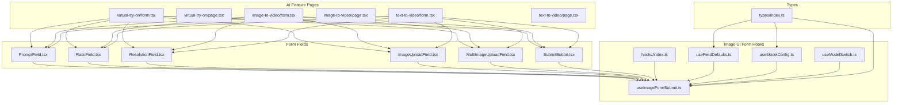
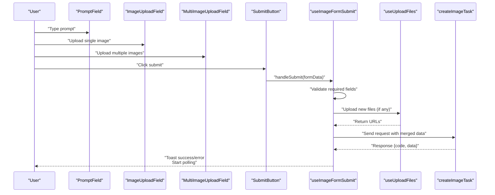
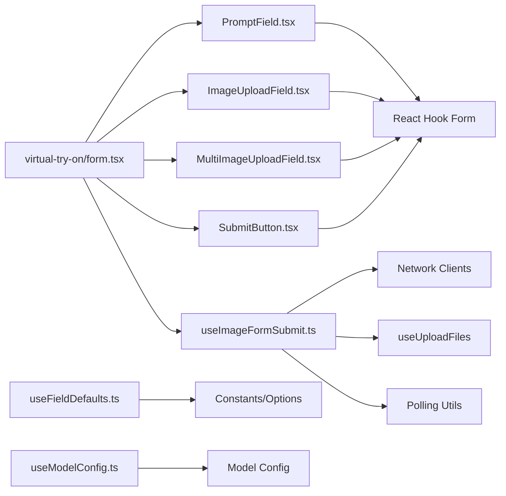

# Form Handling & Validation

<cite>
**Referenced Files in This Document**
- [README.md](file://README.md)
- [index.ts](file://components/form-fields/index.ts)
- [PromptField.tsx](file://components/form-fields/input/PromptField.tsx)
- [RatioField.tsx](file://components/form-fields/input/RatioField.tsx)
- [ResolutionField.tsx](file://components/form-fields/input/ResolutionField.tsx)
- [ImageUploadField.tsx](file://components/form-fields/upload/ImageUploadField.tsx)
- [MultiImageUploadField.tsx](file://components/form-fields/upload/MultiImageUploadField.tsx)
- [SubmitButton.tsx](file://components/form-fields/action/SubmitButton.tsx)
- [index.ts](file://components/image-ui-form/hooks/index.ts)
- [useImageFormSubmit.ts](file://components/image-ui-form/hooks/useImageFormSubmit.ts)
- [useFieldDefaults.ts](file://components/image-ui-form/hooks/useFieldDefaults.ts)
- [useModelConfig.ts](file://components/image-ui-form/hooks/useModelConfig.ts)
- [index.ts](file://components/image-ui-form/types/index.ts)
- [useModelSwitch.ts](file://components/image-ui-form/hooks/useModelSwitch.ts)
- [useFieldDefaults.ts](file://components/image-ui-form/hooks/useFieldDefaults.ts)
- [useImageFormSubmit.ts](file://components/image-ui-form/hooks/useImageFormSubmit.ts)
- [submitUtils.ts](file://components/image-ui-form/utils/submitUtils.ts)
- [modelConversion.ts](file://components/image-ui-form/utils/modelConversion.ts)
- [useVideoFormSubmit.ts](file://components/video-ui-form/hooks/useVideoFormSubmit.ts)
- [useFormSync.ts](file://components/video-ui-form/hooks/useFormSync.ts)
- [useModelSwitch.ts](file://components/video-ui-form/hooks/useModelSwitch.ts)
- [useModelToggle.ts](file://components/video-ui-form/hooks/useModelToggle.ts)
- [useVideoFormStores.ts](file://components/video-ui-form/hooks/useVideoFormStores.ts)
- [form.tsx](file://app/[locale]/(with-footer)/(ai-features)/(image)/virtual-try-on/form.tsx)
- [page.tsx](file://app/[locale]/(with-footer)/(ai-features)/(image)/virtual-try-on/page.tsx)
- [form.tsx](file://app/[locale]/(with-footer)/(ai-features)/(video)/image-to-video/form.tsx)
- [page.tsx](file://app/[locale]/(with-footer)/(ai-features)/(video)/image-to-video/page.tsx)
- [form.tsx](file://app/[locale]/(with-footer)/(ai-features)/(video)/text-to-video/form.tsx)
- [page.tsx](file://app/[locale]/(with-footer)/(ai-features)/(video)/text-to-video/page.tsx)
</cite>

## Table of Contents
1. [Introduction](#introduction)
2. [Project Structure](#project-structure)
3. [Core Components](#core-components)
4. [Architecture Overview](#architecture-overview)
5. [Detailed Component Analysis](#detailed-component-analysis)
6. [Dependency Analysis](#dependency-analysis)
7. [Performance Considerations](#performance-considerations)
8. [Troubleshooting Guide](#troubleshooting-guide)
9. [Conclusion](#conclusion)

## Introduction
This document explains the form handling and validation architecture used across AI features in the Flaq SaaS Template. It focuses on how React Hook Form integrates with Zod validation, how complex AI parameters are modeled and validated, how file uploads are handled, and how errors are surfaced and managed. It also covers accessibility, progressive enhancement, and performance optimization for form validation in AI applications.

## Project Structure
The form system is organized around reusable field components, shared hooks for submission and defaults, and per-feature form pages. The structure emphasizes modularity and reusability across image and video AI features.

**Diagram sources**
- [index.ts:1-52](file://components/form-fields/index.ts#L1-L52)
- [PromptField.tsx:1-114](file://components/form-fields/input/PromptField.tsx#L1-L114)
- [RatioField.tsx:1-31](file://components/form-fields/input/RatioField.tsx#L1-L31)
- [ResolutionField.tsx:1-29](file://components/form-fields/input/ResolutionField.tsx#L1-L29)
- [ImageUploadField.tsx:1-217](file://components/form-fields/upload/ImageUploadField.tsx#L1-L217)
- [MultiImageUploadField.tsx:1-304](file://components/form-fields/upload/MultiImageUploadField.tsx#L1-L304)
- [SubmitButton.tsx:1-35](file://components/form-fields/action/SubmitButton.tsx#L1-L35)
- [index.ts:1-14](file://components/image-ui-form/hooks/index.ts#L1-L14)
- [useImageFormSubmit.ts:1-245](file://components/image-ui-form/hooks/useImageFormSubmit.ts#L1-L245)
- [useFieldDefaults.ts:1-81](file://components/image-ui-form/hooks/useFieldDefaults.ts#L1-L81)
- [useModelConfig.ts:1-94](file://components/image-ui-form/hooks/useModelConfig.ts#L1-L94)
- [index.ts:1-125](file://components/image-ui-form/types/index.ts#L1-L125)
- [useModelSwitch.ts](file://components/image-ui-form/hooks/useModelSwitch.ts)
- [form.tsx](file://app/[locale]/(with-footer)/(ai-features)/(image)/virtual-try-on/form.tsx)
- [page.tsx](file://app/[locale]/(with-footer)/(ai-features)/(image)/virtual-try-on/page.tsx)
- [form.tsx](file://app/[locale]/(with-footer)/(ai-features)/(video)/image-to-video/form.tsx)
- [page.tsx](file://app/[locale]/(with-footer)/(ai-features)/(video)/image-to-video/page.tsx)
- [form.tsx](file://app/[locale]/(with-footer)/(ai-features)/(video)/text-to-video/form.tsx)
- [page.tsx](file://app/[locale]/(with-footer)/(ai-features)/(video)/text-to-video/page.tsx)

**Section sources**
- [README.md:1-3](file://README.md#L1-L3)
- [index.ts:1-52](file://components/form-fields/index.ts#L1-L52)
- [index.ts:1-14](file://components/image-ui-form/hooks/index.ts#L1-L14)
- [index.ts:1-125](file://components/image-ui-form/types/index.ts#L1-L125)

## Core Components
- Form fields: Reusable UI components for prompts, ratios, resolutions, single/multi image uploads, and submit actions. They integrate with React Hook Form via useFormContext and render controlled inputs with validation-friendly patterns.
- Submission hook: Centralized logic for validating required fields, handling file uploads, building requests, invoking APIs, and managing success/error states.
- Defaults and model configuration: Helpers to compute default values and select appropriate models based on form context and configuration.
- Types: Strongly typed form data and props to ensure schema alignment and reduce runtime errors.

Key responsibilities:
- Real-time validation feedback through field components and submission hook guards.
- File handling for mixed File and URL inputs with robust error messaging.
- Accessibility via semantic labels, keyboard navigation, and disabled states.
- Progressive enhancement by supporting URL-based images and optional image inputs depending on model capabilities.

**Section sources**
- [PromptField.tsx:1-114](file://components/form-fields/input/PromptField.tsx#L1-L114)
- [RatioField.tsx:1-31](file://components/form-fields/input/RatioField.tsx#L1-L31)
- [ResolutionField.tsx:1-29](file://components/form-fields/input/ResolutionField.tsx#L1-L29)
- [ImageUploadField.tsx:1-217](file://components/form-fields/upload/ImageUploadField.tsx#L1-L217)
- [MultiImageUploadField.tsx:1-304](file://components/form-fields/upload/MultiImageUploadField.tsx#L1-L304)
- [SubmitButton.tsx:1-35](file://components/form-fields/action/SubmitButton.tsx#L1-L35)
- [useImageFormSubmit.ts:1-245](file://components/image-ui-form/hooks/useImageFormSubmit.ts#L1-L245)
- [useFieldDefaults.ts:1-81](file://components/image-ui-form/hooks/useFieldDefaults.ts#L1-L81)
- [useModelConfig.ts:1-94](file://components/image-ui-form/hooks/useModelConfig.ts#L1-L94)
- [index.ts:1-125](file://components/image-ui-form/types/index.ts#L1-L125)

## Architecture Overview
The form architecture follows a layered pattern:
- UI Layer: Field components encapsulate input rendering and basic UX behaviors (auto-resize, drag-and-drop, previews).
- Logic Layer: Hooks orchestrate validation, defaults, model selection, and submission.
- Data Layer: Utilities transform form data into API requests and manage storage uploads.
- Page Layer: Feature-specific pages assemble fields and pass configuration to the hooks.

**Diagram sources**
- [PromptField.tsx:1-114](file://components/form-fields/input/PromptField.tsx#L1-L114)
- [ImageUploadField.tsx:1-217](file://components/form-fields/upload/ImageUploadField.tsx#L1-L217)
- [MultiImageUploadField.tsx:1-304](file://components/form-fields/upload/MultiImageUploadField.tsx#L1-L304)
- [SubmitButton.tsx:1-35](file://components/form-fields/action/SubmitButton.tsx#L1-L35)
- [useImageFormSubmit.ts:77-224](file://components/image-ui-form/hooks/useImageFormSubmit.ts#L77-L224)

## Detailed Component Analysis

### Form Field Components
- PromptField: Controlled textarea with dynamic height, character count, copy/clear actions, and integration with React Hook Form. It supports optional field name customization and translation namespaces.
- RatioField and ResolutionField: Simple selectors backed by FormSelect, driven by options from model configuration.
- ImageUploadField: Single image dropzone with preview, URL support, and imperative methods for programmatic updates. Handles both File and URL inputs seamlessly.
- MultiImageUploadField: Grid-based multi-file uploader with drag-and-drop, validation, and preview thumbnails. Supports min dimension checks and accepts custom validators.

Accessibility and UX:
- Proper labels and aria semantics via FormLabel/Form components.
- Keyboard activation for add buttons and clear actions.
- Disabled states when uploads are not allowed.
- Visual feedback for drag-active and preview modes.

**Section sources**
- [PromptField.tsx:1-114](file://components/form-fields/input/PromptField.tsx#L1-L114)
- [RatioField.tsx:1-31](file://components/form-fields/input/RatioField.tsx#L1-L31)
- [ResolutionField.tsx:1-29](file://components/form-fields/input/ResolutionField.tsx#L1-L29)
- [ImageUploadField.tsx:1-217](file://components/form-fields/upload/ImageUploadField.tsx#L1-L217)
- [MultiImageUploadField.tsx:1-304](file://components/form-fields/upload/MultiImageUploadField.tsx#L1-L304)

### Submission Hook: useImageFormSubmit
Responsibilities:
- Validate required fields (prompt presence, image uploads when required).
- Resolve model based on whether images are present.
- Handle file uploads (mixed File and URL) and merge URLs with existing ones.
- Build request payload and call API endpoint.
- Manage success/error states, add pending history, start polling, and show notifications.

Error handling patterns:
- Early exits with user-facing messages for missing prompt or images.
- Toast-based error reporting on submission failures.
- Cleanup of polling tasks on failure.

Real-time validation:
- Delegated to field components and submission guard conditions.
- Optional prompt formatting callback allows preprocessing before submission.

Integration points:
- Uses network clients and polling utilities.
- Integrates with file upload hooks and stores for state management.

**Section sources**
- [useImageFormSubmit.ts:1-245](file://components/image-ui-form/hooks/useImageFormSubmit.ts#L1-L245)

### Defaults and Model Configuration
- useFieldDefaults: Computes best default values for aspect ratio and resolution based on priority lists and available options.
- useModelConfig: Parses model version configuration, exposes UI options (ratios, resolutions, quality, max images), and selects appropriate model based on image presence.

These helpers ensure forms start in a valid, sensible state and adapt to model capabilities dynamically.

**Section sources**
- [useFieldDefaults.ts:1-81](file://components/image-ui-form/hooks/useFieldDefaults.ts#L1-L81)
- [useModelConfig.ts:1-94](file://components/image-ui-form/hooks/useModelConfig.ts#L1-L94)

### Types and Schema Alignment
- ImageFormData: Defines the shape of form data, including prompt, images array (File or URL), and model/version metadata.
- ImageFormProps: Provides extensive configuration for UI visibility, validation requirements, default priorities, and optional custom nodes.
- FormValidationResult: Encapsulates validation outcomes for higher-level logic.

Note: While the types define the data contract, the actual Zod schemas are referenced via optional schema extensions in props. This allows feature pages to compose additional validations alongside built-in guards in the submission hook.

**Section sources**
- [index.ts:1-125](file://components/image-ui-form/types/index.ts#L1-L125)

### Form Composition in AI Features
Feature pages assemble fields and pass configuration to the submission hook. Examples:
- Virtual Try-On: Single subject image upload, optional object images, prompt input, and model selection based on image presence.
- Image-to-Video and Text-to-Video: Similar patterns with additional video-specific fields and model toggles.

Composition patterns:
- Pass show/hide flags for optional inputs.
- Configure requireImageUpload to enforce presence of images.
- Provide custom default priorities and optional custom nodes for advanced controls.

**Section sources**
- [form.tsx](file://app/[locale]/(with-footer)/(ai-features)/(image)/virtual-try-on/form.tsx)
- [page.tsx](file://app/[locale]/(with-footer)/(ai-features)/(image)/virtual-try-on/page.tsx)
- [form.tsx](file://app/[locale]/(with-footer)/(ai-features)/(video)/image-to-video/form.tsx)
- [page.tsx](file://app/[locale]/(with-footer)/(ai-features)/(video)/image-to-video/page.tsx)
- [form.tsx](file://app/[locale]/(with-footer)/(ai-features)/(video)/text-to-video/form.tsx)
- [page.tsx](file://app/[locale]/(with-footer)/(ai-features)/(video)/text-to-video/page.tsx)

### Video Form Hooks (Complementary)
While the primary focus is on image forms, video forms share similar patterns:
- useVideoFormSubmit: Coordinates validation, uploads, and API calls for video features.
- useFormSync: Keeps form state synchronized across related components.
- useModelSwitch/useModelToggle: Adjusts model availability and UI based on selections.
- useVideoFormStores: Manages stores for cross-component state.

These hooks complement the image form architecture and demonstrate scalable patterns for AI workflows.

**Section sources**
- [useVideoFormSubmit.ts](file://components/video-ui-form/hooks/useVideoFormSubmit.ts)
- [useFormSync.ts](file://components/video-ui-form/hooks/useFormSync.ts)
- [useModelSwitch.ts](file://components/video-ui-form/hooks/useModelSwitch.ts)
- [useModelToggle.ts](file://components/video-ui-form/hooks/useModelToggle.ts)
- [useVideoFormStores.ts](file://components/video-ui-form/hooks/useVideoFormStores.ts)

## Dependency Analysis
The form system exhibits low coupling and high cohesion:
- Field components depend on React Hook Form and UI primitives but remain UI-focused.
- Submission hook depends on network clients, upload utilities, and stores, encapsulating side effects.
- Defaults and model configuration are pure or memoized, minimizing external dependencies.
- Feature pages depend on field components and hooks, enabling reuse across AI features.

**Diagram sources**
- [PromptField.tsx:1-114](file://components/form-fields/input/PromptField.tsx#L1-L114)
- [ImageUploadField.tsx:1-217](file://components/form-fields/upload/ImageUploadField.tsx#L1-L217)
- [MultiImageUploadField.tsx:1-304](file://components/form-fields/upload/MultiImageUploadField.tsx#L1-L304)
- [SubmitButton.tsx:1-35](file://components/form-fields/action/SubmitButton.tsx#L1-L35)
- [useImageFormSubmit.ts:1-245](file://components/image-ui-form/hooks/useImageFormSubmit.ts#L1-L245)
- [useFieldDefaults.ts:1-81](file://components/image-ui-form/hooks/useFieldDefaults.ts#L1-L81)
- [useModelConfig.ts:1-94](file://components/image-ui-form/hooks/useModelConfig.ts#L1-L94)
- [form.tsx](file://app/[locale]/(with-footer)/(ai-features)/(image)/virtual-try-on/form.tsx)

**Section sources**
- [useImageFormSubmit.ts:1-245](file://components/image-ui-form/hooks/useImageFormSubmit.ts#L1-L245)
- [useFieldDefaults.ts:1-81](file://components/image-ui-form/hooks/useFieldDefaults.ts#L1-L81)
- [useModelConfig.ts:1-94](file://components/image-ui-form/hooks/useModelConfig.ts#L1-L94)

## Performance Considerations
- Memoization: useModelConfig and useFieldDefaults leverage useMemo/useCallback to prevent unnecessary recalculations.
- Asynchronous validations: MultiImageUploadField performs async validations (e.g., min dimension checks) and batches updates to minimize re-renders.
- Deferred image sizing: ImageUploadField computes sizes after render to avoid layout thrashing.
- Debounced or batched updates: Keep form updates minimal during rapid input changes; rely on controlled components and centralized submission.
- File handling: Prefer URL strings for remote images to avoid unnecessary conversions and reduce memory overhead.
- Toast and notifications: Limit frequency of toasts to avoid UI jank; consolidate messages where appropriate.

## Troubleshooting Guide
Common issues and remedies:
- Missing prompt or images: Ensure showPromptInput and requireImageUpload flags are configured correctly. The submission hook emits localized error messages when required inputs are absent.
- Upload failures: Verify accepted image types and dimensions. MultiImageUploadField enforces minimum pixel constraints and shows user-friendly errors.
- Model selection mismatches: Confirm model version configuration and image presence. useModelConfig selects appropriate models based on capabilities.
- CORS and URL images: ImageUploadField supports direct URL assignment to avoid CORS issues; ensure URLs are accessible.
- Stuck loading states: SubmitButton disables itself during submission; ensure submission logic completes and resets state.

Operational checks:
- Inspect submission hook logs and error toasts for immediate feedback.
- Validate form data shape against ImageFormData to catch type mismatches early.
- Test with minimal configurations (e.g., disable optional fields) to isolate validation failures.

**Section sources**
- [useImageFormSubmit.ts:97-115](file://components/image-ui-form/hooks/useImageFormSubmit.ts#L97-L115)
- [MultiImageUploadField.tsx:96-102](file://components/form-fields/upload/MultiImageUploadField.tsx#L96-L102)
- [ImageUploadField.tsx:72-90](file://components/form-fields/upload/ImageUploadField.tsx#L72-L90)
- [SubmitButton.tsx:22-32](file://components/form-fields/action/SubmitButton.tsx#L22-L32)

## Conclusion
The Flaq SaaS Template’s form system combines reusable field components with robust submission logic, defaults, and model configuration. It supports complex AI parameters, handles mixed file inputs gracefully, and provides clear error feedback. By leveraging React Hook Form and Zod-compatible type definitions, the system achieves maintainable, accessible, and performant form validation for AI workflows. Extending the architecture to new AI features involves composing fields, configuring submission hooks, and aligning types—ensuring consistent UX and reliable behavior.