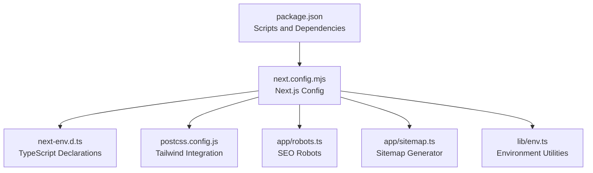

# Getting Started

<cite>
**Referenced Files in This Document**
- [README.md](file://README.md)
- [package.json](file://package.json)
- [next.config.mjs](file://next.config.mjs)
- [next-env.d.ts](file://next-env.d.ts)
- [postcss.config.js](file://postcss.config.js)
- [app/robots.ts](file://app/robots.ts)
- [app/sitemap.ts](file://app/sitemap.ts)
- [lib/env.ts](file://lib/env.ts)
</cite>

## Table of Contents
1. [Introduction](#introduction)
2. [Prerequisites](#prerequisites)
3. [Installation](#installation)
4. [Environment Setup](#environment-setup)
5. [Initial Configuration](#initial-configuration)
6. [Running the Development Server](#running-the-development-server)
7. [Understanding the Project Structure](#understanding-the-project-structure)
8. [Accessing AI Features](#accessing-ai-features)
9. [Troubleshooting Guide](#troubleshooting-guide)
10. [Next Steps](#next-steps)

## Introduction
Flaq SaaS Template is a free SaaS starter built with Next.js 16 and React, designed to help you rapidly prototype and launch AIGC (AI-Generated Content) applications powered by flaq.ai. It provides a modern foundation with internationalization, UI primitives, and integrations that accelerate building image and video generation tools.

Key capabilities include:
- Rapid prototyping of AIGC tools
- Built-in internationalization support
- Modern UI toolkit and animations
- Optimized image handling and remote pattern configuration
- SEO-friendly metadata and sitemap generation

**Section sources**
- [README.md:1-3](file://README.md#L1-L3)

## Prerequisites
Before you begin, ensure your environment meets the following requirements:
- Node.js version compatible with the project’s runtime
- Next.js 16.x application framework
- Basic React knowledge (components, hooks, JSX)
- Package manager (the project specifies pnpm)

These requirements are reflected in the project’s dependency declarations and configuration.

**Section sources**
- [package.json:64](file://package.json#L64)
- [package.json:122](file://package.json#L122)

## Installation
Install dependencies using the package manager configured for this project:
- Use the pnpm package manager as indicated by the lockfile and configuration.

After installing dependencies, you can proceed to configure environment variables and run the development server.

**Section sources**
- [package.json:122](file://package.json#L122)

## Environment Setup
Configure environment variables required by the application. The following variables are exposed to the client-side runtime and influence behavior:

- NEXT_BASE_API: Base API endpoint for backend services
- SITE_ID: Identifier for the site instance
- NEXT_PUBLIC_SITE_URL: Public base URL used for SEO metadata (e.g., sitemaps)
- IMAGE_REMOTE_PATTERNS: Comma-separated list of allowed remote image hostnames; supports optional protocol prefixes
- ALLOW_LOCAL_IMAGE_OPTIMIZATION: Enable local IP image optimization when set to true
- NODE_ENV: Controls logging and console removal behavior

Notes:
- Remote image patterns are parsed from a comma-separated string and normalized to HTTPS by default.
- Console logs are removed in production builds to reduce bundle size and noise.

**Section sources**
- [next.config.mjs:35-38](file://next.config.mjs#L35-L38)
- [next.config.mjs:25-26](file://next.config.mjs#L25-L26)
- [next.config.mjs:40-47](file://next.config.mjs#L40-L47)

## Initial Configuration
Beyond environment variables, the project includes additional configuration files:

- TypeScript declaration for Next.js environment types
- PostCSS configuration for Tailwind CSS integration
- Internationalization plugin integration via next-intl
- Robots and sitemap generators for SEO

These files establish the foundational setup for type safety, styling, i18n, and SEO.

**Section sources**
- [next-env.d.ts:1-7](file://next-env.d.ts#L1-L7)
- [postcss.config.js:1-6](file://postcss.config.js#L1-L6)
- [next.config.mjs:1-3](file://next.config.mjs#L1-L3)

## Running the Development Server
Start the development server using the script defined in the project configuration. The development command enables hot reloading and live updates during iterative development.

Steps:
1. Run the development script
2. Open the displayed URL in your browser
3. Verify that the page loads without errors

Common ports:
- The default Next.js development port is commonly used; adjust if conflicting with existing services.

**Section sources**
- [package.json:6-7](file://package.json#L6)

## Understanding the Project Structure
At a high level, the repository provides:
- Application configuration for Next.js 16
- Internationalization and SEO metadata handlers
- Environment-driven image optimization and remote pattern policies
- Type-safe Next.js environment declarations
- Tailwind CSS integration via PostCSS

While the application entry points and pages are not present in this snapshot, the configuration files indicate a structured setup ready for adding routes, pages, and features.

**Diagram sources**
- [package.json:5-15](file://package.json#L5-L15)
- [next.config.mjs:28-58](file://next.config.mjs#L28-L58)
- [next-env.d.ts:1-7](file://next-env.d.ts#L1-L7)
- [postcss.config.js:1-6](file://postcss.config.js#L1-L6)
- [app/robots.ts:1-35](file://app/robots.ts#L1-L35)
- [app/sitemap.ts:1-35](file://app/sitemap.ts#L1-L35)
- [lib/env.ts](file://lib/env.ts)

## Accessing AI Features
The template is designed to accelerate building AIGC tools with flaq.ai. While the specific feature implementations are not included in this snapshot, typical workflows involve:
- Integrating with the configured base API endpoint
- Using UI components and layouts to render AI-generated assets
- Leveraging internationalization and metadata helpers for global reach

To explore available features:
- Review the sitemap generator for feature route references
- Inspect environment utilities for shared constants and URLs
- Add pages and routes under the Next.js app structure as needed

Note: The sitemap generator references feature routes and support links, indicating a structured approach to organizing AIGC features.

**Section sources**
- [app/sitemap.ts:4-5](file://app/sitemap.ts#L4-L5)
- [lib/env.ts](file://lib/env.ts)

## Troubleshooting Guide
Common setup and runtime issues:

- Missing environment variables
  - Symptom: Build or runtime errors referencing missing environment keys
  - Resolution: Set NEXT_BASE_API, SITE_ID, and NEXT_PUBLIC_SITE_URL in your environment

- Image optimization blocked
  - Symptom: Remote images not loading or being flagged
  - Resolution: Configure IMAGE_REMOTE_PATTERNS with allowed hostnames; optionally enable ALLOW_LOCAL_IMAGE_OPTIMIZATION for local IPs

- Excessive console logs in production
  - Symptom: Unexpected console output in production builds
  - Resolution: Production builds automatically remove console logs; ensure NODE_ENV is set to production when building

- Port conflicts during development
  - Symptom: Development server fails to start due to port binding
  - Resolution: Change the default port or stop the conflicting service

- TypeScript diagnostics
  - Symptom: Type errors blocking development
  - Resolution: Run the type check script and address reported issues

- Linting and formatting
  - Symptom: Code quality warnings or formatting inconsistencies
  - Resolution: Use the lint and prettier scripts to diagnose and fix issues

**Section sources**
- [next.config.mjs:25-26](file://next.config.mjs#L25-L26)
- [next.config.mjs:40-47](file://next.config.mjs#L40-L47)
- [package.json:11-14](file://package.json#L11-L14)

## Next Steps
With the environment configured and the development server running, you can now:
- Add new pages and routes under the Next.js app structure
- Integrate AI features using the base API endpoint
- Customize UI components and styles with the integrated Tailwind setup
- Extend internationalization and metadata configurations as needed