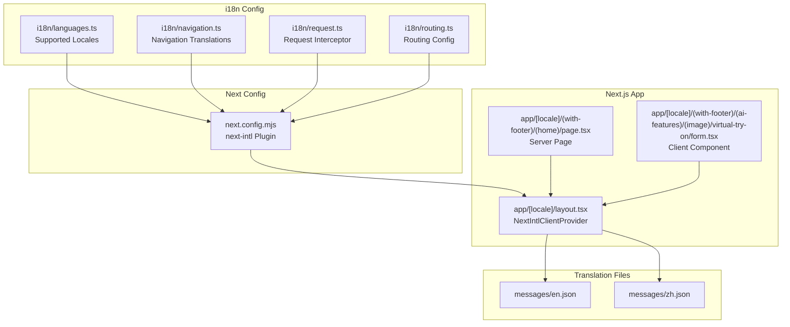
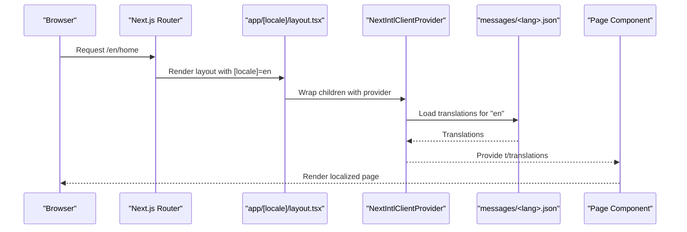
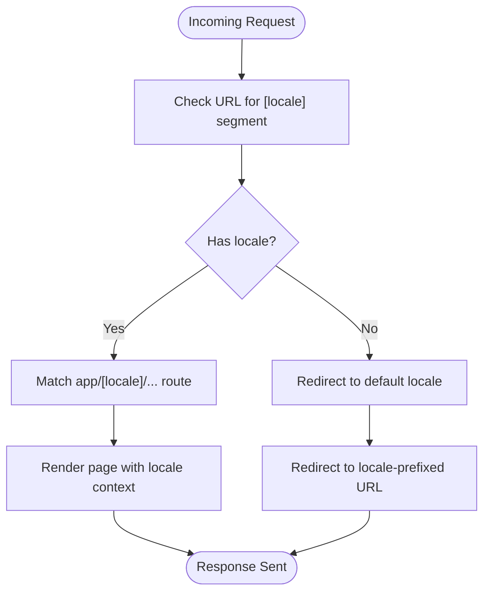
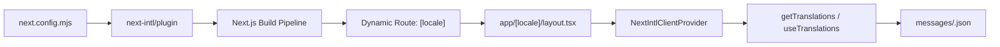

# Internationalization & Localization

<cite>
**Referenced Files in This Document**
- [next.config.mjs](file://next.config.mjs)
- [package.json](file://package.json)
- [i18n/languages.ts](file://i18n/languages.ts)
- [i18n/navigation.ts](file://i18n/navigation.ts)
- [i18n/request.ts](file://i18n/request.ts)
- [i18n/routing.ts](file://i18n/routing.ts)
- [messages/en.json](file://messages/en.json)
- [messages/zh.json](file://messages/zh.json)
- [app/[locale]/layout.tsx](file://app/[locale]/layout.tsx)
- [app/[locale]/(with-footer)/(home)/page.tsx](file://app/[locale]/(with-footer)/(home)/page.tsx)
- [app/[locale]/(with-footer)/(ai-features)/(image)/image-to-image/page.tsx](file://app/[locale]/(with-footer)/(ai-features)/(image)/image-to-image/page.tsx)
- [app/[locale]/(with-footer)/(ai-features)/(image)/virtual-try-on/form.tsx](file://app/[locale]/(with-footer)/(ai-features)/(image)/virtual-try-on/form.tsx)
- [app/[locale]/(with-footer)/(footer)/privacy-policy/page.tsx](file://app/[locale]/(with-footer)/(footer)/privacy-policy/page.tsx)
- [components/LocaleSwitcher.tsx](file://components/LocaleSwitcher.tsx)
</cite>

## Table of Contents
1. [Introduction](#introduction)
2. [Project Structure](#project-structure)
3. [Core Components](#core-components)
4. [Architecture Overview](#architecture-overview)
5. [Detailed Component Analysis](#detailed-component-analysis)
6. [Dependency Analysis](#dependency-analysis)
7. [Performance Considerations](#performance-considerations)
8. [SEO Considerations](#seo-considerations)
9. [Practical Implementation Guide](#practical-implementation-guide)
10. [Troubleshooting Guide](#troubleshooting-guide)
11. [Conclusion](#conclusion)

## Introduction
This document explains the Internationalization & Localization (i18n) implementation in the Flaq SaaS Template using next-intl. It covers the i18n architecture, locale routing patterns, content management strategies, and practical guidance for adding new languages, managing translation files, and implementing locale-specific customizations. The template leverages Next.js file system routing with dynamic segments for locales, server-side translation loading, and client-side translation hooks to deliver regionally adapted experiences.

## Project Structure
The i18n implementation centers around several key areas:
- Next.js configuration with next-intl plugin integration
- Locale-aware routing via dynamic route segments
- Translation files organized per locale
- Client and server components using next-intl APIs
- Locale switcher component for user-driven language selection

**Diagram sources**
- [next.config.mjs:1-58](file://next.config.mjs#L1-L58)
- [i18n/languages.ts](file://i18n/languages.ts)
- [i18n/navigation.ts](file://i18n/navigation.ts)
- [i18n/request.ts](file://i18n/request.ts)
- [i18n/routing.ts](file://i18n/routing.ts)
- [messages/en.json](file://messages/en.json)
- [messages/zh.json](file://messages/zh.json)
- [app/[locale]/layout.tsx](file://app/[locale]/layout.tsx)
- [app/[locale]/(with-footer)/(home)/page.tsx](file://app/[locale]/(with-footer)/(home)/page.tsx)
- [app/[locale]/(with-footer)/(ai-features)/(image)/virtual-try-on/form.tsx](file://app/[locale]/(with-footer)/(ai-features)/(image)/virtual-try-on/form.tsx)

**Section sources**
- [next.config.mjs:1-58](file://next.config.mjs#L1-L58)
- [package.json:65](file://package.json#L65)

## Core Components
- Next-intl plugin integration in Next.js configuration enables automatic static optimization for messages and locale routing.
- Dynamic route segment [locale] in app structure enforces locale-aware routing across pages.
- Translation files under messages/<lang>.json provide structured translations for each supported locale.
- Client provider NextIntlClientProvider wraps the app tree to supply translations and formatters to components.
- Server-side translation loading via getTranslations/getMessages ensures efficient SSR with localized content.
- Client-side translation hooks like useTranslations enable reactive UI updates without re-rendering entire trees.
- LocaleSwitcher component demonstrates runtime locale switching using next-intl's useLocale hook.

Key implementation references:
- Next-intl plugin registration and export configuration
- Dynamic locale route segment definition
- Translation file structure and content
- Client provider and translation loading
- Client-side translation usage
- Locale switching behavior

**Section sources**
- [next.config.mjs:1-58](file://next.config.mjs#L1-L58)
- [app/[locale]/layout.tsx:4-5](file://app/[locale]/layout.tsx#L4-L5)
- [messages/en.json](file://messages/en.json)
- [messages/zh.json](file://messages/zh.json)
- [components/LocaleSwitcher.tsx:6](file://components/LocaleSwitcher.tsx#L6)

## Architecture Overview
The i18n architecture follows a layered approach:
- Routing Layer: Dynamic [locale] segment routes requests to locale-specific pages.
- Configuration Layer: i18n configuration files define supported locales, navigation translations, and routing behavior.
- Translation Layer: messages/<lang>.json files store translation keys and values for each locale.
- Presentation Layer: NextIntlClientProvider supplies translations to components; getTranslations/getMessages load translations server-side; useTranslations loads client-side.

**Diagram sources**
- [app/[locale]/layout.tsx:4-5](file://app/[locale]/layout.tsx#L4-L5)
- [messages/en.json](file://messages/en.json)
- [app/[locale]/(with-footer)/(home)/page.tsx](file://app/[locale]/(with-footer)/(home)/page.tsx)

## Detailed Component Analysis

### Locale Routing Pattern
The template uses a dynamic route segment [locale] to enforce locale-aware routing. Pages under app/[locale]/ are automatically considered part of the i18n routing system. This pattern ensures that:
- URLs include the locale prefix (e.g., /en, /zh)
- Navigation remains consistent across the site
- Server-side rendering respects the requested locale

**Diagram sources**
- [app/[locale]/layout.tsx](file://app/[locale]/layout.tsx)
- [i18n/routing.ts](file://i18n/routing.ts)

**Section sources**
- [app/[locale]/layout.tsx](file://app/[locale]/layout.tsx)
- [i18n/routing.ts](file://i18n/routing.ts)

### Translation Loading and Usage
Server-side translation loading:
- getTranslations/getMessages are used in server components to load translations during SSR.
- This ensures fast initial page loads with pre-fetched localized content.

Client-side translation usage:
- useTranslations is used in client components to access translations without causing hydration mismatches.
- This enables interactive UI elements (e.g., buttons, forms) to update dynamically based on the current locale.

Examples of usage:
- Server page using getTranslations for page content
- Client form using useTranslations for button labels and placeholders
- Footer pages using useTranslations for policy content

**Section sources**
- [app/[locale]/(with-footer)/(home)/page.tsx](file://app/[locale]/(with-footer)/(home)/page.tsx)
- [app/[locale]/(with-footer)/(ai-features)/(image)/virtual-try-on/form.tsx](file://app/[locale]/(with-footer)/(ai-features)/(image)/virtual-try-on/form.tsx)
- [app/[locale]/(with-footer)/(footer)/privacy-policy/page.tsx](file://app/[locale]/(with-footer)/(footer)/privacy-policy/page.tsx)

### Locale Switcher Component
The LocaleSwitcher component demonstrates runtime locale switching:
- Uses next-intl's useLocale hook to detect the current locale
- Provides a user interface to change the locale
- Integrates with the routing system to navigate to locale-prefixed URLs

Implementation highlights:
- Locale detection and switching logic
- Integration with Next.js router for navigation
- Preservation of current page context while changing locale

**Section sources**
- [components/LocaleSwitcher.tsx:6](file://components/LocaleSwitcher.tsx#L6)

### Content Management Strategies
Translation files are organized per locale under messages/<lang>.json. This strategy enables:
- Clear separation of concerns per language
- Easy maintenance and review of translations
- Scalable addition of new locales without affecting existing ones

Best practices:
- Keep translation keys consistent across locales
- Use hierarchical keys for nested components
- Avoid embedding HTML directly in translation files; prefer formatting tokens and apply markup in components
- Regularly audit translation coverage and completeness

**Section sources**
- [messages/en.json](file://messages/en.json)
- [messages/zh.json](file://messages/zh.json)

## Dependency Analysis
The i18n system relies on the following dependencies and integrations:
- next-intl: Core library providing translation APIs, routing integration, and build-time optimizations
- next-intl/plugin: Next.js plugin that integrates next-intl into the build pipeline
- Next.js dynamic routes: [locale] segment for locale-aware routing
- Client provider and hooks: NextIntlClientProvider and useTranslations for client-side usage

**Diagram sources**
- [next.config.mjs:1-58](file://next.config.mjs#L1-L58)
- [package.json:65](file://package.json#L65)
- [app/[locale]/layout.tsx:4-5](file://app/[locale]/layout.tsx#L4-L5)
- [messages/en.json](file://messages/en.json)

**Section sources**
- [next.config.mjs:1-58](file://next.config.mjs#L1-L58)
- [package.json:65](file://package.json#L65)

## Performance Considerations
- Static optimization: The next-intl plugin optimizes translation loading for static generation, reducing runtime overhead.
- On-demand loading: Client components can lazy-load translations using useTranslations, minimizing initial payload size.
- Efficient SSR: Server components leverage getTranslations/getMessages to preload translations during SSR, improving TTFB.
- Bundle splitting: Keep translation files modular and avoid monolithic files to enable granular caching and loading.

## SEO Considerations
- Canonical URLs: Ensure canonical links reflect the current locale to avoid duplicate content issues.
- hreflang tags: Implement hreflang metadata to signal language/region variants for better international SEO.
- Structured navigation: Use navigation translations to maintain consistent breadcrumbs and internal linking across locales.
- Sitemaps: Generate locale-specific sitemaps to help search engines index regional content properly.

## Practical Implementation Guide

### Adding a New Language
Steps to add a new locale (e.g., fr):
1. Create a new translation file messages/fr.json with translation keys mirroring the structure of existing files.
2. Update i18n configuration to include the new locale in supported locales.
3. Verify routing behavior for the new locale using the [locale] segment.
4. Test server-side and client-side translation loading in pages and components.
5. Validate locale switching and navigation behavior.

References for implementation:
- Translation file creation and structure
- Locale configuration updates
- Client provider and translation loading
- Client-side translation usage

**Section sources**
- [messages/en.json](file://messages/en.json)
- [messages/zh.json](file://messages/zh.json)
- [i18n/languages.ts](file://i18n/languages.ts)
- [app/[locale]/layout.tsx:4-5](file://app/[locale]/layout.tsx#L4-L5)

### Managing Translation Keys
- Maintain a consistent naming convention for translation keys across locales.
- Group related keys by component or feature to improve maintainability.
- Use placeholder tokens for dynamic content and format values in components rather than embedding formatted strings in translation files.
- Regularly audit missing or unused keys to keep translation sets lean.

### Handling Right-to-Left Languages
- Implement directionality using CSS logical properties and direction-aware layouts.
- Test UI components for RTL alignment and spacing adjustments.
- Consider locale-specific typography and icon mirroring for RTL languages.
- Validate form layouts and modal positioning for RTL contexts.

### Maintaining Consistency Across Locales
- Establish a translation governance process to review and approve changes.
- Use automated checks to detect missing translations for new keys.
- Standardize terminology across locales to reduce cognitive load for users.
- Document locale-specific nuances (e.g., date formats, number formats) in a style guide.

## Troubleshooting Guide
Common issues and resolutions:
- Missing translations: Ensure translation files exist for all configured locales and keys are present.
- Hydration mismatches: Use NextIntlClientProvider at the root and prefer useTranslations in client components.
- Incorrect locale routing: Verify the [locale] segment is correctly placed and supported in routing configuration.
- Build errors: Confirm next-intl plugin is applied in next.config.mjs and dependencies are installed.

**Section sources**
- [next.config.mjs:1-58](file://next.config.mjs#L1-L58)
- [app/[locale]/layout.tsx:4-5](file://app/[locale]/layout.tsx#L4-L5)

## Conclusion
The Flaq SaaS Template implements a robust i18n solution using next-intl, enabling scalable, locale-aware applications with efficient SSR and client-side translation loading. By leveraging dynamic locale routing, structured translation files, and client provider patterns, the template supports seamless addition of new languages, maintains consistency across locales, and provides a foundation for advanced localization features such as RTL support and SEO optimization.