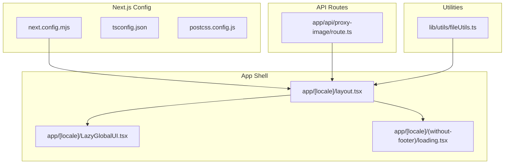
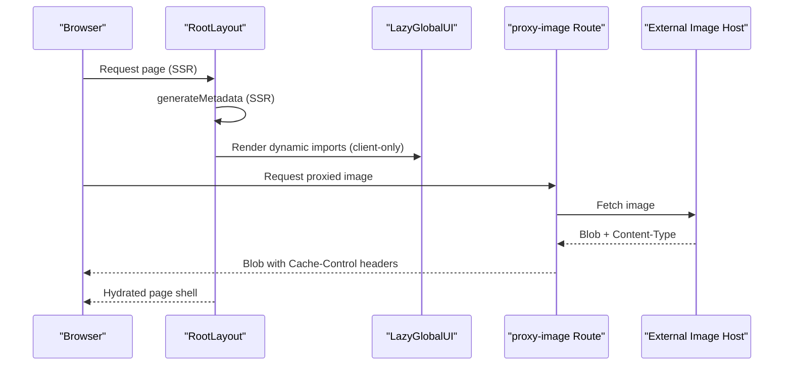
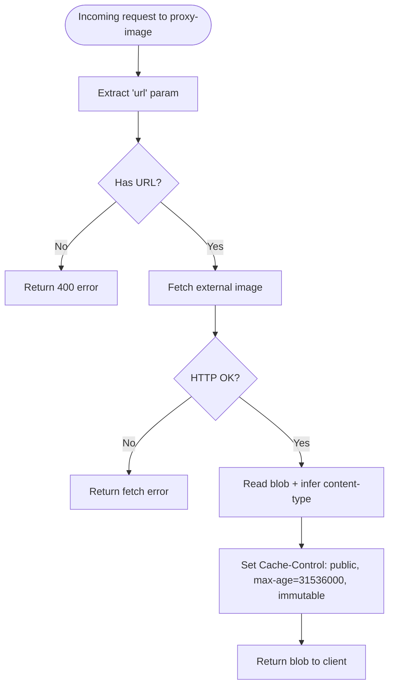
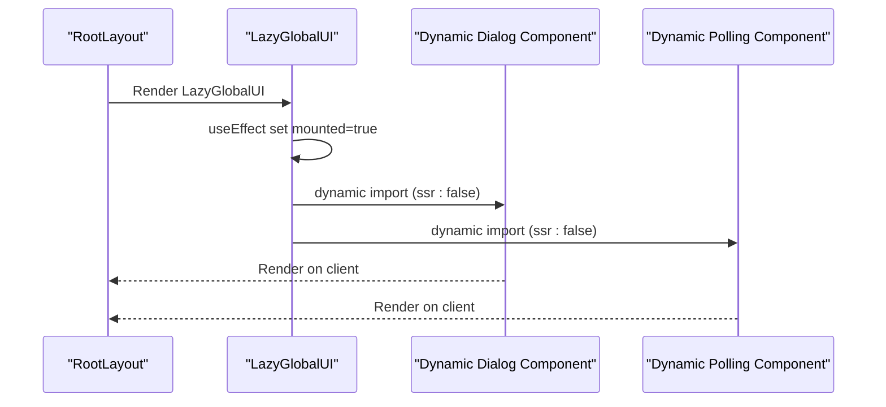
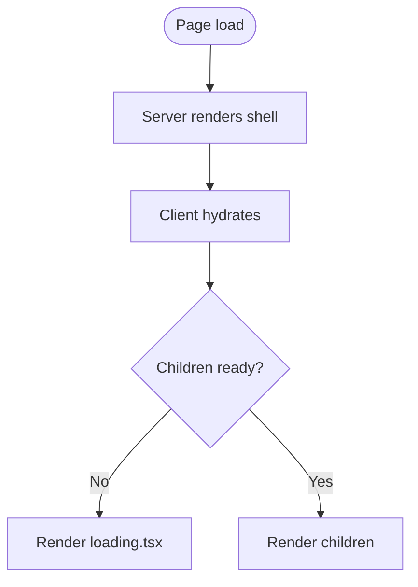
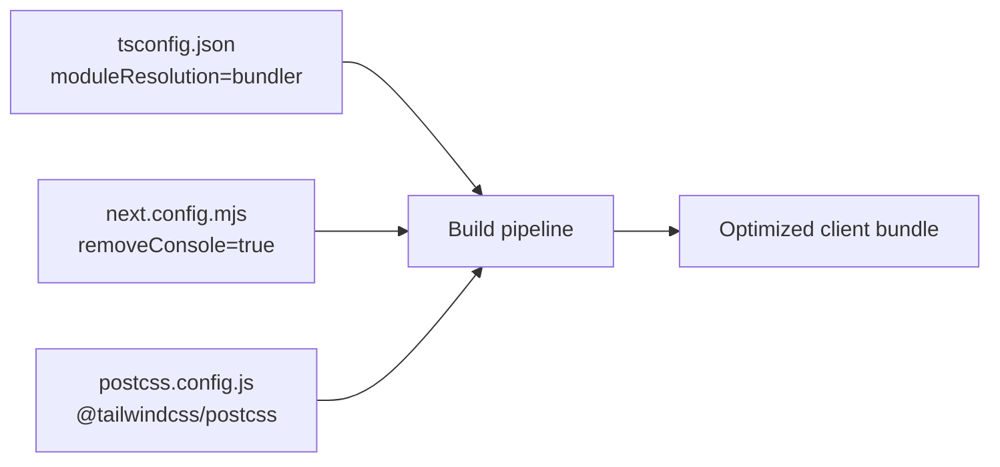
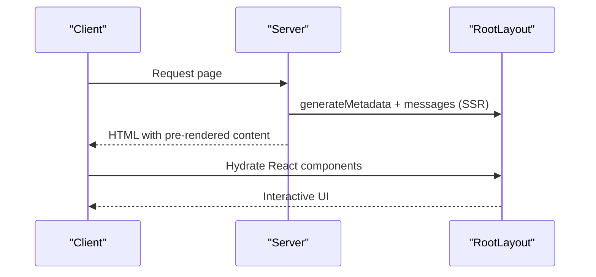
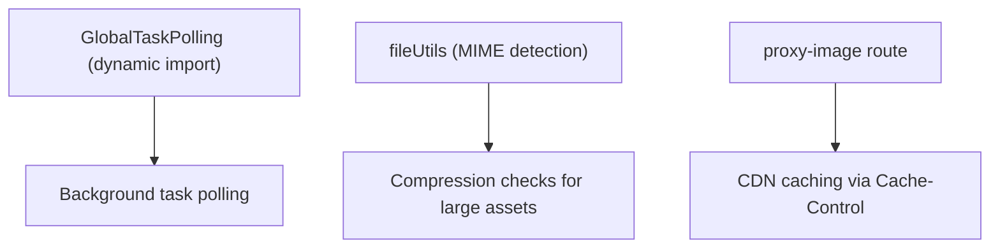
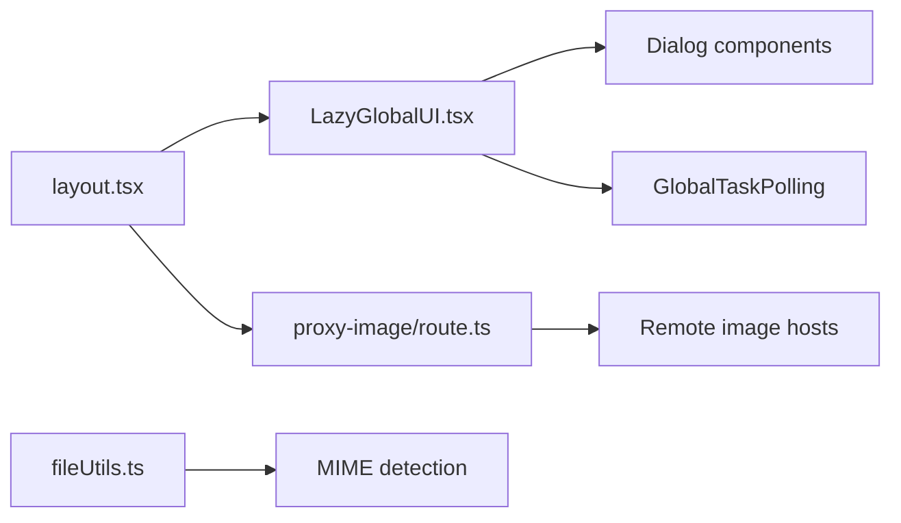

# Performance & Optimization

<cite>
**Referenced Files in This Document**
- [next.config.mjs](file://next.config.mjs)
- [app/[locale]/layout.tsx](file://app/[locale]/layout.tsx)
- [app/[locale]/LazyGlobalUI.tsx](file://app/[locale]/LazyGlobalUI.tsx)
- [app/[locale]/(without-footer)/loading.tsx](file://app/[locale]/(without-footer)/loading.tsx)
- [app/api/proxy-image/route.ts](file://app/api/proxy-image/route.ts)
- [lib/utils/fileUtils.ts](file://lib/utils/fileUtils.ts)
- [postcss.config.js](file://postcss.config.js)
- [tsconfig.json](file://tsconfig.json)
- [eslint.config.mjs](file://eslint.config.mjs)
</cite>

## Table of Contents
1. [Introduction](#introduction)
2. [Project Structure](#project-structure)
3. [Core Components](#core-components)
4. [Architecture Overview](#architecture-overview)
5. [Detailed Component Analysis](#detailed-component-analysis)
6. [Dependency Analysis](#dependency-analysis)
7. [Performance Considerations](#performance-considerations)
8. [Troubleshooting Guide](#troubleshooting-guide)
9. [Conclusion](#conclusion)

## Introduction
This document focuses on performance and optimization strategies implemented in the Flaq SaaS Template built with Next.js. It covers image optimization, lazy loading, bundle optimization, dynamic imports for global UI components, loading state management, and Next.js-specific optimizations such as server-side rendering (SSR) and client-side hydration. Practical guidance is included for measuring performance, identifying bottlenecks, and implementing targeted improvements, with special attention to AI-centric considerations such as processing queue management, memory optimization for large assets, and CDN-backed asset delivery.

## Project Structure
The repository follows a conventional Next.js app directory layout with app router pages, API routes, shared components, and configuration files. Key areas relevant to performance include:
- Next.js configuration for images, logging, and build-time compiler options
- Root layout and global UI injection via dynamic imports
- Global loading fallbacks for page transitions
- Image proxy route for optimized and cached asset delivery
- Utility helpers for file handling and compression

**Diagram sources**
- [next.config.mjs:28-55](file://next.config.mjs#L28-L55)
- [app/[locale]/layout.tsx:80-118](file://app/[locale]/layout.tsx#L80-L118)
- [app/[locale]/LazyGlobalUI.tsx:11-26](file://app/[locale]/LazyGlobalUI.tsx#L11-L26)
- [app/[locale]/(without-footer)/loading.tsx:3-9](file://app/[locale]/(without-footer)/loading.tsx#L3-L9)
- [app/api/proxy-image/route.ts:1-33](file://app/api/proxy-image/route.ts#L1-L33)
- [lib/utils/fileUtils.ts:44-103](file://lib/utils/fileUtils.ts#L44-L103)

**Section sources**
- [next.config.mjs:28-55](file://next.config.mjs#L28-L55)
- [app/[locale]/layout.tsx:80-118](file://app/[locale]/layout.tsx#L80-L118)
- [app/[locale]/LazyGlobalUI.tsx:11-26](file://app/[locale]/LazyGlobalUI.tsx#L11-L26)
- [app/[locale]/(without-footer)/loading.tsx:3-9](file://app/[locale]/(without-footer)/loading.tsx#L3-L9)
- [app/api/proxy-image/route.ts:1-33](file://app/api/proxy-image/route.ts#L1-L33)
- [lib/utils/fileUtils.ts:44-103](file://lib/utils/fileUtils.ts#L44-L103)

## Core Components
- Next.js configuration: Controls image optimization, logging verbosity, console removal in production, and environment exposure.
- Root layout: Provides SSR metadata generation, i18n provider, navigation guard, and global UI injection.
- Lazy global UI: Dynamically imports non-critical UI components to reduce initial bundle size and improve TTI.
- Global loading fallback: Page-level skeleton/loading while content hydrates.
- Image proxy route: Fetches external images, sets caching headers, and returns optimized blobs.
- File utilities: Determines MIME types and supports image compression checks for large assets.

**Section sources**
- [next.config.mjs:28-55](file://next.config.mjs#L28-L55)
- [app/[locale]/layout.tsx:28-78](file://app/[locale]/layout.tsx#L28-L78)
- [app/[locale]/layout.tsx:80-118](file://app/[locale]/layout.tsx#L80-L118)
- [app/[locale]/LazyGlobalUI.tsx:6-9](file://app/[locale]/LazyGlobalUI.tsx#L6-L9)
- [app/[locale]/(without-footer)/loading.tsx:3-9](file://app/[locale]/(without-footer)/loading.tsx#L3-L9)
- [app/api/proxy-image/route.ts:11-27](file://app/api/proxy-image/route.ts#L11-L27)
- [lib/utils/fileUtils.ts:44-103](file://lib/utils/fileUtils.ts#L44-L103)

## Architecture Overview
The runtime architecture emphasizes SSR-first rendering with strategic client-side hydration and lazy loading of non-essential UI. Image optimization is centralized through Next.js configuration and an image proxy route with caching headers. Global UI components are dynamically imported to minimize initial payload.

**Diagram sources**
- [app/[locale]/layout.tsx:28-78](file://app/[locale]/layout.tsx#L28-L78)
- [app/[locale]/layout.tsx:80-118](file://app/[locale]/layout.tsx#L80-L118)
- [app/[locale]/LazyGlobalUI.tsx:11-26](file://app/[locale]/LazyGlobalUI.tsx#L11-L26)
- [app/api/proxy-image/route.ts:3-32](file://app/api/proxy-image/route.ts#L3-L32)

## Detailed Component Analysis

### Image Optimization and CDN Delivery
- Next.js image optimization is enabled and configured to accept remote patterns from environment variables. Local IP optimization can be conditionally enabled via an environment flag.
- An image proxy route fetches external images, inspects content-type, and returns a blob with long-term caching headers suitable for CDN distribution.
- File utilities derive MIME types from URLs to ensure correct handling of images and videos, supporting downstream compression checks.

**Diagram sources**
- [app/api/proxy-image/route.ts:3-32](file://app/api/proxy-image/route.ts#L3-L32)

**Section sources**
- [next.config.mjs:48-53](file://next.config.mjs#L48-L53)
- [app/api/proxy-image/route.ts:11-27](file://app/api/proxy-image/route.ts#L11-L27)
- [lib/utils/fileUtils.ts:44-95](file://lib/utils/fileUtils.ts#L44-L95)

### Lazy Loading and Dynamic Imports for Global UI
- Non-critical UI components (e.g., top loading bar, cookie consent dialog, global task polling, business dialog) are dynamically imported with SSR disabled.
- A mount guard ensures these components render only after hydration, preventing hydration mismatches and reducing initial client payload.

**Diagram sources**
- [app/[locale]/layout.tsx:111-111](file://app/[locale]/layout.tsx#L111-L111)
- [app/[locale]/LazyGlobalUI.tsx:6-9](file://app/[locale]/LazyGlobalUI.tsx#L6-L9)
- [app/[locale]/LazyGlobalUI.tsx:11-26](file://app/[locale]/LazyGlobalUI.tsx#L11-L26)

**Section sources**
- [app/[locale]/layout.tsx:111-111](file://app/[locale]/layout.tsx#L111-L111)
- [app/[locale]/LazyGlobalUI.tsx:6-9](file://app/[locale]/LazyGlobalUI.tsx#L6-L9)
- [app/[locale]/LazyGlobalUI.tsx:11-26](file://app/[locale]/LazyGlobalUI.tsx#L11-L26)

### Loading State Management
- A page-level loading fallback is provided during SSR-to-CSR transitions, ensuring perceived performance and UX continuity.
- The global Toaster component is initialized early in the layout to avoid FOUC and maintain consistent feedback timing.

**Diagram sources**
- [app/[locale]/(without-footer)/loading.tsx:3-9](file://app/[locale]/(without-footer)/loading.tsx#L3-L9)
- [app/[locale]/layout.tsx:97-110](file://app/[locale]/layout.tsx#L97-L110)

**Section sources**
- [app/[locale]/(without-footer)/loading.tsx:3-9](file://app/[locale]/(without-footer)/loading.tsx#L3-L9)
- [app/[locale]/layout.tsx:97-110](file://app/[locale]/layout.tsx#L97-L110)

### Bundle Optimization Techniques
- Console logs are stripped in production builds to reduce bundle size and noise.
- TypeScript strictness and bundler module resolution are configured for efficient builds.
- PostCSS plugin configuration integrates Tailwind utilities without additional overhead.

**Diagram sources**
- [tsconfig.json:14-18](file://tsconfig.json#L14-L18)
- [next.config.mjs:45-47](file://next.config.mjs#L45-L47)
- [postcss.config.js:1-5](file://postcss.config.js#L1-L5)

**Section sources**
- [next.config.mjs:45-47](file://next.config.mjs#L45-L47)
- [tsconfig.json:14-18](file://tsconfig.json#L14-L18)
- [postcss.config.js:1-5](file://postcss.config.js#L1-L5)

### Next.js SSR, ISR, and Hydration
- SSR: Metadata generation and i18n messages are generated server-side in the root layout, improving SEO and first paint.
- ISR: No incremental static regeneration is configured; pages remain SSR-rendered per request.
- Hydration: The layout uses a dark theme suppression and hydration warning suppression to prevent mismatch flashes.

**Diagram sources**
- [app/[locale]/layout.tsx:28-78](file://app/[locale]/layout.tsx#L28-L78)
- [app/[locale]/layout.tsx:90-90](file://app/[locale]/layout.tsx#L90-L90)

**Section sources**
- [app/[locale]/layout.tsx:28-78](file://app/[locale]/layout.tsx#L28-L78)
- [app/[locale]/layout.tsx:90-90](file://app/[locale]/layout.tsx#L90-L90)

### AI-Specific Performance Considerations
- Processing queue management: Global polling component is dynamically imported and rendered client-side to manage long-running tasks without blocking initial render.
- Memory optimization for large assets: File utilities derive MIME types from URLs to handle large images and videos efficiently; downstream compression checks can be applied to reduce payload sizes.
- CDN integration: The image proxy route returns immutable cache headers suitable for CDN caching, reducing origin bandwidth and latency.

**Diagram sources**
- [app/[locale]/LazyGlobalUI.tsx:8-8](file://app/[locale]/LazyGlobalUI.tsx#L8-L8)
- [lib/utils/fileUtils.ts:44-95](file://lib/utils/fileUtils.ts#L44-L95)
- [app/api/proxy-image/route.ts:23-27](file://app/api/proxy-image/route.ts#L23-L27)

**Section sources**
- [app/[locale]/LazyGlobalUI.tsx:8-8](file://app/[locale]/LazyGlobalUI.tsx#L8-L8)
- [lib/utils/fileUtils.ts:44-95](file://lib/utils/fileUtils.ts#L44-L95)
- [app/api/proxy-image/route.ts:23-27](file://app/api/proxy-image/route.ts#L23-L27)

## Dependency Analysis
- Root layout depends on i18n providers, navigation guards, and global UI injection points.
- Lazy global UI depends on dynamic imports for non-critical dialogs and polling.
- Image proxy route depends on environment-driven remote patterns and Next.js server runtime.
- File utilities depend on URL parsing and MIME inference for asset handling.

**Diagram sources**
- [app/[locale]/layout.tsx:15-15](file://app/[locale]/layout.tsx#L15-L15)
- [app/[locale]/LazyGlobalUI.tsx:6-9](file://app/[locale]/LazyGlobalUI.tsx#L6-L9)
- [app/api/proxy-image/route.ts:4-5](file://app/api/proxy-image/route.ts#L4-L5)
- [lib/utils/fileUtils.ts:50-58](file://lib/utils/fileUtils.ts#L50-L58)

**Section sources**
- [app/[locale]/layout.tsx:15-15](file://app/[locale]/layout.tsx#L15-L15)
- [app/[locale]/LazyGlobalUI.tsx:6-9](file://app/[locale]/LazyGlobalUI.tsx#L6-L9)
- [app/api/proxy-image/route.ts:4-5](file://app/api/proxy-image/route.ts#L4-L5)
- [lib/utils/fileUtils.ts:50-58](file://lib/utils/fileUtils.ts#L50-L58)

## Performance Considerations
- Image optimization
  - Enable and configure remote patterns to allow Next.js image optimization for permitted domains.
  - Use the image proxy route for external images to leverage caching headers and reduce origin traffic.
  - Consider pre-compressing large images client-side using the MIME detection utilities to reduce payload sizes.
- Lazy loading
  - Keep critical UI above the fold server-rendered; defer non-essential dialogs and polling to client-only dynamic imports.
  - Use a mount guard to avoid rendering until hydration completes.
- Bundle optimization
  - Remove console logs in production builds.
  - Prefer bundler module resolution and strict TypeScript settings for smaller bundles.
  - Integrate Tailwind via PostCSS to avoid unnecessary CSS bloat.
- SSR and hydration
  - Generate metadata and messages server-side to improve TTFB and perceived performance.
  - Minimize hydration mismatches by deferring non-critical components to the client.
- Monitoring and measurement
  - Use Next.js logging fetch verbosity in development to inspect network timings.
  - Measure TTFB, TTI, and CLS using browser devtools and Lighthouse.
  - Track CDN hit rates for proxied images to validate caching effectiveness.

[No sources needed since this section provides general guidance]

## Troubleshooting Guide
- Images not optimizing or failing to load
  - Verify remote patterns in configuration and ensure the environment variable is set correctly.
  - Confirm the image proxy route receives a valid URL parameter and returns appropriate content-type headers.
- Excessive client payload
  - Audit dynamic imports and ensure only non-critical components are marked client-only.
  - Review console removal setting in production builds.
- Slow initial load
  - Confirm global loading fallback is present and minimal.
  - Validate that heavy assets are compressed and served via CDN with long cache TTLs.
- Hydration warnings
  - Ensure client-only components are guarded by a mount check before rendering.

**Section sources**
- [next.config.mjs:25-26](file://next.config.mjs#L25-L26)
- [next.config.mjs:48-53](file://next.config.mjs#L48-L53)
- [app/api/proxy-image/route.ts:4-5](file://app/api/proxy-image/route.ts#L4-L5)
- [app/[locale]/LazyGlobalUI.tsx:12-16](file://app/[locale]/LazyGlobalUI.tsx#L12-L16)
- [next.config.mjs:45-47](file://next.config.mjs#L45-L47)
- [app/[locale]/(without-footer)/loading.tsx:3-9](file://app/[locale]/(without-footer)/loading.tsx#L3-L9)

## Conclusion
The Flaq SaaS Template leverages Next.js SSR, dynamic imports, and a centralized image proxy with caching headers to deliver strong performance characteristics. By deferring non-critical UI to the client, optimizing bundles, and integrating CDN-backed asset delivery, the application achieves fast initial loads and responsive interactions. For AI workloads, client-side polling and MIME-aware asset handling further support efficient processing and memory usage. Continue to monitor metrics, iterate on lazy loading strategies, and refine caching policies to sustain performance at scale.