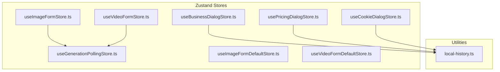
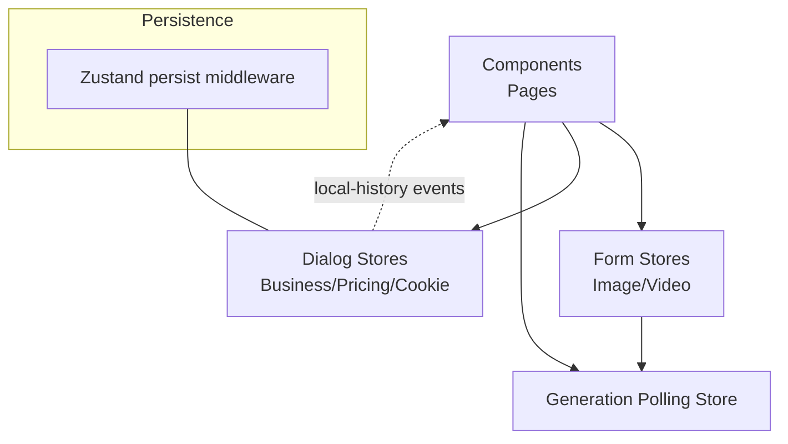
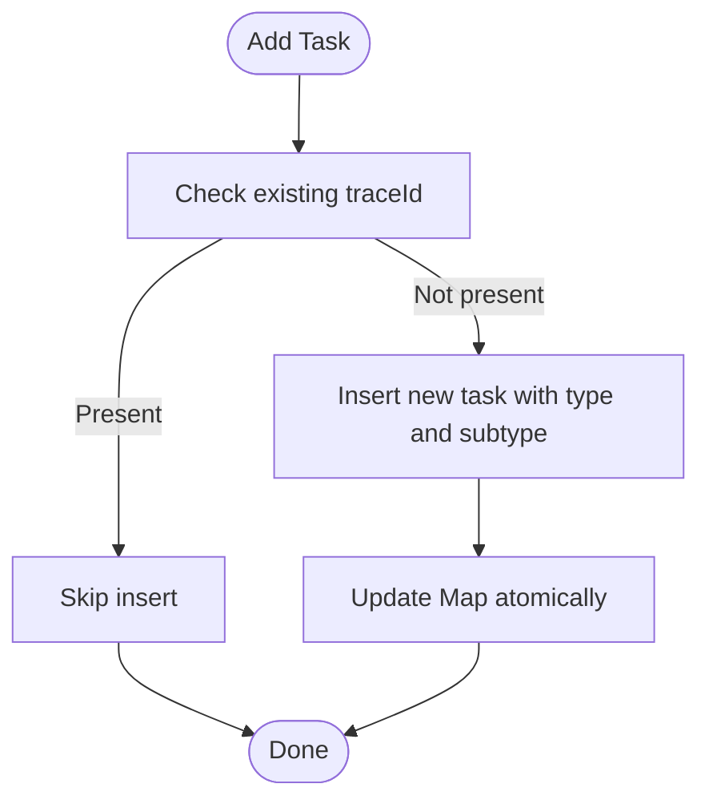
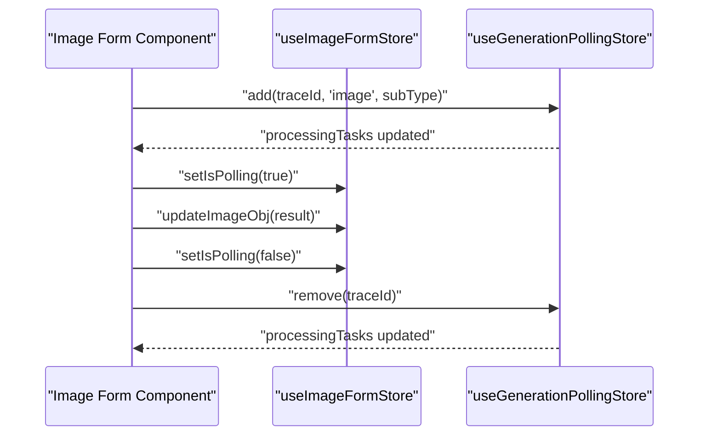
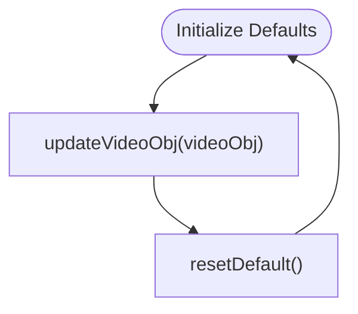
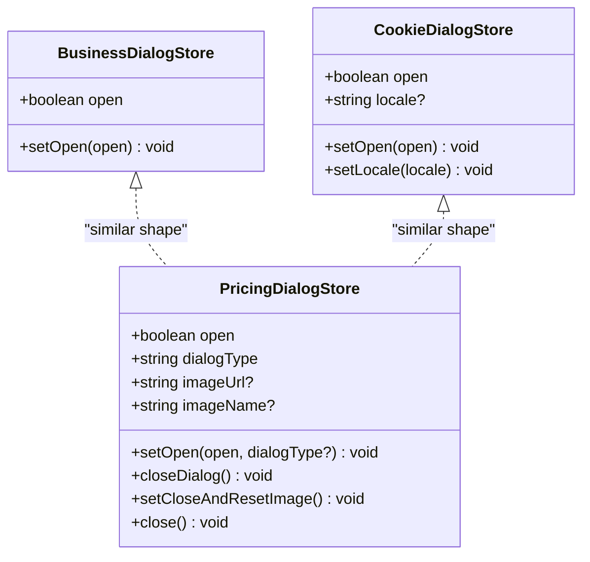
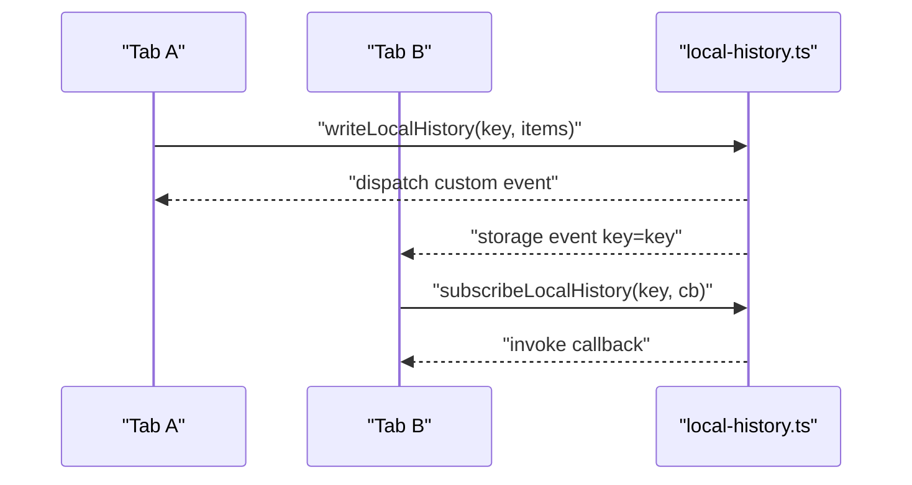
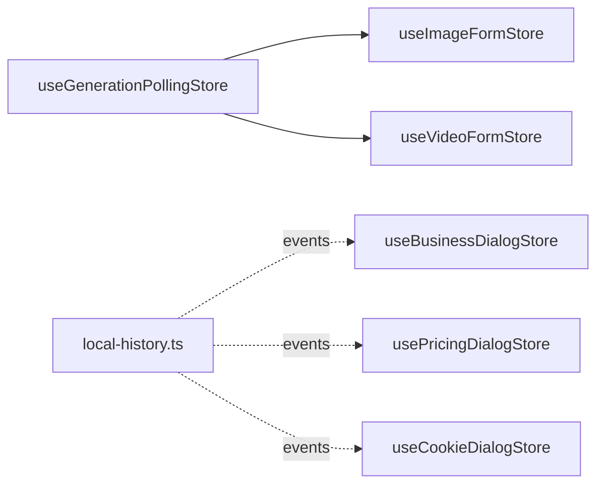

# State Management

<cite>
**Referenced Files in This Document**
- [README.md](file://README.md)
- [store/useGenerationPollingStore.ts](file://store/useGenerationPollingStore.ts)
- [store/form/useImageFormStore.ts](file://store/form/useImageFormStore.ts)
- [store/form/useVideoFormStore.ts](file://store/form/useVideoFormStore.ts)
- [store/form/useImageFormDefaultStore.ts](file://store/form/useImageFormDefaultStore.ts)
- [store/form/useVideoFormDefaultStore.ts](file://store/form/useVideoFormDefaultStore.ts)
- [store/useBusinessDialogStore.ts](file://store/useBusinessDialogStore.ts)
- [store/usePricingDialogStore.ts](file://store/usePricingDialogStore.ts)
- [store/dialog/useCookieDialogStore.ts](file://store/dialog/useCookieDialogStore.ts)
- [network/local-history.ts](file://network/local-history.ts)
</cite>

## Table of Contents
1. [Introduction](#introduction)
2. [Project Structure](#project-structure)
3. [Core Components](#core-components)
4. [Architecture Overview](#architecture-overview)
5. [Detailed Component Analysis](#detailed-component-analysis)
6. [Dependency Analysis](#dependency-analysis)
7. [Performance Considerations](#performance-considerations)
8. [Troubleshooting Guide](#troubleshooting-guide)
9. [Conclusion](#conclusion)
10. [Appendices](#appendices)

## Introduction
This document explains the state management architecture powered by Zustand in the Flaq SaaS Template. It focuses on how global state is organized, how stores are structured for AI features (image and video generation), and how state updates are applied across components. It also covers integration with component lifecycles, AI processing states, user preferences, persistence strategies, performance optimizations, debugging approaches, and practical usage patterns such as subscriptions and state composition.

## Project Structure
The state management is centralized under a dedicated store directory with feature-specific stores grouped by domain:
- Form stores for image and video generation workflows
- Polling store for tracking long-running AI tasks
- Dialog stores for UI-driven state (business, pricing, cookie consent)
- Local history utilities for cross-tab/local synchronization

**Diagram sources**
- [store/useGenerationPollingStore.ts:1-63](file://store/useGenerationPollingStore.ts#L1-L63)
- [store/form/useImageFormStore.ts:1-129](file://store/form/useImageFormStore.ts#L1-L129)
- [store/form/useVideoFormStore.ts:1-76](file://store/form/useVideoFormStore.ts#L1-L76)
- [store/form/useImageFormDefaultStore.ts:1-23](file://store/form/useImageFormDefaultStore.ts#L1-L23)
- [store/form/useVideoFormDefaultStore.ts:1-23](file://store/form/useVideoFormDefaultStore.ts#L1-L23)
- [store/useBusinessDialogStore.ts:1-13](file://store/useBusinessDialogStore.ts#L1-L13)
- [store/usePricingDialogStore.ts:1-49](file://store/usePricingDialogStore.ts#L1-L49)
- [store/dialog/useCookieDialogStore.ts:1-33](file://store/dialog/useCookieDialogStore.ts#L1-L33)
- [network/local-history.ts:1-49](file://network/local-history.ts#L1-L49)

**Section sources**
- [README.md:1-3](file://README.md#L1-L3)
- [store/useGenerationPollingStore.ts:1-63](file://store/useGenerationPollingStore.ts#L1-L63)
- [store/form/useImageFormStore.ts:1-129](file://store/form/useImageFormStore.ts#L1-L129)
- [store/form/useVideoFormStore.ts:1-76](file://store/form/useVideoFormStore.ts#L1-L76)
- [store/form/useImageFormDefaultStore.ts:1-23](file://store/form/useImageFormDefaultStore.ts#L1-L23)
- [store/form/useVideoFormDefaultStore.ts:1-23](file://store/form/useVideoFormDefaultStore.ts#L1-L23)
- [store/useBusinessDialogStore.ts:1-13](file://store/useBusinessDialogStore.ts#L1-L13)
- [store/usePricingDialogStore.ts:1-49](file://store/usePricingDialogStore.ts#L1-L49)
- [store/dialog/useCookieDialogStore.ts:1-33](file://store/dialog/useCookieDialogStore.ts#L1-L33)
- [network/local-history.ts:1-49](file://network/local-history.ts#L1-L49)

## Core Components
- Generation polling store: Tracks active AI processing tasks keyed by trace identifiers, enabling UI feedback and coordination across image/video generation flows.
- Image form store: Manages image generation state, including previews, uploads, layer editing, and polling flags for start/end frames.
- Video form store: Manages video generation state, including previews, model metadata, and defaults for example assets.
- Default prompt stores: Provide lightweight persistent or transient prompt defaults for image and video forms.
- Dialog stores: Manage UI dialogs for business info, pricing, and cookie consent, with persistence for user preferences.
- Local history utilities: Provide local storage-backed event notifications and subscriptions for cross-tab synchronization.

Key patterns:
- Each store defines a strict State and Actions interface, ensuring predictable updates.
- Stores use functional updates via set/get to maintain immutability and avoid stale closures.
- Persistence is selectively applied using Zustand’s persist middleware where appropriate.

**Section sources**
- [store/useGenerationPollingStore.ts:11-18](file://store/useGenerationPollingStore.ts#L11-L18)
- [store/form/useImageFormStore.ts:53-80](file://store/form/useImageFormStore.ts#L53-L80)
- [store/form/useVideoFormStore.ts:47-61](file://store/form/useVideoFormStore.ts#L47-L61)
- [store/form/useImageFormDefaultStore.ts:3-10](file://store/form/useImageFormDefaultStore.ts#L3-L10)
- [store/form/useVideoFormDefaultStore.ts:3-10](file://store/form/useVideoFormDefaultStore.ts#L3-L10)
- [store/useBusinessDialogStore.ts:3-6](file://store/useBusinessDialogStore.ts#L3-L6)
- [store/usePricingDialogStore.ts:5-17](file://store/usePricingDialogStore.ts#L5-L17)
- [store/dialog/useCookieDialogStore.ts:6-14](file://store/dialog/useCookieDialogStore.ts#L6-L14)
- [network/local-history.ts:9-26](file://network/local-history.ts#L9-L26)

## Architecture Overview
The state architecture separates concerns by feature domains while sharing common patterns:
- AI processing orchestration is coordinated through the generation polling store.
- Form-specific stores encapsulate UI state for image/video generation.
- Dialog stores manage transient and persisted UI state.
- Utilities support cross-tab synchronization and local persistence.

**Diagram sources**
- [store/useGenerationPollingStore.ts:20-62](file://store/useGenerationPollingStore.ts#L20-L62)
- [store/form/useImageFormStore.ts:96-126](file://store/form/useImageFormStore.ts#L96-L126)
- [store/form/useVideoFormStore.ts:69-73](file://store/form/useVideoFormStore.ts#L69-L73)
- [store/useBusinessDialogStore.ts:8-11](file://store/useBusinessDialogStore.ts#L8-L11)
- [store/usePricingDialogStore.ts:19-47](file://store/usePricingDialogStore.ts#L19-L47)
- [store/dialog/useCookieDialogStore.ts:18-31](file://store/dialog/useCookieDialogStore.ts#L18-L31)
- [network/local-history.ts:28-44](file://network/local-history.ts#L28-L44)

## Detailed Component Analysis

### Generation Polling Store
Purpose:
- Track active AI generation tasks keyed by trace identifiers.
- Provide helpers to add/remove tasks and check processing status by type.

State and actions:
- State: Map of tasks keyed by traceId.
- Actions: add, remove, has, hasProcessing, getAll.

Usage pattern:
- Add a task when a generation request starts.
- Remove a task when the process completes or fails.
- Use hasProcessing to conditionally render busy states in UI.

**Diagram sources**
- [store/useGenerationPollingStore.ts:23-40](file://store/useGenerationPollingStore.ts#L23-L40)

**Section sources**
- [store/useGenerationPollingStore.ts:11-18](file://store/useGenerationPollingStore.ts#L11-L18)
- [store/useGenerationPollingStore.ts:20-62](file://store/useGenerationPollingStore.ts#L20-L62)

### Image Form Store
Purpose:
- Manage state for image generation UI, including previews, uploads, layer editing, and polling flags.

State and actions:
- State includes image objects, form sources, layer data, and polling booleans.
- Actions update each field and reset to defaults while preserving polling state when necessary.

Integration with polling:
- Uses polling flags to coordinate long-running image operations.

**Diagram sources**
- [store/form/useImageFormStore.ts:96-126](file://store/form/useImageFormStore.ts#L96-L126)
- [store/useGenerationPollingStore.ts:20-62](file://store/useGenerationPollingStore.ts#L20-L62)

**Section sources**
- [store/form/useImageFormStore.ts:53-80](file://store/form/useImageFormStore.ts#L53-L80)
- [store/form/useImageFormStore.ts:96-126](file://store/form/useImageFormStore.ts#L96-L126)

### Video Form Store
Purpose:
- Manage state for video generation UI, including previews, model metadata, and example assets.

State and actions:
- State includes a video object with media list and defaults.
- Actions update the video object and reset to defaults.

**Diagram sources**
- [store/form/useVideoFormStore.ts:63-67](file://store/form/useVideoFormStore.ts#L63-L67)
- [store/form/useVideoFormStore.ts:69-73](file://store/form/useVideoFormStore.ts#L69-L73)

**Section sources**
- [store/form/useVideoFormStore.ts:47-61](file://store/form/useVideoFormStore.ts#L47-L61)
- [store/form/useVideoFormStore.ts:69-73](file://store/form/useVideoFormStore.ts#L69-L73)

### Default Prompt Stores
Purpose:
- Provide default prompt values for image and video forms.

Patterns:
- Simple state with setPrompt and resetDefault actions.
- Suitable for transient defaults or minimal persistence depending on usage.

**Section sources**
- [store/form/useImageFormDefaultStore.ts:3-10](file://store/form/useImageFormDefaultStore.ts#L3-L10)
- [store/form/useVideoFormDefaultStore.ts:3-10](file://store/form/useVideoFormDefaultStore.ts#L3-L10)

### Dialog Stores
Purpose:
- Manage UI dialog visibility and user preferences.

- Business dialog store: Controls a single boolean flag for dialog open state.
- Pricing dialog store: Manages open state, dialog type, and optional image metadata.
- Cookie dialog store: Manages open state and locale with persistence via Zustand persist.

Persistence:
- Cookie dialog store persists to localStorage using a prefixed key.

**Diagram sources**
- [store/useBusinessDialogStore.ts:3-6](file://store/useBusinessDialogStore.ts#L3-L6)
- [store/usePricingDialogStore.ts:5-17](file://store/usePricingDialogStore.ts#L5-L17)
- [store/dialog/useCookieDialogStore.ts:6-14](file://store/dialog/useCookieDialogStore.ts#L6-L14)

**Section sources**
- [store/useBusinessDialogStore.ts:1-13](file://store/useBusinessDialogStore.ts#L1-L13)
- [store/usePricingDialogStore.ts:1-49](file://store/usePricingDialogStore.ts#L1-L49)
- [store/dialog/useCookieDialogStore.ts:1-33](file://store/dialog/useCookieDialogStore.ts#L1-L33)

### Local History Utilities
Purpose:
- Provide localStorage-backed history lists with cross-tab event notifications.

Capabilities:
- Read/write history lists.
- Subscribe to changes via custom events and storage events.
- Notify other tabs of updates.

**Diagram sources**
- [network/local-history.ts:9-26](file://network/local-history.ts#L9-L26)
- [network/local-history.ts:28-44](file://network/local-history.ts#L28-L44)

**Section sources**
- [network/local-history.ts:1-49](file://network/local-history.ts#L1-L49)

## Dependency Analysis
- Form stores depend on the generation polling store to reflect processing state in UI.
- Dialog stores can integrate with local history utilities for cross-tab synchronization of preferences.
- Persistence is isolated per store via Zustand middleware, avoiding global side effects.

**Diagram sources**
- [store/useGenerationPollingStore.ts:20-62](file://store/useGenerationPollingStore.ts#L20-L62)
- [store/form/useImageFormStore.ts:96-126](file://store/form/useImageFormStore.ts#L96-L126)
- [store/form/useVideoFormStore.ts:69-73](file://store/form/useVideoFormStore.ts#L69-L73)
- [store/useBusinessDialogStore.ts:8-11](file://store/useBusinessDialogStore.ts#L8-L11)
- [store/usePricingDialogStore.ts:19-47](file://store/usePricingDialogStore.ts#L19-L47)
- [store/dialog/useCookieDialogStore.ts:18-31](file://store/dialog/useCookieDialogStore.ts#L18-L31)
- [network/local-history.ts:28-44](file://network/local-history.ts#L28-L44)

**Section sources**
- [store/useGenerationPollingStore.ts:20-62](file://store/useGenerationPollingStore.ts#L20-L62)
- [store/form/useImageFormStore.ts:96-126](file://store/form/useImageFormStore.ts#L96-L126)
- [store/form/useVideoFormStore.ts:69-73](file://store/form/useVideoFormStore.ts#L69-L73)
- [store/dialog/useCookieDialogStore.ts:18-31](file://store/dialog/useCookieDialogStore.ts#L18-L31)
- [network/local-history.ts:28-44](file://network/local-history.ts#L28-L44)

## Performance Considerations
- Prefer functional updates with set(get => ...) to avoid stale reads during batched updates.
- Keep state flat or minimally nested to reduce re-renders; use targeted selectors when subscribing.
- Use atomic Map updates (as in the polling store) to prevent unnecessary copies.
- Persist only essential data to localStorage to minimize IO overhead.
- Debounce or throttle frequent UI updates (e.g., progress indicators) to reduce render pressure.
- Avoid storing large binary blobs in stores; keep references or URLs instead.

## Troubleshooting Guide
Common issues and resolutions:
- Stale state after navigation:
  - Ensure stores are scoped to feature boundaries and not shared globally unless necessary.
  - Verify resetDefault actions preserve critical flags (e.g., polling booleans) when required.
- Cross-tab desynchronization:
  - Confirm local-history subscribers are registered and custom/storage events are dispatched.
  - Validate keys used for persistence and event names match across tabs.
- Long-running process not reflected:
  - Verify add/remove calls are paired and traceIds are unique.
  - Check hasProcessing checks are invoked after state updates.
- Dialog state not persisting:
  - Confirm persist middleware is configured with correct storage and key.
  - Ensure the store is initialized on the client side.

**Section sources**
- [store/form/useImageFormStore.ts:109-125](file://store/form/useImageFormStore.ts#L109-L125)
- [store/useGenerationPollingStore.ts:23-49](file://store/useGenerationPollingStore.ts#L23-L49)
- [network/local-history.ts:28-44](file://network/local-history.ts#L28-L44)
- [store/dialog/useCookieDialogStore.ts:18-31](file://store/dialog/useCookieDialogStore.ts#L18-L31)

## Conclusion
The Flaq SaaS Template employs a clean, modular Zustand-based state architecture tailored for AI workflows. Stores are organized by feature, with explicit separation of concerns for form state, polling, and UI dialogs. Persistence is selectively applied, and utilities enable cross-tab synchronization. By following the patterns outlined here—functional updates, atomic Map mutations, targeted subscriptions, and careful persistence—developers can build reliable, performant, and debuggable AI experiences.

## Appendices

### Practical Usage Patterns
- Subscription management:
  - Subscribe to specific store slices rather than the entire store to minimize re-renders.
  - Unsubscribe on component unmount to prevent memory leaks.
- State composition:
  - Compose multiple small stores (e.g., defaults + form state) to keep logic cohesive.
  - Derive derived state (e.g., hasProcessing) from base stores to avoid duplication.
- Progress tracking:
  - Use the polling store to reflect ongoing work and gate UI interactions accordingly.
- Error state management:
  - Extend stores to include error fields and reset mechanisms; surface errors in UI dialogs when needed.

[No sources needed since this section provides general guidance]