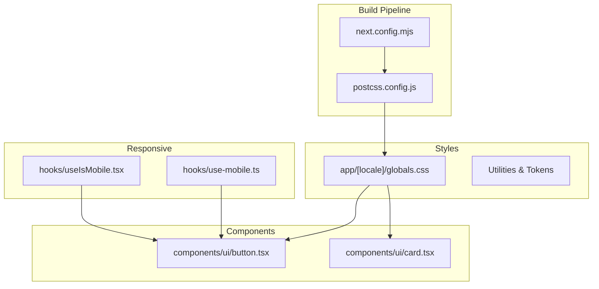
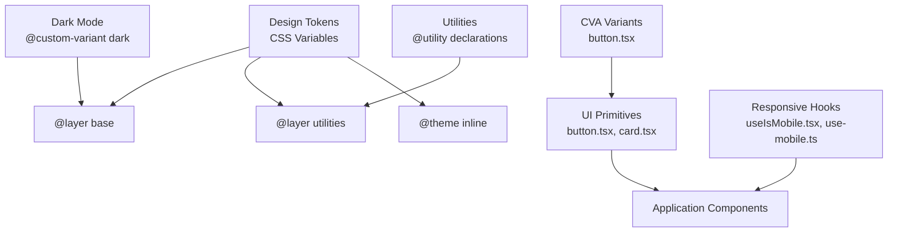
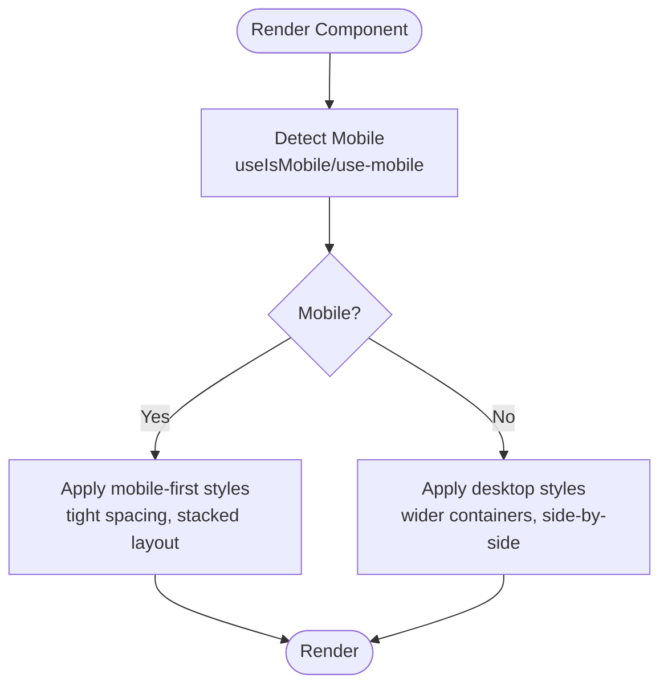
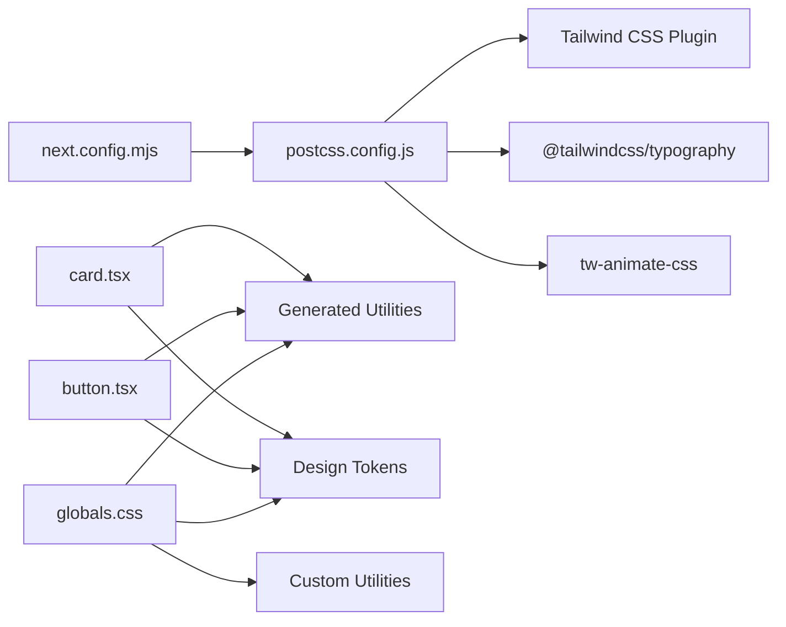

# Styling & Design System

<cite>
**Referenced Files in This Document**
- [postcss.config.js](file://postcss.config.js)
- [globals.css](file://app/[locale]/globals.css)
- [package.json](file://package.json)
- [button.tsx](file://components/ui/button.tsx)
- [card.tsx](file://components/ui/card.tsx)
- [useIsMobile.tsx](file://hooks/useIsMobile.tsx)
- [use-mobile.ts](file://hooks/use-mobile.ts)
- [next.config.mjs](file://next.config.mjs)
</cite>

## Table of Contents
1. [Introduction](#introduction)
2. [Project Structure](#project-structure)
3. [Core Components](#core-components)
4. [Architecture Overview](#architecture-overview)
5. [Detailed Component Analysis](#detailed-component-analysis)
6. [Dependency Analysis](#dependency-analysis)
7. [Performance Considerations](#performance-considerations)
8. [Troubleshooting Guide](#troubleshooting-guide)
9. [Conclusion](#conclusion)

## Introduction
This document explains the Styling & Design System for the Flaq SaaS Template, focusing on Tailwind CSS implementation, design token management, and component styling patterns. It covers the utility-first approach, custom theme configuration, dark mode support, responsive design, accessibility considerations, and performance optimization strategies tailored for AI-driven SaaS experiences.

## Project Structure
The styling system centers around a PostCSS pipeline configured with Tailwind CSS, a global stylesheet that defines design tokens and utilities, and a set of UI primitives built with variant-driven class composition. Hooks provide responsive behavior, while Next.js configuration ensures optimized asset handling.



**Diagram sources**
- [postcss.config.js:1-6](file://postcss.config.js#L1-L6)
- [next.config.mjs:28-58](file://next.config.mjs#L28-L58)
- [globals.css:1-408](file://app/[locale]/globals.css#L1-L408)
- [button.tsx:1-60](file://components/ui/button.tsx#L1-L60)
- [card.tsx:1-93](file://components/ui/card.tsx#L1-L93)
- [useIsMobile.tsx:1-13](file://hooks/useIsMobile.tsx#L1-L13)
- [use-mobile.ts:1-19](file://hooks/use-mobile.ts#L1-L19)

**Section sources**
- [postcss.config.js:1-6](file://postcss.config.js#L1-L6)
- [next.config.mjs:28-58](file://next.config.mjs#L28-L58)
- [globals.css:1-408](file://app/[locale]/globals.css#L1-L408)

## Core Components
- Tailwind CSS pipeline: PostCSS plugin integrates Tailwind utilities and plugins for typography and animations.
- Global design tokens: CSS custom properties define semantic color tokens, spacing, radius, typography, and animation keys.
- Utilities: Custom @utility declarations encapsulate frequently used patterns (containers, centering, scrollbars).
- Dark mode: A custom dark variant targets selectors under a .dark class for theme-aware rendering.
- UI primitives: Shadcn-inspired components use class-variance-authority (CVA) to compose variants and sizes.
- Responsive hooks: Lightweight hooks detect mobile breakpoints for conditional rendering and behavior.

**Section sources**
- [postcss.config.js:1-6](file://postcss.config.js#L1-L6)
- [globals.css:6-61](file://app/[locale]/globals.css#L6-L61)
- [globals.css:151-213](file://app/[locale]/globals.css#L151-L213)
- [globals.css:215-397](file://app/[locale]/globals.css#L215-L397)
- [button.tsx:7-36](file://components/ui/button.tsx#L7-L36)
- [card.tsx:5-16](file://components/ui/card.tsx#L5-L16)
- [useIsMobile.tsx:1-13](file://hooks/useIsMobile.tsx#L1-L13)
- [use-mobile.ts:1-19](file://hooks/use-mobile.ts#L1-L19)

## Architecture Overview
The design system architecture blends a token-driven CSS layer with component-level variants. Tailwind utilities are generated via PostCSS and consumed by global styles and UI components. Design tokens are declared in CSS custom properties and exposed as semantic tokens for consistent theming. Components encapsulate presentation logic and accept variant props to maintain a single source of truth for styling.



**Diagram sources**
- [globals.css:6-61](file://app/[locale]/globals.css#L6-L61)
- [globals.css:151-213](file://app/[locale]/globals.css#L151-L213)
- [globals.css:215-397](file://app/[locale]/globals.css#L215-L397)
- [button.tsx:7-36](file://components/ui/button.tsx#L7-L36)
- [card.tsx:5-16](file://components/ui/card.tsx#L5-L16)
- [useIsMobile.tsx:1-13](file://hooks/useIsMobile.tsx#L1-L13)
- [use-mobile.ts:1-19](file://hooks/use-mobile.ts#L1-L19)

## Detailed Component Analysis

### Tailwind CSS Pipeline and Plugins
- PostCSS configuration enables the Tailwind CSS plugin for utility generation.
- Typography plugin and animation library are imported globally to extend Tailwind’s capabilities.
- These plugins integrate during build-time to produce a compact CSS surface.

**Section sources**
- [postcss.config.js:1-6](file://postcss.config.js#L1-L6)

### Global Styles, Tokens, and Utilities
- Base layer resets and compatibility adjustments ensure consistent borders and interactive states.
- Semantic tokens define color families and roles (e.g., backgrounds, cards, text, accents).
- Utility helpers encapsulate common layouts and behaviors (centering, scrollbars, input styling).
- Dark mode variant targets selectors under a .dark class to flip themes without duplicating styles.
- Animation keys and easing curves are centralized for reusable motion effects.

Practical guidance:
- Add new tokens to the base layer and expose them via @theme inline for component consumption.
- Prefer utility helpers for cross-cutting concerns to reduce duplication.
- Keep dark mode logic scoped to the custom variant to avoid scattered overrides.

**Section sources**
- [globals.css:27-39](file://app/[locale]/globals.css#L27-L39)
- [globals.css:151-213](file://app/[locale]/globals.css#L151-L213)
- [globals.css:215-397](file://app/[locale]/globals.css#L215-L397)
- [globals.css:6-61](file://app/[locale]/globals.css#L6-L61)

### Component Styling Patterns with CVA
- Variants and sizes are composed via class-variance-authority to keep styling declarative and testable.
- Components forward refs and accept an optional asChild slot pattern for composition.
- Focus, disabled, and invalid states are styled consistently across variants.
- Shadow and ring utilities are applied per variant to maintain depth cues.

```mermaid
classDiagram
class Button {
+variant : "default|destructive|outline|secondary|ghost|link"
+size : "default|sm|lg|icon"
+asChild : boolean
+className : string
}
class Card {
+className : string
}
class CardHeader {
+className : string
}
class CardTitle {
+className : string
}
class CardDescription {
+className : string
}
class CardAction {
+className : string
}
class CardContent {
+className : string
}
class CardFooter {
+className : string
}
Button --> "uses" CVA["buttonVariants"]
Card --> CardHeader
Card --> CardTitle
Card --> CardDescription
Card --> CardAction
Card --> CardContent
Card --> CardFooter
```

**Diagram sources**
- [button.tsx:7-36](file://components/ui/button.tsx#L7-L36)
- [button.tsx:38-57](file://components/ui/button.tsx#L38-L57)
- [card.tsx:5-16](file://components/ui/card.tsx#L5-L16)
- [card.tsx:18-28](file://components/ui/card.tsx#L18-L28)
- [card.tsx:31-38](file://components/ui/card.tsx#L31-L38)
- [card.tsx:41-48](file://components/ui/card.tsx#L41-L48)
- [card.tsx:51-61](file://components/ui/card.tsx#L51-L61)
- [card.tsx:64-71](file://components/ui/card.tsx#L64-L71)
- [card.tsx:74-81](file://components/ui/card.tsx#L74-L81)

**Section sources**
- [button.tsx:7-36](file://components/ui/button.tsx#L7-L36)
- [button.tsx:38-57](file://components/ui/button.tsx#L38-L57)
- [card.tsx:5-16](file://components/ui/card.tsx#L5-L16)
- [card.tsx:18-28](file://components/ui/card.tsx#L18-L28)
- [card.tsx:31-38](file://components/ui/card.tsx#L31-L38)
- [card.tsx:41-48](file://components/ui/card.tsx#L41-L48)
- [card.tsx:51-61](file://components/ui/card.tsx#L51-L61)
- [card.tsx:64-71](file://components/ui/card.tsx#L64-L71)
- [card.tsx:74-81](file://components/ui/card.tsx#L74-L81)

### Responsive Design Implementation
- Mobile detection is handled by two lightweight hooks using window matchMedia and a fixed breakpoint.
- Components can leverage these hooks to adapt layout, spacing, or affordance choices for small screens.
- Global utilities and containers help enforce consistent widths and gutters across breakpoints.



**Diagram sources**
- [useIsMobile.tsx:1-13](file://hooks/useIsMobile.tsx#L1-L13)
- [use-mobile.ts:1-19](file://hooks/use-mobile.ts#L1-L19)
- [globals.css:8-17](file://app/[locale]/globals.css#L8-L17)
- [globals.css:41-50](file://app/[locale]/globals.css#L41-L50)

**Section sources**
- [useIsMobile.tsx:1-13](file://hooks/useIsMobile.tsx#L1-L13)
- [use-mobile.ts:1-19](file://hooks/use-mobile.ts#L1-L19)
- [globals.css:8-17](file://app/[locale]/globals.css#L8-L17)
- [globals.css:41-50](file://app/[locale]/globals.css#L41-L50)

### Dark Mode Support
- A custom dark variant targets selectors under the .dark class, enabling theme switching without duplicating rules.
- Tokens in :root define light/dark palettes; semantic tokens map to these for consistent usage across components.
- Focus and ring states adapt to dark backgrounds for visibility and accessibility.

Implementation tips:
- Toggle .dark on the root element to switch themes.
- Prefer semantic tokens in components to automatically respect theme changes.

**Section sources**
- [globals.css:6](file://app/[locale]/globals.css#L6)
- [globals.css:151-213](file://app/[locale]/globals.css#L151-L213)
- [globals.css:215-397](file://app/[locale]/globals.css#L215-L397)

### Accessibility Compliance
- Focus states are defined via ring and outline utilities to ensure keyboard navigation visibility.
- Disabled states reduce interactivity and opacity to communicate non-interactive states.
- Invalid states receive distinct ring colors to signal errors clearly.

Recommendations:
- Maintain sufficient contrast against themed backgrounds.
- Provide visible focus rings for interactive elements.
- Avoid hiding focus styles; rely on ring utilities for consistent focus indication.

**Section sources**
- [button.tsx:8](file://components/ui/button.tsx#L8)
- [button.tsx:14](file://components/ui/button.tsx#L14)
- [button.tsx:16](file://components/ui/button.tsx#L16)
- [button.tsx:31-34](file://components/ui/button.tsx#L31-L34)
- [globals.css:399-407](file://app/[locale]/globals.css#L399-L407)

### Extending the Design Language
- Add new tokens in the base layer and expose them via @theme inline for component-level consumption.
- Introduce new @utility helpers for repeated layout or interaction patterns.
- Extend CVA variants in primitives to reflect new roles or sizes, ensuring backward compatibility.

**Section sources**
- [globals.css:151-213](file://app/[locale]/globals.css#L151-L213)
- [globals.css:215-397](file://app/[locale]/globals.css#L215-L397)
- [globals.css:6-61](file://app/[locale]/globals.css#L6-L61)
- [button.tsx:7-36](file://components/ui/button.tsx#L7-L36)

## Dependency Analysis
The styling stack relies on PostCSS and Tailwind CSS plugins, with Next.js managing the build and runtime behavior. UI primitives depend on design tokens and utilities defined in the global stylesheet.



**Diagram sources**
- [postcss.config.js:1-6](file://postcss.config.js#L1-L6)
- [globals.css:1-3](file://app/[locale]/globals.css#L1-L3)
- [button.tsx:5](file://components/ui/button.tsx#L5)
- [card.tsx:3](file://components/ui/card.tsx#L3)
- [next.config.mjs:28-58](file://next.config.mjs#L28-L58)

**Section sources**
- [postcss.config.js:1-6](file://postcss.config.js#L1-L6)
- [globals.css:1-3](file://app/[locale]/globals.css#L1-L3)
- [button.tsx:5](file://components/ui/button.tsx#L5)
- [card.tsx:3](file://components/ui/card.tsx#L3)
- [next.config.mjs:28-58](file://next.config.mjs#L28-L58)

## Performance Considerations
- Keep the number of unique tokens and utilities minimal to reduce CSS payload.
- Prefer utility-first composition over ad-hoc styles to maximize reuse and minimize duplication.
- Use responsive variants judiciously; avoid excessive breakpoint-specific overrides.
- Enable tree-shaking by scoping utilities and tokens to components that use them.
- Consider lazy-loading non-critical animations and heavy utilities only when needed.

[No sources needed since this section provides general guidance]

## Troubleshooting Guide
- Dark mode not applying: Verify the .dark class is toggled on the root element and that the custom dark variant is present.
- Token mismatch: Ensure semantic tokens in @theme inline align with values defined in :root.
- Utilities not generating: Confirm PostCSS plugin is enabled and Tailwind directives are present in the stylesheet.
- Responsive inconsistencies: Use the provided hooks to gate mobile-specific styles and avoid relying solely on media queries inside components.

**Section sources**
- [globals.css:6](file://app/[locale]/globals.css#L6)
- [globals.css:151-213](file://app/[locale]/globals.css#L151-L213)
- [globals.css:215-397](file://app/[locale]/globals.css#L215-L397)
- [postcss.config.js:1-6](file://postcss.config.js#L1-L6)
- [useIsMobile.tsx:1-13](file://hooks/useIsMobile.tsx#L1-L13)
- [use-mobile.ts:1-19](file://hooks/use-mobile.ts#L1-L19)

## Conclusion
The Flaq SaaS Template employs a robust, token-driven design system powered by Tailwind CSS and PostCSS. By centralizing design tokens, composing component variants with CVA, and leveraging responsive hooks, the system achieves visual consistency, scalability, and accessibility. Following the outlined patterns and performance recommendations will help maintain a cohesive design language across AI-powered SaaS experiences.